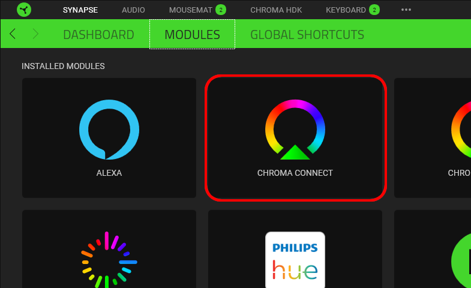

# Latest

* Note: Visit the [Chroma Animation Guide](https://chroma.razer.com/ChromaGuide/) to find the latest supported plugin for Chroma RGB.

# C# SDK - Chroma Animation Sample App

**Table of Contents**

* [Quick Start](#quick-start)
* [See Also](#see-also)
* [About](#about)
* [Chroma Editor Library](#chroma-editor-library)
* [Windows PC](#windows-pc)
* [Windows Cloud](#windows-cloud)
* [API Class](#api-class)
* [Initialization](#initialization)
* [API](#api)

<a name="see-also"></a>

## See Also ##

**Docs:**

* [Chroma Animation Guide](http://chroma.razer.com/ChromaGuide/) - Visual examples of the Chroma Animation API methods

**Plugins:**

* [CChromaEditor](https://github.com/RazerOfficial/CChromaEditor) - C++ native MFC library for playing and editing Chroma animations

## Quick Start ##

* Install [Synapse](https://www.razer.com/synapse-3)

* Make sure the Chroma Connect module is installed.



* If you don't have Chroma hardware, you can see Chroma effects with the [Chroma Emulator](https://github.com/razerofficial/ChromaEmulator)

<a name="about"></a>

## About ##

The `C# Sample App` is a C# console app that shows the animations from the [Chroma Animation Guide](http://chroma.razer.com/ChromaGuide/).

**Screenshot:**


---

<a name="chroma-editor-library"></a>

## Chroma Editor Library

The `Chroma Editor Library` is a helper library for Chroma animation playback and realtime manipulation of Chroma animations.

The latest versions of the `Chroma Editor Library` can be found in [Releases](https://github.com/razerofficial/CChromaEditor/releases) for `Windows-PC` and `Windows-Cloud`.

<a name="windows-pc"></a>

## Windows PC

For `Windows PC` builds the `RzChromaSDK.dll` and `RzChromaStreamPlugin.dll` are not packaged with the build. These libraries are automatically updated and managed by Synapse and the Chroma Connect module. Avoid including these files in your build folder for `Windows PC` builds.

**32-bit libraries**

```
Win32BuildFolder\CChromaEditorLibrary.dll
```

**64-bit libraries**

```
Win64BuildFolder\CChromaEditorLibrary64.dll
```

<a name="windows-cloud"></a>

## Windows Cloud

`Windows Cloud` builds run on cloud platforms using `Windows` such as `Amazon Luna`, `Microsoft Game Pass`, and `NVidia GeForce Now`. Game instances run in the cloud without direct access to Chroma hardware. By running the `Windows Cloud` version of the library `Chroma` effects can reach your local machine and connected hardware. Cloud instances won't have Synapse installed which requires special cloud versions of the libraries. The `Chroma Editor Library` uses the core `RzChromaSDK` low-level library to send Chroma effects to the cloud with the `RzChromaStreamPlugin` streaming library. Viewers can watch the cloud stream via the [Razer Stream Portal](https://stream.razer.com/).

**32-bit libraries**

```
Win32BuildFolder\CChromaEditorLibrary.dll
Win32BuildFolder\RzChromaSDK.dll
Win32BuildFolder\RzChromaStreamPlugin.dll
```

**64-bit libraries**

```
Win64BuildFolder\CChromaEditorLibrary64.dll
Win64BuildFolder\RzChromaSDK64.dll
Win64BuildFolder\RzChromaStreamPlugin64.dll
```

<a name="api-class"></a>

## API Class

The `ChromaAnimationAPI` class provides a wrapper for the Chroma Editor Library. The wrapper for the API can be found at [ChromaAnimationAPI.cs](ChromaAnimationAPI.cs).

<a name="initialization"></a>

## Initialization

---

The `ChromaAnimationAPI.InitSDK(ref appInfo)` method returns `RazerErrors.RZRESULT_SUCCESS` when initialization has succeeded. Avoid making calls to the Chroma API when anything other than success is returned. A unsuccessful result indicates `Chroma` is not present on the machine.

```
  ChromaSDK.APPINFOTYPE appInfo = new APPINFOTYPE();

  appInfo.Title = "Sample Game Title";
  appInfo.Description = "Sample Game Description";
  appInfo.Author_Name = "Company Name";
  appInfo.Author_Contact = "Company Website or Email";

  //    0x01 | // Keyboards
  //    0x02 | // Mice
  //    0x04 | // Headset
  //    0x08 | // Mousepads
  //    0x10 | // Keypads
  //    0x20   // ChromaLink devices
  appInfo.SupportedDevice = (0x01 | 0x02 | 0x04 | 0x08 | 0x10 | 0x20);
  //    0x01 | // Utility. (To specifiy this is an utility application)
  //    0x02   // Game. (To specifiy this is a game);
  appInfo.Category = 0x02;
  
  int result = ChromaAnimationAPI.InitSDK(ref appInfo);
  if (result != RazerErrors.RZRESULT_SUCCESS)
  {
    Console.Error.WriteLine("Failed to initialize Chroma SDK with error={0}\r\n", result);

    // avoid making Chroma API calls after a non-zero init result
    return;
  }
```

<a name="api"></a>

## API ##

* [AddColor](#AddColor)
* [AddFrame](#AddFrame)
* [AddNonZeroAllKeysAllFrames](#AddNonZeroAllKeysAllFrames)
* [AddNonZeroAllKeysAllFramesName](#AddNonZeroAllKeysAllFramesName)
* [AddNonZeroAllKeysAllFramesNameD](#AddNonZeroAllKeysAllFramesNameD)
* [AddNonZeroAllKeysAllFramesOffset](#AddNonZeroAllKeysAllFramesOffset)
* [AddNonZeroAllKeysAllFramesOffsetName](#AddNonZeroAllKeysAllFramesOffsetName)
* [AddNonZeroAllKeysAllFramesOffsetNameD](#AddNonZeroAllKeysAllFramesOffsetNameD)
* [AddNonZeroAllKeysOffset](#AddNonZeroAllKeysOffset)
* [AddNonZeroAllKeysOffsetName](#AddNonZeroAllKeysOffsetName)
* [AddNonZeroAllKeysOffsetNameD](#AddNonZeroAllKeysOffsetNameD)
* [AddNonZeroTargetAllKeysAllFrames](#AddNonZeroTargetAllKeysAllFrames)
* [AddNonZeroTargetAllKeysAllFramesName](#AddNonZeroTargetAllKeysAllFramesName)
* [AddNonZeroTargetAllKeysAllFramesNameD](#AddNonZeroTargetAllKeysAllFramesNameD)
* [AddNonZeroTargetAllKeysAllFramesOffset](#AddNonZeroTargetAllKeysAllFramesOffset)
* [AddNonZeroTargetAllKeysAllFramesOffsetName](#AddNonZeroTargetAllKeysAllFramesOffsetName)
* [AddNonZeroTargetAllKeysAllFramesOffsetNameD](#AddNonZeroTargetAllKeysAllFramesOffsetNameD)
* [AddNonZeroTargetAllKeysOffset](#AddNonZeroTargetAllKeysOffset)
* [AddNonZeroTargetAllKeysOffsetName](#AddNonZeroTargetAllKeysOffsetName)
* [AddNonZeroTargetAllKeysOffsetNameD](#AddNonZeroTargetAllKeysOffsetNameD)
* [AppendAllFrames](#AppendAllFrames)
* [AppendAllFramesName](#AppendAllFramesName)
* [AppendAllFramesNameD](#AppendAllFramesNameD)
* [ClearAll](#ClearAll)
* [ClearAnimationType](#ClearAnimationType)
* [CloseAll](#CloseAll)
* [CloseAnimation](#CloseAnimation)
* [CloseAnimationD](#CloseAnimationD)
* [CloseAnimationName](#CloseAnimationName)
* [CloseAnimationNameD](#CloseAnimationNameD)
* [CloseComposite](#CloseComposite)
* [CloseCompositeD](#CloseCompositeD)
* [CopyAllKeys](#CopyAllKeys)
* [CopyAllKeysName](#CopyAllKeysName)
* [CopyAnimation](#CopyAnimation)
* [CopyAnimationName](#CopyAnimationName)
* [CopyAnimationNameD](#CopyAnimationNameD)
* [CopyBlueChannelAllFrames](#CopyBlueChannelAllFrames)
* [CopyBlueChannelAllFramesName](#CopyBlueChannelAllFramesName)
* [CopyBlueChannelAllFramesNameD](#CopyBlueChannelAllFramesNameD)
* [CopyGreenChannelAllFrames](#CopyGreenChannelAllFrames)
* [CopyGreenChannelAllFramesName](#CopyGreenChannelAllFramesName)
* [CopyGreenChannelAllFramesNameD](#CopyGreenChannelAllFramesNameD)
* [CopyKeyColor](#CopyKeyColor)
* [CopyKeyColorAllFrames](#CopyKeyColorAllFrames)
* [CopyKeyColorAllFramesName](#CopyKeyColorAllFramesName)
* [CopyKeyColorAllFramesNameD](#CopyKeyColorAllFramesNameD)
* [CopyKeyColorAllFramesOffset](#CopyKeyColorAllFramesOffset)
* [CopyKeyColorAllFramesOffsetName](#CopyKeyColorAllFramesOffsetName)
* [CopyKeyColorAllFramesOffsetNameD](#CopyKeyColorAllFramesOffsetNameD)
* [CopyKeyColorName](#CopyKeyColorName)
* [CopyKeyColorNameD](#CopyKeyColorNameD)
* [CopyKeysColor](#CopyKeysColor)
* [CopyKeysColorAllFrames](#CopyKeysColorAllFrames)
* [CopyKeysColorAllFramesName](#CopyKeysColorAllFramesName)
* [CopyKeysColorName](#CopyKeysColorName)
* [CopyKeysColorOffset](#CopyKeysColorOffset)
* [CopyKeysColorOffsetName](#CopyKeysColorOffsetName)
* [CopyNonZeroAllKeys](#CopyNonZeroAllKeys)
* [CopyNonZeroAllKeysAllFrames](#CopyNonZeroAllKeysAllFrames)
* [CopyNonZeroAllKeysAllFramesName](#CopyNonZeroAllKeysAllFramesName)
* [CopyNonZeroAllKeysAllFramesNameD](#CopyNonZeroAllKeysAllFramesNameD)
* [CopyNonZeroAllKeysAllFramesOffset](#CopyNonZeroAllKeysAllFramesOffset)
* [CopyNonZeroAllKeysAllFramesOffsetName](#CopyNonZeroAllKeysAllFramesOffsetName)
* [CopyNonZeroAllKeysAllFramesOffsetNameD](#CopyNonZeroAllKeysAllFramesOffsetNameD)
* [CopyNonZeroAllKeysName](#CopyNonZeroAllKeysName)
* [CopyNonZeroAllKeysNameD](#CopyNonZeroAllKeysNameD)
* [CopyNonZeroAllKeysOffset](#CopyNonZeroAllKeysOffset)
* [CopyNonZeroAllKeysOffsetName](#CopyNonZeroAllKeysOffsetName)
* [CopyNonZeroAllKeysOffsetNameD](#CopyNonZeroAllKeysOffsetNameD)
* [CopyNonZeroKeyColor](#CopyNonZeroKeyColor)
* [CopyNonZeroKeyColorName](#CopyNonZeroKeyColorName)
* [CopyNonZeroKeyColorNameD](#CopyNonZeroKeyColorNameD)
* [CopyNonZeroTargetAllKeys](#CopyNonZeroTargetAllKeys)
* [CopyNonZeroTargetAllKeysAllFrames](#CopyNonZeroTargetAllKeysAllFrames)
* [CopyNonZeroTargetAllKeysAllFramesName](#CopyNonZeroTargetAllKeysAllFramesName)
* [CopyNonZeroTargetAllKeysAllFramesNameD](#CopyNonZeroTargetAllKeysAllFramesNameD)
* [CopyNonZeroTargetAllKeysAllFramesOffset](#CopyNonZeroTargetAllKeysAllFramesOffset)
* [CopyNonZeroTargetAllKeysAllFramesOffsetName](#CopyNonZeroTargetAllKeysAllFramesOffsetName)
* [CopyNonZeroTargetAllKeysAllFramesOffsetNameD](#CopyNonZeroTargetAllKeysAllFramesOffsetNameD)
* [CopyNonZeroTargetAllKeysName](#CopyNonZeroTargetAllKeysName)
* [CopyNonZeroTargetAllKeysNameD](#CopyNonZeroTargetAllKeysNameD)
* [CopyNonZeroTargetAllKeysOffset](#CopyNonZeroTargetAllKeysOffset)
* [CopyNonZeroTargetAllKeysOffsetName](#CopyNonZeroTargetAllKeysOffsetName)
* [CopyNonZeroTargetAllKeysOffsetNameD](#CopyNonZeroTargetAllKeysOffsetNameD)
* [CopyNonZeroTargetZeroAllKeysAllFrames](#CopyNonZeroTargetZeroAllKeysAllFrames)
* [CopyNonZeroTargetZeroAllKeysAllFramesName](#CopyNonZeroTargetZeroAllKeysAllFramesName)
* [CopyNonZeroTargetZeroAllKeysAllFramesNameD](#CopyNonZeroTargetZeroAllKeysAllFramesNameD)
* [CopyRedChannelAllFrames](#CopyRedChannelAllFrames)
* [CopyRedChannelAllFramesName](#CopyRedChannelAllFramesName)
* [CopyRedChannelAllFramesNameD](#CopyRedChannelAllFramesNameD)
* [CopyZeroAllKeysAllFrames](#CopyZeroAllKeysAllFrames)
* [CopyZeroAllKeysAllFramesName](#CopyZeroAllKeysAllFramesName)
* [CopyZeroAllKeysAllFramesNameD](#CopyZeroAllKeysAllFramesNameD)
* [CopyZeroAllKeysAllFramesOffset](#CopyZeroAllKeysAllFramesOffset)
* [CopyZeroAllKeysAllFramesOffsetName](#CopyZeroAllKeysAllFramesOffsetName)
* [CopyZeroAllKeysAllFramesOffsetNameD](#CopyZeroAllKeysAllFramesOffsetNameD)
* [CopyZeroKeyColor](#CopyZeroKeyColor)
* [CopyZeroKeyColorName](#CopyZeroKeyColorName)
* [CopyZeroKeyColorNameD](#CopyZeroKeyColorNameD)
* [CopyZeroTargetAllKeysAllFrames](#CopyZeroTargetAllKeysAllFrames)
* [CopyZeroTargetAllKeysAllFramesName](#CopyZeroTargetAllKeysAllFramesName)
* [CopyZeroTargetAllKeysAllFramesNameD](#CopyZeroTargetAllKeysAllFramesNameD)
* [CoreCreateChromaLinkEffect](#CoreCreateChromaLinkEffect)
* [CoreCreateEffect](#CoreCreateEffect)
* [CoreCreateHeadsetEffect](#CoreCreateHeadsetEffect)
* [CoreCreateKeyboardEffect](#CoreCreateKeyboardEffect)
* [CoreCreateKeypadEffect](#CoreCreateKeypadEffect)
* [CoreCreateMouseEffect](#CoreCreateMouseEffect)
* [CoreCreateMousepadEffect](#CoreCreateMousepadEffect)
* [CoreDeleteEffect](#CoreDeleteEffect)
* [CoreInit](#CoreInit)
* [CoreInitSDK](#CoreInitSDK)
* [CoreQueryDevice](#CoreQueryDevice)
* [CoreSetEffect](#CoreSetEffect)
* [CoreStreamBroadcast](#CoreStreamBroadcast)
* [CoreStreamBroadcastEnd](#CoreStreamBroadcastEnd)
* [CoreStreamGetAuthShortcode](#CoreStreamGetAuthShortcode)
* [CoreStreamGetFocus](#CoreStreamGetFocus)
* [CoreStreamGetId](#CoreStreamGetId)
* [CoreStreamGetKey](#CoreStreamGetKey)
* [CoreStreamGetStatus](#CoreStreamGetStatus)
* [CoreStreamGetStatusString](#CoreStreamGetStatusString)
* [CoreStreamReleaseShortcode](#CoreStreamReleaseShortcode)
* [CoreStreamSetFocus](#CoreStreamSetFocus)
* [CoreStreamSupportsStreaming](#CoreStreamSupportsStreaming)
* [CoreStreamWatch](#CoreStreamWatch)
* [CoreStreamWatchEnd](#CoreStreamWatchEnd)
* [CoreUnInit](#CoreUnInit)
* [CreateAnimation](#CreateAnimation)
* [CreateAnimationInMemory](#CreateAnimationInMemory)
* [CreateEffect](#CreateEffect)
* [DeleteEffect](#DeleteEffect)
* [DuplicateFirstFrame](#DuplicateFirstFrame)
* [DuplicateFirstFrameName](#DuplicateFirstFrameName)
* [DuplicateFirstFrameNameD](#DuplicateFirstFrameNameD)
* [DuplicateFrames](#DuplicateFrames)
* [DuplicateFramesName](#DuplicateFramesName)
* [DuplicateFramesNameD](#DuplicateFramesNameD)
* [DuplicateMirrorFrames](#DuplicateMirrorFrames)
* [DuplicateMirrorFramesName](#DuplicateMirrorFramesName)
* [DuplicateMirrorFramesNameD](#DuplicateMirrorFramesNameD)
* [FadeEndFrames](#FadeEndFrames)
* [FadeEndFramesName](#FadeEndFramesName)
* [FadeEndFramesNameD](#FadeEndFramesNameD)
* [FadeStartFrames](#FadeStartFrames)
* [FadeStartFramesName](#FadeStartFramesName)
* [FadeStartFramesNameD](#FadeStartFramesNameD)
* [FillColor](#FillColor)
* [FillColorAllFrames](#FillColorAllFrames)
* [FillColorAllFramesName](#FillColorAllFramesName)
* [FillColorAllFramesNameD](#FillColorAllFramesNameD)
* [FillColorAllFramesRGB](#FillColorAllFramesRGB)
* [FillColorAllFramesRGBName](#FillColorAllFramesRGBName)
* [FillColorAllFramesRGBNameD](#FillColorAllFramesRGBNameD)
* [FillColorName](#FillColorName)
* [FillColorNameD](#FillColorNameD)
* [FillColorRGB](#FillColorRGB)
* [FillColorRGBName](#FillColorRGBName)
* [FillColorRGBNameD](#FillColorRGBNameD)
* [FillNonZeroColor](#FillNonZeroColor)
* [FillNonZeroColorAllFrames](#FillNonZeroColorAllFrames)
* [FillNonZeroColorAllFramesName](#FillNonZeroColorAllFramesName)
* [FillNonZeroColorAllFramesNameD](#FillNonZeroColorAllFramesNameD)
* [FillNonZeroColorAllFramesRGB](#FillNonZeroColorAllFramesRGB)
* [FillNonZeroColorAllFramesRGBName](#FillNonZeroColorAllFramesRGBName)
* [FillNonZeroColorAllFramesRGBNameD](#FillNonZeroColorAllFramesRGBNameD)
* [FillNonZeroColorName](#FillNonZeroColorName)
* [FillNonZeroColorNameD](#FillNonZeroColorNameD)
* [FillNonZeroColorRGB](#FillNonZeroColorRGB)
* [FillNonZeroColorRGBName](#FillNonZeroColorRGBName)
* [FillNonZeroColorRGBNameD](#FillNonZeroColorRGBNameD)
* [FillRandomColors](#FillRandomColors)
* [FillRandomColorsAllFrames](#FillRandomColorsAllFrames)
* [FillRandomColorsAllFramesName](#FillRandomColorsAllFramesName)
* [FillRandomColorsAllFramesNameD](#FillRandomColorsAllFramesNameD)
* [FillRandomColorsBlackAndWhite](#FillRandomColorsBlackAndWhite)
* [FillRandomColorsBlackAndWhiteAllFrames](#FillRandomColorsBlackAndWhiteAllFrames)
* [FillRandomColorsBlackAndWhiteAllFramesName](#FillRandomColorsBlackAndWhiteAllFramesName)
* [FillRandomColorsBlackAndWhiteAllFramesNameD](#FillRandomColorsBlackAndWhiteAllFramesNameD)
* [FillRandomColorsBlackAndWhiteName](#FillRandomColorsBlackAndWhiteName)
* [FillRandomColorsBlackAndWhiteNameD](#FillRandomColorsBlackAndWhiteNameD)
* [FillRandomColorsName](#FillRandomColorsName)
* [FillRandomColorsNameD](#FillRandomColorsNameD)
* [FillThresholdColors](#FillThresholdColors)
* [FillThresholdColorsAllFrames](#FillThresholdColorsAllFrames)
* [FillThresholdColorsAllFramesName](#FillThresholdColorsAllFramesName)
* [FillThresholdColorsAllFramesNameD](#FillThresholdColorsAllFramesNameD)
* [FillThresholdColorsAllFramesRGB](#FillThresholdColorsAllFramesRGB)
* [FillThresholdColorsAllFramesRGBName](#FillThresholdColorsAllFramesRGBName)
* [FillThresholdColorsAllFramesRGBNameD](#FillThresholdColorsAllFramesRGBNameD)
* [FillThresholdColorsMinMaxAllFramesRGB](#FillThresholdColorsMinMaxAllFramesRGB)
* [FillThresholdColorsMinMaxAllFramesRGBName](#FillThresholdColorsMinMaxAllFramesRGBName)
* [FillThresholdColorsMinMaxAllFramesRGBNameD](#FillThresholdColorsMinMaxAllFramesRGBNameD)
* [FillThresholdColorsMinMaxRGB](#FillThresholdColorsMinMaxRGB)
* [FillThresholdColorsMinMaxRGBName](#FillThresholdColorsMinMaxRGBName)
* [FillThresholdColorsMinMaxRGBNameD](#FillThresholdColorsMinMaxRGBNameD)
* [FillThresholdColorsName](#FillThresholdColorsName)
* [FillThresholdColorsNameD](#FillThresholdColorsNameD)
* [FillThresholdColorsRGB](#FillThresholdColorsRGB)
* [FillThresholdColorsRGBName](#FillThresholdColorsRGBName)
* [FillThresholdColorsRGBNameD](#FillThresholdColorsRGBNameD)
* [FillThresholdRGBColorsAllFramesRGB](#FillThresholdRGBColorsAllFramesRGB)
* [FillThresholdRGBColorsAllFramesRGBName](#FillThresholdRGBColorsAllFramesRGBName)
* [FillThresholdRGBColorsAllFramesRGBNameD](#FillThresholdRGBColorsAllFramesRGBNameD)
* [FillThresholdRGBColorsRGB](#FillThresholdRGBColorsRGB)
* [FillThresholdRGBColorsRGBName](#FillThresholdRGBColorsRGBName)
* [FillThresholdRGBColorsRGBNameD](#FillThresholdRGBColorsRGBNameD)
* [FillZeroColor](#FillZeroColor)
* [FillZeroColorAllFrames](#FillZeroColorAllFrames)
* [FillZeroColorAllFramesName](#FillZeroColorAllFramesName)
* [FillZeroColorAllFramesNameD](#FillZeroColorAllFramesNameD)
* [FillZeroColorAllFramesRGB](#FillZeroColorAllFramesRGB)
* [FillZeroColorAllFramesRGBName](#FillZeroColorAllFramesRGBName)
* [FillZeroColorAllFramesRGBNameD](#FillZeroColorAllFramesRGBNameD)
* [FillZeroColorName](#FillZeroColorName)
* [FillZeroColorNameD](#FillZeroColorNameD)
* [FillZeroColorRGB](#FillZeroColorRGB)
* [FillZeroColorRGBName](#FillZeroColorRGBName)
* [FillZeroColorRGBNameD](#FillZeroColorRGBNameD)
* [Get1DColor](#Get1DColor)
* [Get1DColorName](#Get1DColorName)
* [Get1DColorNameD](#Get1DColorNameD)
* [Get2DColor](#Get2DColor)
* [Get2DColorName](#Get2DColorName)
* [Get2DColorNameD](#Get2DColorNameD)
* [GetAnimation](#GetAnimation)
* [GetAnimationCount](#GetAnimationCount)
* [GetAnimationD](#GetAnimationD)
* [GetAnimationId](#GetAnimationId)
* [GetAnimationName](#GetAnimationName)
* [GetCurrentFrame](#GetCurrentFrame)
* [GetCurrentFrameName](#GetCurrentFrameName)
* [GetCurrentFrameNameD](#GetCurrentFrameNameD)
* [GetDevice](#GetDevice)
* [GetDeviceName](#GetDeviceName)
* [GetDeviceNameD](#GetDeviceNameD)
* [GetDeviceType](#GetDeviceType)
* [GetDeviceTypeName](#GetDeviceTypeName)
* [GetDeviceTypeNameD](#GetDeviceTypeNameD)
* [GetFrame](#GetFrame)
* [GetFrameCount](#GetFrameCount)
* [GetFrameCountName](#GetFrameCountName)
* [GetFrameCountNameD](#GetFrameCountNameD)
* [GetKeyColor](#GetKeyColor)
* [GetKeyColorD](#GetKeyColorD)
* [GetKeyColorName](#GetKeyColorName)
* [GetLibraryLoadedState](#GetLibraryLoadedState)
* [GetLibraryLoadedStateD](#GetLibraryLoadedStateD)
* [GetMaxColumn](#GetMaxColumn)
* [GetMaxColumnD](#GetMaxColumnD)
* [GetMaxLeds](#GetMaxLeds)
* [GetMaxLedsD](#GetMaxLedsD)
* [GetMaxRow](#GetMaxRow)
* [GetMaxRowD](#GetMaxRowD)
* [GetPlayingAnimationCount](#GetPlayingAnimationCount)
* [GetPlayingAnimationId](#GetPlayingAnimationId)
* [GetRGB](#GetRGB)
* [GetRGBD](#GetRGBD)
* [HasAnimationLoop](#HasAnimationLoop)
* [HasAnimationLoopName](#HasAnimationLoopName)
* [HasAnimationLoopNameD](#HasAnimationLoopNameD)
* [Init](#Init)
* [InitD](#InitD)
* [InitSDK](#InitSDK)
* [InsertDelay](#InsertDelay)
* [InsertDelayName](#InsertDelayName)
* [InsertDelayNameD](#InsertDelayNameD)
* [InsertFrame](#InsertFrame)
* [InsertFrameName](#InsertFrameName)
* [InsertFrameNameD](#InsertFrameNameD)
* [InvertColors](#InvertColors)
* [InvertColorsAllFrames](#InvertColorsAllFrames)
* [InvertColorsAllFramesName](#InvertColorsAllFramesName)
* [InvertColorsAllFramesNameD](#InvertColorsAllFramesNameD)
* [InvertColorsName](#InvertColorsName)
* [InvertColorsNameD](#InvertColorsNameD)
* [IsAnimationPaused](#IsAnimationPaused)
* [IsAnimationPausedName](#IsAnimationPausedName)
* [IsAnimationPausedNameD](#IsAnimationPausedNameD)
* [IsDialogOpen](#IsDialogOpen)
* [IsDialogOpenD](#IsDialogOpenD)
* [IsInitialized](#IsInitialized)
* [IsInitializedD](#IsInitializedD)
* [IsPlatformSupported](#IsPlatformSupported)
* [IsPlatformSupportedD](#IsPlatformSupportedD)
* [IsPlaying](#IsPlaying)
* [IsPlayingD](#IsPlayingD)
* [IsPlayingName](#IsPlayingName)
* [IsPlayingNameD](#IsPlayingNameD)
* [IsPlayingType](#IsPlayingType)
* [IsPlayingTypeD](#IsPlayingTypeD)
* [Lerp](#Lerp)
* [LerpColor](#LerpColor)
* [LoadAnimation](#LoadAnimation)
* [LoadAnimationD](#LoadAnimationD)
* [LoadAnimationName](#LoadAnimationName)
* [LoadComposite](#LoadComposite)
* [MakeBlankFrames](#MakeBlankFrames)
* [MakeBlankFramesName](#MakeBlankFramesName)
* [MakeBlankFramesNameD](#MakeBlankFramesNameD)
* [MakeBlankFramesRandom](#MakeBlankFramesRandom)
* [MakeBlankFramesRandomBlackAndWhite](#MakeBlankFramesRandomBlackAndWhite)
* [MakeBlankFramesRandomBlackAndWhiteName](#MakeBlankFramesRandomBlackAndWhiteName)
* [MakeBlankFramesRandomBlackAndWhiteNameD](#MakeBlankFramesRandomBlackAndWhiteNameD)
* [MakeBlankFramesRandomName](#MakeBlankFramesRandomName)
* [MakeBlankFramesRandomNameD](#MakeBlankFramesRandomNameD)
* [MakeBlankFramesRGB](#MakeBlankFramesRGB)
* [MakeBlankFramesRGBName](#MakeBlankFramesRGBName)
* [MakeBlankFramesRGBNameD](#MakeBlankFramesRGBNameD)
* [MirrorHorizontally](#MirrorHorizontally)
* [MirrorVertically](#MirrorVertically)
* [MultiplyColorLerpAllFrames](#MultiplyColorLerpAllFrames)
* [MultiplyColorLerpAllFramesName](#MultiplyColorLerpAllFramesName)
* [MultiplyColorLerpAllFramesNameD](#MultiplyColorLerpAllFramesNameD)
* [MultiplyIntensity](#MultiplyIntensity)
* [MultiplyIntensityAllFrames](#MultiplyIntensityAllFrames)
* [MultiplyIntensityAllFramesName](#MultiplyIntensityAllFramesName)
* [MultiplyIntensityAllFramesNameD](#MultiplyIntensityAllFramesNameD)
* [MultiplyIntensityAllFramesRGB](#MultiplyIntensityAllFramesRGB)
* [MultiplyIntensityAllFramesRGBName](#MultiplyIntensityAllFramesRGBName)
* [MultiplyIntensityAllFramesRGBNameD](#MultiplyIntensityAllFramesRGBNameD)
* [MultiplyIntensityColor](#MultiplyIntensityColor)
* [MultiplyIntensityColorAllFrames](#MultiplyIntensityColorAllFrames)
* [MultiplyIntensityColorAllFramesName](#MultiplyIntensityColorAllFramesName)
* [MultiplyIntensityColorAllFramesNameD](#MultiplyIntensityColorAllFramesNameD)
* [MultiplyIntensityColorName](#MultiplyIntensityColorName)
* [MultiplyIntensityColorNameD](#MultiplyIntensityColorNameD)
* [MultiplyIntensityName](#MultiplyIntensityName)
* [MultiplyIntensityNameD](#MultiplyIntensityNameD)
* [MultiplyIntensityRGB](#MultiplyIntensityRGB)
* [MultiplyIntensityRGBName](#MultiplyIntensityRGBName)
* [MultiplyIntensityRGBNameD](#MultiplyIntensityRGBNameD)
* [MultiplyNonZeroTargetColorLerp](#MultiplyNonZeroTargetColorLerp)
* [MultiplyNonZeroTargetColorLerpAllFrames](#MultiplyNonZeroTargetColorLerpAllFrames)
* [MultiplyNonZeroTargetColorLerpAllFramesName](#MultiplyNonZeroTargetColorLerpAllFramesName)
* [MultiplyNonZeroTargetColorLerpAllFramesNameD](#MultiplyNonZeroTargetColorLerpAllFramesNameD)
* [MultiplyNonZeroTargetColorLerpAllFramesRGB](#MultiplyNonZeroTargetColorLerpAllFramesRGB)
* [MultiplyNonZeroTargetColorLerpAllFramesRGBName](#MultiplyNonZeroTargetColorLerpAllFramesRGBName)
* [MultiplyNonZeroTargetColorLerpAllFramesRGBNameD](#MultiplyNonZeroTargetColorLerpAllFramesRGBNameD)
* [MultiplyTargetColorLerp](#MultiplyTargetColorLerp)
* [MultiplyTargetColorLerpAllFrames](#MultiplyTargetColorLerpAllFrames)
* [MultiplyTargetColorLerpAllFramesName](#MultiplyTargetColorLerpAllFramesName)
* [MultiplyTargetColorLerpAllFramesNameD](#MultiplyTargetColorLerpAllFramesNameD)
* [MultiplyTargetColorLerpAllFramesRGB](#MultiplyTargetColorLerpAllFramesRGB)
* [MultiplyTargetColorLerpAllFramesRGBName](#MultiplyTargetColorLerpAllFramesRGBName)
* [MultiplyTargetColorLerpAllFramesRGBNameD](#MultiplyTargetColorLerpAllFramesRGBNameD)
* [MultiplyTargetColorLerpName](#MultiplyTargetColorLerpName)
* [OffsetColors](#OffsetColors)
* [OffsetColorsAllFrames](#OffsetColorsAllFrames)
* [OffsetColorsAllFramesName](#OffsetColorsAllFramesName)
* [OffsetColorsAllFramesNameD](#OffsetColorsAllFramesNameD)
* [OffsetColorsName](#OffsetColorsName)
* [OffsetColorsNameD](#OffsetColorsNameD)
* [OffsetNonZeroColors](#OffsetNonZeroColors)
* [OffsetNonZeroColorsAllFrames](#OffsetNonZeroColorsAllFrames)
* [OffsetNonZeroColorsAllFramesName](#OffsetNonZeroColorsAllFramesName)
* [OffsetNonZeroColorsAllFramesNameD](#OffsetNonZeroColorsAllFramesNameD)
* [OffsetNonZeroColorsName](#OffsetNonZeroColorsName)
* [OffsetNonZeroColorsNameD](#OffsetNonZeroColorsNameD)
* [OpenAnimation](#OpenAnimation)
* [OpenAnimationD](#OpenAnimationD)
* [OpenAnimationFromMemory](#OpenAnimationFromMemory)
* [OpenEditorDialog](#OpenEditorDialog)
* [OpenEditorDialogAndPlay](#OpenEditorDialogAndPlay)
* [OpenEditorDialogAndPlayD](#OpenEditorDialogAndPlayD)
* [OpenEditorDialogD](#OpenEditorDialogD)
* [OverrideFrameDuration](#OverrideFrameDuration)
* [OverrideFrameDurationD](#OverrideFrameDurationD)
* [OverrideFrameDurationName](#OverrideFrameDurationName)
* [PauseAnimation](#PauseAnimation)
* [PauseAnimationName](#PauseAnimationName)
* [PauseAnimationNameD](#PauseAnimationNameD)
* [PlayAnimation](#PlayAnimation)
* [PlayAnimationD](#PlayAnimationD)
* [PlayAnimationFrame](#PlayAnimationFrame)
* [PlayAnimationFrameName](#PlayAnimationFrameName)
* [PlayAnimationFrameNameD](#PlayAnimationFrameNameD)
* [PlayAnimationLoop](#PlayAnimationLoop)
* [PlayAnimationName](#PlayAnimationName)
* [PlayAnimationNameD](#PlayAnimationNameD)
* [PlayComposite](#PlayComposite)
* [PlayCompositeD](#PlayCompositeD)
* [PreviewFrame](#PreviewFrame)
* [PreviewFrameD](#PreviewFrameD)
* [PreviewFrameName](#PreviewFrameName)
* [ReduceFrames](#ReduceFrames)
* [ReduceFramesName](#ReduceFramesName)
* [ReduceFramesNameD](#ReduceFramesNameD)
* [ResetAnimation](#ResetAnimation)
* [ResumeAnimation](#ResumeAnimation)
* [ResumeAnimationName](#ResumeAnimationName)
* [ResumeAnimationNameD](#ResumeAnimationNameD)
* [Reverse](#Reverse)
* [ReverseAllFrames](#ReverseAllFrames)
* [ReverseAllFramesName](#ReverseAllFramesName)
* [ReverseAllFramesNameD](#ReverseAllFramesNameD)
* [SaveAnimation](#SaveAnimation)
* [SaveAnimationName](#SaveAnimationName)
* [Set1DColor](#Set1DColor)
* [Set1DColorName](#Set1DColorName)
* [Set1DColorNameD](#Set1DColorNameD)
* [Set2DColor](#Set2DColor)
* [Set2DColorName](#Set2DColorName)
* [Set2DColorNameD](#Set2DColorNameD)
* [SetChromaCustomColorAllFrames](#SetChromaCustomColorAllFrames)
* [SetChromaCustomColorAllFramesName](#SetChromaCustomColorAllFramesName)
* [SetChromaCustomColorAllFramesNameD](#SetChromaCustomColorAllFramesNameD)
* [SetChromaCustomFlag](#SetChromaCustomFlag)
* [SetChromaCustomFlagName](#SetChromaCustomFlagName)
* [SetChromaCustomFlagNameD](#SetChromaCustomFlagNameD)
* [SetCurrentFrame](#SetCurrentFrame)
* [SetCurrentFrameName](#SetCurrentFrameName)
* [SetCurrentFrameNameD](#SetCurrentFrameNameD)
* [SetCustomColorFlag2D](#SetCustomColorFlag2D)
* [SetDevice](#SetDevice)
* [SetEffect](#SetEffect)
* [SetEffectCustom1D](#SetEffectCustom1D)
* [SetEffectCustom2D](#SetEffectCustom2D)
* [SetEffectKeyboardCustom2D](#SetEffectKeyboardCustom2D)
* [SetIdleAnimation](#SetIdleAnimation)
* [SetIdleAnimationName](#SetIdleAnimationName)
* [SetKeyColor](#SetKeyColor)
* [SetKeyColorAllFrames](#SetKeyColorAllFrames)
* [SetKeyColorAllFramesName](#SetKeyColorAllFramesName)
* [SetKeyColorAllFramesNameD](#SetKeyColorAllFramesNameD)
* [SetKeyColorAllFramesRGB](#SetKeyColorAllFramesRGB)
* [SetKeyColorAllFramesRGBName](#SetKeyColorAllFramesRGBName)
* [SetKeyColorAllFramesRGBNameD](#SetKeyColorAllFramesRGBNameD)
* [SetKeyColorName](#SetKeyColorName)
* [SetKeyColorNameD](#SetKeyColorNameD)
* [SetKeyColorRGB](#SetKeyColorRGB)
* [SetKeyColorRGBName](#SetKeyColorRGBName)
* [SetKeyColorRGBNameD](#SetKeyColorRGBNameD)
* [SetKeyNonZeroColor](#SetKeyNonZeroColor)
* [SetKeyNonZeroColorName](#SetKeyNonZeroColorName)
* [SetKeyNonZeroColorNameD](#SetKeyNonZeroColorNameD)
* [SetKeyNonZeroColorRGB](#SetKeyNonZeroColorRGB)
* [SetKeyNonZeroColorRGBName](#SetKeyNonZeroColorRGBName)
* [SetKeyNonZeroColorRGBNameD](#SetKeyNonZeroColorRGBNameD)
* [SetKeyRowColumnColorName](#SetKeyRowColumnColorName)
* [SetKeysColor](#SetKeysColor)
* [SetKeysColorAllFrames](#SetKeysColorAllFrames)
* [SetKeysColorAllFramesName](#SetKeysColorAllFramesName)
* [SetKeysColorAllFramesRGB](#SetKeysColorAllFramesRGB)
* [SetKeysColorAllFramesRGBName](#SetKeysColorAllFramesRGBName)
* [SetKeysColorName](#SetKeysColorName)
* [SetKeysColorRGB](#SetKeysColorRGB)
* [SetKeysColorRGBName](#SetKeysColorRGBName)
* [SetKeysNonZeroColor](#SetKeysNonZeroColor)
* [SetKeysNonZeroColorAllFrames](#SetKeysNonZeroColorAllFrames)
* [SetKeysNonZeroColorAllFramesName](#SetKeysNonZeroColorAllFramesName)
* [SetKeysNonZeroColorName](#SetKeysNonZeroColorName)
* [SetKeysNonZeroColorRGB](#SetKeysNonZeroColorRGB)
* [SetKeysNonZeroColorRGBName](#SetKeysNonZeroColorRGBName)
* [SetKeysZeroColor](#SetKeysZeroColor)
* [SetKeysZeroColorAllFrames](#SetKeysZeroColorAllFrames)
* [SetKeysZeroColorAllFramesName](#SetKeysZeroColorAllFramesName)
* [SetKeysZeroColorAllFramesRGB](#SetKeysZeroColorAllFramesRGB)
* [SetKeysZeroColorAllFramesRGBName](#SetKeysZeroColorAllFramesRGBName)
* [SetKeysZeroColorName](#SetKeysZeroColorName)
* [SetKeysZeroColorRGB](#SetKeysZeroColorRGB)
* [SetKeysZeroColorRGBName](#SetKeysZeroColorRGBName)
* [SetKeyZeroColor](#SetKeyZeroColor)
* [SetKeyZeroColorName](#SetKeyZeroColorName)
* [SetKeyZeroColorNameD](#SetKeyZeroColorNameD)
* [SetKeyZeroColorRGB](#SetKeyZeroColorRGB)
* [SetKeyZeroColorRGBName](#SetKeyZeroColorRGBName)
* [SetKeyZeroColorRGBNameD](#SetKeyZeroColorRGBNameD)
* [SetLogDelegate](#SetLogDelegate)
* [SetStaticColor](#SetStaticColor)
* [SetStaticColorAll](#SetStaticColorAll)
* [StaticColor](#StaticColor)
* [StaticColorAll](#StaticColorAll)
* [StaticColorD](#StaticColorD)
* [StopAll](#StopAll)
* [StopAnimation](#StopAnimation)
* [StopAnimationD](#StopAnimationD)
* [StopAnimationName](#StopAnimationName)
* [StopAnimationNameD](#StopAnimationNameD)
* [StopAnimationType](#StopAnimationType)
* [StopAnimationTypeD](#StopAnimationTypeD)
* [StopComposite](#StopComposite)
* [StopCompositeD](#StopCompositeD)
* [SubtractColor](#SubtractColor)
* [SubtractNonZeroAllKeysAllFrames](#SubtractNonZeroAllKeysAllFrames)
* [SubtractNonZeroAllKeysAllFramesName](#SubtractNonZeroAllKeysAllFramesName)
* [SubtractNonZeroAllKeysAllFramesNameD](#SubtractNonZeroAllKeysAllFramesNameD)
* [SubtractNonZeroAllKeysAllFramesOffset](#SubtractNonZeroAllKeysAllFramesOffset)
* [SubtractNonZeroAllKeysAllFramesOffsetName](#SubtractNonZeroAllKeysAllFramesOffsetName)
* [SubtractNonZeroAllKeysAllFramesOffsetNameD](#SubtractNonZeroAllKeysAllFramesOffsetNameD)
* [SubtractNonZeroAllKeysOffset](#SubtractNonZeroAllKeysOffset)
* [SubtractNonZeroAllKeysOffsetName](#SubtractNonZeroAllKeysOffsetName)
* [SubtractNonZeroAllKeysOffsetNameD](#SubtractNonZeroAllKeysOffsetNameD)
* [SubtractNonZeroTargetAllKeysAllFrames](#SubtractNonZeroTargetAllKeysAllFrames)
* [SubtractNonZeroTargetAllKeysAllFramesName](#SubtractNonZeroTargetAllKeysAllFramesName)
* [SubtractNonZeroTargetAllKeysAllFramesNameD](#SubtractNonZeroTargetAllKeysAllFramesNameD)
* [SubtractNonZeroTargetAllKeysAllFramesOffset](#SubtractNonZeroTargetAllKeysAllFramesOffset)
* [SubtractNonZeroTargetAllKeysAllFramesOffsetName](#SubtractNonZeroTargetAllKeysAllFramesOffsetName)
* [SubtractNonZeroTargetAllKeysAllFramesOffsetNameD](#SubtractNonZeroTargetAllKeysAllFramesOffsetNameD)
* [SubtractNonZeroTargetAllKeysOffset](#SubtractNonZeroTargetAllKeysOffset)
* [SubtractNonZeroTargetAllKeysOffsetName](#SubtractNonZeroTargetAllKeysOffsetName)
* [SubtractNonZeroTargetAllKeysOffsetNameD](#SubtractNonZeroTargetAllKeysOffsetNameD)
* [SubtractThresholdColorsMinMaxAllFramesRGB](#SubtractThresholdColorsMinMaxAllFramesRGB)
* [SubtractThresholdColorsMinMaxAllFramesRGBName](#SubtractThresholdColorsMinMaxAllFramesRGBName)
* [SubtractThresholdColorsMinMaxAllFramesRGBNameD](#SubtractThresholdColorsMinMaxAllFramesRGBNameD)
* [SubtractThresholdColorsMinMaxRGB](#SubtractThresholdColorsMinMaxRGB)
* [SubtractThresholdColorsMinMaxRGBName](#SubtractThresholdColorsMinMaxRGBName)
* [SubtractThresholdColorsMinMaxRGBNameD](#SubtractThresholdColorsMinMaxRGBNameD)
* [TrimEndFrames](#TrimEndFrames)
* [TrimEndFramesName](#TrimEndFramesName)
* [TrimEndFramesNameD](#TrimEndFramesNameD)
* [TrimFrame](#TrimFrame)
* [TrimFrameName](#TrimFrameName)
* [TrimFrameNameD](#TrimFrameNameD)
* [TrimStartFrames](#TrimStartFrames)
* [TrimStartFramesName](#TrimStartFramesName)
* [TrimStartFramesNameD](#TrimStartFramesNameD)
* [Uninit](#Uninit)
* [UninitD](#UninitD)
* [UnloadAnimation](#UnloadAnimation)
* [UnloadAnimationD](#UnloadAnimationD)
* [UnloadAnimationName](#UnloadAnimationName)
* [UnloadComposite](#UnloadComposite)
* [UnloadLibrarySDK](#UnloadLibrarySDK)
* [UnloadLibraryStreamingPlugin](#UnloadLibraryStreamingPlugin)
* [UpdateFrame](#UpdateFrame)
* [UpdateFrameName](#UpdateFrameName)
* [UseIdleAnimation](#UseIdleAnimation)
* [UseIdleAnimations](#UseIdleAnimations)
* [UsePreloading](#UsePreloading)
* [UsePreloadingName](#UsePreloadingName)

---

<a name="AddColor"></a>
**AddColor**

Return the sum of colors

```charp
int result = ChromaAnimationAPI.AddColor(int color1, int color2);
```

---

<a name="AddFrame"></a>
**AddFrame**

Adds a frame to the `Chroma` animation and sets the `duration` (in seconds).
The `color` is expected to be an array of the dimensions for the `deviceType/device`.
The `length` parameter is the size of the `color` array. For `EChromaSDKDevice1DEnum`
the array size should be `MAX LEDS`. For `EChromaSDKDevice2DEnum` the array
size should be `MAX ROW` * `MAX COLUMN`. Returns the animation id upon
success. Returns -1 upon failure.

```charp
int result = ChromaAnimationAPI.AddFrame(int animationId, float duration, int[] colors, int length);
```

---

<a name="AddNonZeroAllKeysAllFrames"></a>
**AddNonZeroAllKeysAllFrames**

Add source color to target where color is not black for all frames, reference
source and target by id.

```charp
ChromaAnimationAPI.AddNonZeroAllKeysAllFrames(int sourceAnimationId, int targetAnimationId);
```

---

<a name="AddNonZeroAllKeysAllFramesName"></a>
**AddNonZeroAllKeysAllFramesName**

Add source color to target where color is not black for all frames, reference
source and target by name.

```charp
ChromaAnimationAPI.AddNonZeroAllKeysAllFramesName(string sourceAnimation, string targetAnimation);
```

---

<a name="AddNonZeroAllKeysAllFramesNameD"></a>
**AddNonZeroAllKeysAllFramesNameD**

D suffix for limited data types.

```charp
double result = ChromaAnimationAPI.AddNonZeroAllKeysAllFramesNameD(string sourceAnimation, string targetAnimation);
```

---

<a name="AddNonZeroAllKeysAllFramesOffset"></a>
**AddNonZeroAllKeysAllFramesOffset**

Add source color to target where color is not black for all frames starting
at offset for the length of the source, reference source and target by
id.

```charp
ChromaAnimationAPI.AddNonZeroAllKeysAllFramesOffset(int sourceAnimationId, int targetAnimationId, int offset);
```

---

<a name="AddNonZeroAllKeysAllFramesOffsetName"></a>
**AddNonZeroAllKeysAllFramesOffsetName**

Add source color to target where color is not black for all frames starting
at offset for the length of the source, reference source and target by
name.

```charp
ChromaAnimationAPI.AddNonZeroAllKeysAllFramesOffsetName(string sourceAnimation, string targetAnimation, int offset);
```

---

<a name="AddNonZeroAllKeysAllFramesOffsetNameD"></a>
**AddNonZeroAllKeysAllFramesOffsetNameD**

D suffix for limited data types.

```charp
double result = ChromaAnimationAPI.AddNonZeroAllKeysAllFramesOffsetNameD(string sourceAnimation, string targetAnimation, double offset);
```

---

<a name="AddNonZeroAllKeysOffset"></a>
**AddNonZeroAllKeysOffset**

Add source color to target where color is not black for the source frame
and target offset frame, reference source and target by id.

```charp
ChromaAnimationAPI.AddNonZeroAllKeysOffset(int sourceAnimationId, int targetAnimationId, int frameId, int offset);
```

---

<a name="AddNonZeroAllKeysOffsetName"></a>
**AddNonZeroAllKeysOffsetName**

Add source color to target where color is not black for the source frame
and target offset frame, reference source and target by name.

```charp
ChromaAnimationAPI.AddNonZeroAllKeysOffsetName(string sourceAnimation, string targetAnimation, int frameId, int offset);
```

---

<a name="AddNonZeroAllKeysOffsetNameD"></a>
**AddNonZeroAllKeysOffsetNameD**

D suffix for limited data types.

```charp
double result = ChromaAnimationAPI.AddNonZeroAllKeysOffsetNameD(string sourceAnimation, string targetAnimation, double frameId, double offset);
```

---

<a name="AddNonZeroTargetAllKeysAllFrames"></a>
**AddNonZeroTargetAllKeysAllFrames**

Add source color to target where the target color is not black for all frames,
reference source and target by id.

```charp
ChromaAnimationAPI.AddNonZeroTargetAllKeysAllFrames(int sourceAnimationId, int targetAnimationId);
```

---

<a name="AddNonZeroTargetAllKeysAllFramesName"></a>
**AddNonZeroTargetAllKeysAllFramesName**

Add source color to target where the target color is not black for all frames,
reference source and target by name.

```charp
ChromaAnimationAPI.AddNonZeroTargetAllKeysAllFramesName(string sourceAnimation, string targetAnimation);
```

---

<a name="AddNonZeroTargetAllKeysAllFramesNameD"></a>
**AddNonZeroTargetAllKeysAllFramesNameD**

D suffix for limited data types.

```charp
double result = ChromaAnimationAPI.AddNonZeroTargetAllKeysAllFramesNameD(string sourceAnimation, string targetAnimation);
```

---

<a name="AddNonZeroTargetAllKeysAllFramesOffset"></a>
**AddNonZeroTargetAllKeysAllFramesOffset**

Add source color to target where the target color is not black for all frames
starting at offset for the length of the source, reference source and target
by id.

```charp
ChromaAnimationAPI.AddNonZeroTargetAllKeysAllFramesOffset(int sourceAnimationId, int targetAnimationId, int offset);
```

---

<a name="AddNonZeroTargetAllKeysAllFramesOffsetName"></a>
**AddNonZeroTargetAllKeysAllFramesOffsetName**

Add source color to target where the target color is not black for all frames
starting at offset for the length of the source, reference source and target
by name.

```charp
ChromaAnimationAPI.AddNonZeroTargetAllKeysAllFramesOffsetName(string sourceAnimation, string targetAnimation, int offset);
```

---

<a name="AddNonZeroTargetAllKeysAllFramesOffsetNameD"></a>
**AddNonZeroTargetAllKeysAllFramesOffsetNameD**

D suffix for limited data types.

```charp
double result = ChromaAnimationAPI.AddNonZeroTargetAllKeysAllFramesOffsetNameD(string sourceAnimation, string targetAnimation, double offset);
```

---

<a name="AddNonZeroTargetAllKeysOffset"></a>
**AddNonZeroTargetAllKeysOffset**

Add source color to target where target color is not blank from the source
frame to the target offset frame, reference source and target by id.

```charp
ChromaAnimationAPI.AddNonZeroTargetAllKeysOffset(int sourceAnimationId, int targetAnimationId, int frameId, int offset);
```

---

<a name="AddNonZeroTargetAllKeysOffsetName"></a>
**AddNonZeroTargetAllKeysOffsetName**

Add source color to target where target color is not blank from the source
frame to the target offset frame, reference source and target by name.

```charp
ChromaAnimationAPI.AddNonZeroTargetAllKeysOffsetName(string sourceAnimation, string targetAnimation, int frameId, int offset);
```

---

<a name="AddNonZeroTargetAllKeysOffsetNameD"></a>
**AddNonZeroTargetAllKeysOffsetNameD**

D suffix for limited data types.

```charp
double result = ChromaAnimationAPI.AddNonZeroTargetAllKeysOffsetNameD(string sourceAnimation, string targetAnimation, double frameId, double offset);
```

---

<a name="AppendAllFrames"></a>
**AppendAllFrames**

Append all source frames to the target animation, reference source and target
by id.

```charp
ChromaAnimationAPI.AppendAllFrames(int sourceAnimationId, int targetAnimationId);
```

---

<a name="AppendAllFramesName"></a>
**AppendAllFramesName**

Append all source frames to the target animation, reference source and target
by name.

```charp
ChromaAnimationAPI.AppendAllFramesName(string sourceAnimation, string targetAnimation);
```

---

<a name="AppendAllFramesNameD"></a>
**AppendAllFramesNameD**

D suffix for limited data types.

```charp
double result = ChromaAnimationAPI.AppendAllFramesNameD(string sourceAnimation, string targetAnimation);
```

---

<a name="ClearAll"></a>
**ClearAll**

`PluginClearAll` will issue a `CLEAR` effect for all devices.

```charp
ChromaAnimationAPI.ClearAll();
```

---

<a name="ClearAnimationType"></a>
**ClearAnimationType**

`PluginClearAnimationType` will issue a `CLEAR` effect for the given device.

```charp
ChromaAnimationAPI.ClearAnimationType(int deviceType, int device);
```

---

<a name="CloseAll"></a>
**CloseAll**

`PluginCloseAll` closes all open animations so they can be reloaded from
disk. The set of animations will be stopped if playing.

```charp
ChromaAnimationAPI.CloseAll();
```

---

<a name="CloseAnimation"></a>
**CloseAnimation**

Closes the `Chroma` animation to free up resources referenced by id. Returns
the animation id upon success. Returns -1 upon failure. This might be used
while authoring effects if there was a change necessitating re-opening
the animation. The animation id can no longer be used once closed.

```charp
int result = ChromaAnimationAPI.CloseAnimation(int animationId);
```

---

<a name="CloseAnimationD"></a>
**CloseAnimationD**

D suffix for limited data types.

```charp
double result = ChromaAnimationAPI.CloseAnimationD(double animationId);
```

---

<a name="CloseAnimationName"></a>
**CloseAnimationName**

Closes the `Chroma` animation referenced by name so that the animation can
be reloaded from disk.

```charp
ChromaAnimationAPI.CloseAnimationName(string path);
```

---

<a name="CloseAnimationNameD"></a>
**CloseAnimationNameD**

D suffix for limited data types.

```charp
double result = ChromaAnimationAPI.CloseAnimationNameD(string path);
```

---

<a name="CloseComposite"></a>
**CloseComposite**

`PluginCloseComposite` closes a set of animations so they can be reloaded
from disk. The set of animations will be stopped if playing.

```charp
ChromaAnimationAPI.CloseComposite(string name);
```

---

<a name="CloseCompositeD"></a>
**CloseCompositeD**

D suffix for limited data types.

```charp
double result = ChromaAnimationAPI.CloseCompositeD(string name);
```

---

<a name="CopyAllKeys"></a>
**CopyAllKeys**

Copy source animation to target animation for the given frame. Source and
target are referenced by id.

```charp
ChromaAnimationAPI.CopyAllKeys(int sourceAnimationId, int targetAnimationId, int frameId);
```

---

<a name="CopyAllKeysName"></a>
**CopyAllKeysName**

Copy source animation to target animation for the given frame. Source and
target are referenced by id.

```charp
ChromaAnimationAPI.CopyAllKeysName(string sourceAnimation, string targetAnimation, int frameId);
```

---

<a name="CopyAnimation"></a>
**CopyAnimation**

Copy animation to named target animation in memory. If target animation
exists, close first. Source is referenced by id.

```charp
int result = ChromaAnimationAPI.CopyAnimation(int sourceAnimationId, string targetAnimation);
```

---

<a name="CopyAnimationName"></a>
**CopyAnimationName**

Copy animation to named target animation in memory. If target animation
exists, close first. Source is referenced by name.

```charp
ChromaAnimationAPI.CopyAnimationName(string sourceAnimation, string targetAnimation);
```

---

<a name="CopyAnimationNameD"></a>
**CopyAnimationNameD**

D suffix for limited data types.

```charp
double result = ChromaAnimationAPI.CopyAnimationNameD(string sourceAnimation, string targetAnimation);
```

---

<a name="CopyBlueChannelAllFrames"></a>
**CopyBlueChannelAllFrames**

Copy blue channel to other channels for all frames. Intensity range is 0.0
to 1.0. Reference the animation by id.

```charp
ChromaAnimationAPI.CopyBlueChannelAllFrames(int animationId, float redIntensity, float greenIntensity);
```

---

<a name="CopyBlueChannelAllFramesName"></a>
**CopyBlueChannelAllFramesName**

Copy blue channel to other channels for all frames. Intensity range is 0.0
to 1.0. Reference the animation by name.

```charp
ChromaAnimationAPI.CopyBlueChannelAllFramesName(string path, float redIntensity, float greenIntensity);
```

---

<a name="CopyBlueChannelAllFramesNameD"></a>
**CopyBlueChannelAllFramesNameD**

D suffix for limited data types.

```charp
double result = ChromaAnimationAPI.CopyBlueChannelAllFramesNameD(string path, double redIntensity, double greenIntensity);
```

---

<a name="CopyGreenChannelAllFrames"></a>
**CopyGreenChannelAllFrames**

Copy green channel to other channels for all frames. Intensity range is
0.0 to 1.0. Reference the animation by id.

```charp
ChromaAnimationAPI.CopyGreenChannelAllFrames(int animationId, float redIntensity, float blueIntensity);
```

---

<a name="CopyGreenChannelAllFramesName"></a>
**CopyGreenChannelAllFramesName**

Copy green channel to other channels for all frames. Intensity range is
0.0 to 1.0. Reference the animation by name.

```charp
ChromaAnimationAPI.CopyGreenChannelAllFramesName(string path, float redIntensity, float blueIntensity);
```

---

<a name="CopyGreenChannelAllFramesNameD"></a>
**CopyGreenChannelAllFramesNameD**

D suffix for limited data types.

```charp
double result = ChromaAnimationAPI.CopyGreenChannelAllFramesNameD(string path, double redIntensity, double blueIntensity);
```

---

<a name="CopyKeyColor"></a>
**CopyKeyColor**

Copy animation key color from the source animation to the target animation
for the given frame. Reference the source and target by id.

```charp
ChromaAnimationAPI.CopyKeyColor(int sourceAnimationId, int targetAnimationId, int frameId, int rzkey);
```

---

<a name="CopyKeyColorAllFrames"></a>
**CopyKeyColorAllFrames**

Copy animation key color from the source animation to the target animation
for all frames. Reference the source and target by id.

```charp
ChromaAnimationAPI.CopyKeyColorAllFrames(int sourceAnimationId, int targetAnimationId, int rzkey);
```

---

<a name="CopyKeyColorAllFramesName"></a>
**CopyKeyColorAllFramesName**

Copy animation key color from the source animation to the target animation
for all frames. Reference the source and target by name.

```charp
ChromaAnimationAPI.CopyKeyColorAllFramesName(string sourceAnimation, string targetAnimation, int rzkey);
```

---

<a name="CopyKeyColorAllFramesNameD"></a>
**CopyKeyColorAllFramesNameD**

D suffix for limited data types.

```charp
double result = ChromaAnimationAPI.CopyKeyColorAllFramesNameD(string sourceAnimation, string targetAnimation, double rzkey);
```

---

<a name="CopyKeyColorAllFramesOffset"></a>
**CopyKeyColorAllFramesOffset**

Copy animation key color from the source animation to the target animation
for all frames, starting at the offset for the length of the source animation.
Source and target are referenced by id.

```charp
ChromaAnimationAPI.CopyKeyColorAllFramesOffset(int sourceAnimationId, int targetAnimationId, int rzkey, int offset);
```

---

<a name="CopyKeyColorAllFramesOffsetName"></a>
**CopyKeyColorAllFramesOffsetName**

Copy animation key color from the source animation to the target animation
for all frames, starting at the offset for the length of the source animation.
Source and target are referenced by name.

```charp
ChromaAnimationAPI.CopyKeyColorAllFramesOffsetName(string sourceAnimation, string targetAnimation, int rzkey, int offset);
```

---

<a name="CopyKeyColorAllFramesOffsetNameD"></a>
**CopyKeyColorAllFramesOffsetNameD**

D suffix for limited data types.

```charp
double result = ChromaAnimationAPI.CopyKeyColorAllFramesOffsetNameD(string sourceAnimation, string targetAnimation, double rzkey, double offset);
```

---

<a name="CopyKeyColorName"></a>
**CopyKeyColorName**

Copy animation key color from the source animation to the target animation
for the given frame.

```charp
ChromaAnimationAPI.CopyKeyColorName(string sourceAnimation, string targetAnimation, int frameId, int rzkey);
```

---

<a name="CopyKeyColorNameD"></a>
**CopyKeyColorNameD**

D suffix for limited data types.

```charp
double result = ChromaAnimationAPI.CopyKeyColorNameD(string sourceAnimation, string targetAnimation, double frameId, double rzkey);
```

---

<a name="CopyKeysColor"></a>
**CopyKeysColor**

Copy animation color for a set of keys from the source animation to the
target animation for the given frame. Reference the source and target by
id.

```charp
ChromaAnimationAPI.CopyKeysColor(int sourceAnimationId, int targetAnimationId, int frameId, int[] keys, int size);
```

---

<a name="CopyKeysColorAllFrames"></a>
**CopyKeysColorAllFrames**

Copy animation color for a set of keys from the source animation to the
target animation for all frames. Reference the source and target by id.

```charp
ChromaAnimationAPI.CopyKeysColorAllFrames(int sourceAnimationId, int targetAnimationId, int[] keys, int size);
```

---

<a name="CopyKeysColorAllFramesName"></a>
**CopyKeysColorAllFramesName**

Copy animation color for a set of keys from the source animation to the
target animation for all frames. Reference the source and target by name.

```charp
ChromaAnimationAPI.CopyKeysColorAllFramesName(string sourceAnimation, string targetAnimation, int[] keys, int size);
```

---

<a name="CopyKeysColorName"></a>
**CopyKeysColorName**

Copy animation color for a set of keys from the source animation to the
target animation for the given frame. Reference the source and target by
name.

```charp
ChromaAnimationAPI.CopyKeysColorName(string sourceAnimation, string targetAnimation, int frameId, int[] keys, int size);
```

---

<a name="CopyKeysColorOffset"></a>
**CopyKeysColorOffset**

Copy animation color for a set of keys from the source animation to the
target animation from the source frame to the target frame. Reference the
source and target by id.

```charp
ChromaAnimationAPI.CopyKeysColorOffset(int sourceAnimationId, int targetAnimationId, int sourceFrameId, int targetFrameId, int[] keys, int size);
```

---

<a name="CopyKeysColorOffsetName"></a>
**CopyKeysColorOffsetName**

Copy animation color for a set of keys from the source animation to the
target animation from the source frame to the target frame. Reference the
source and target by name.

```charp
ChromaAnimationAPI.CopyKeysColorOffsetName(string sourceAnimation, string targetAnimation, int sourceFrameId, int targetFrameId, int[] keys, int size);
```

---

<a name="CopyNonZeroAllKeys"></a>
**CopyNonZeroAllKeys**

Copy source animation to target animation for the given frame. Source and
target are referenced by id.

```charp
ChromaAnimationAPI.CopyNonZeroAllKeys(int sourceAnimationId, int targetAnimationId, int frameId);
```

---

<a name="CopyNonZeroAllKeysAllFrames"></a>
**CopyNonZeroAllKeysAllFrames**

Copy nonzero colors from a source animation to a target animation for all
frames. Reference source and target by id.

```charp
ChromaAnimationAPI.CopyNonZeroAllKeysAllFrames(int sourceAnimationId, int targetAnimationId);
```

---

<a name="CopyNonZeroAllKeysAllFramesName"></a>
**CopyNonZeroAllKeysAllFramesName**

Copy nonzero colors from a source animation to a target animation for all
frames. Reference source and target by name.

```charp
ChromaAnimationAPI.CopyNonZeroAllKeysAllFramesName(string sourceAnimation, string targetAnimation);
```

---

<a name="CopyNonZeroAllKeysAllFramesNameD"></a>
**CopyNonZeroAllKeysAllFramesNameD**

D suffix for limited data types.

```charp
double result = ChromaAnimationAPI.CopyNonZeroAllKeysAllFramesNameD(string sourceAnimation, string targetAnimation);
```

---

<a name="CopyNonZeroAllKeysAllFramesOffset"></a>
**CopyNonZeroAllKeysAllFramesOffset**

Copy nonzero colors from a source animation to a target animation for all
frames starting at the offset for the length of the source animation. The
source and target are referenced by id.

```charp
ChromaAnimationAPI.CopyNonZeroAllKeysAllFramesOffset(int sourceAnimationId, int targetAnimationId, int offset);
```

---

<a name="CopyNonZeroAllKeysAllFramesOffsetName"></a>
**CopyNonZeroAllKeysAllFramesOffsetName**

Copy nonzero colors from a source animation to a target animation for all
frames starting at the offset for the length of the source animation. The
source and target are referenced by name.

```charp
ChromaAnimationAPI.CopyNonZeroAllKeysAllFramesOffsetName(string sourceAnimation, string targetAnimation, int offset);
```

---

<a name="CopyNonZeroAllKeysAllFramesOffsetNameD"></a>
**CopyNonZeroAllKeysAllFramesOffsetNameD**

D suffix for limited data types.

```charp
double result = ChromaAnimationAPI.CopyNonZeroAllKeysAllFramesOffsetNameD(string sourceAnimation, string targetAnimation, double offset);
```

---

<a name="CopyNonZeroAllKeysName"></a>
**CopyNonZeroAllKeysName**

Copy nonzero colors from source animation to target animation for the specified
frame. Source and target are referenced by id.

```charp
ChromaAnimationAPI.CopyNonZeroAllKeysName(string sourceAnimation, string targetAnimation, int frameId);
```

---

<a name="CopyNonZeroAllKeysNameD"></a>
**CopyNonZeroAllKeysNameD**

D suffix for limited data types.

```charp
double result = ChromaAnimationAPI.CopyNonZeroAllKeysNameD(string sourceAnimation, string targetAnimation, double frameId);
```

---

<a name="CopyNonZeroAllKeysOffset"></a>
**CopyNonZeroAllKeysOffset**

Copy nonzero colors from the source animation to the target animation from
the source frame to the target offset frame. Source and target are referenced
by id.

```charp
ChromaAnimationAPI.CopyNonZeroAllKeysOffset(int sourceAnimationId, int targetAnimationId, int frameId, int offset);
```

---

<a name="CopyNonZeroAllKeysOffsetName"></a>
**CopyNonZeroAllKeysOffsetName**

Copy nonzero colors from the source animation to the target animation from
the source frame to the target offset frame. Source and target are referenced
by name.

```charp
ChromaAnimationAPI.CopyNonZeroAllKeysOffsetName(string sourceAnimation, string targetAnimation, int frameId, int offset);
```

---

<a name="CopyNonZeroAllKeysOffsetNameD"></a>
**CopyNonZeroAllKeysOffsetNameD**

D suffix for limited data types.

```charp
double result = ChromaAnimationAPI.CopyNonZeroAllKeysOffsetNameD(string sourceAnimation, string targetAnimation, double frameId, double offset);
```

---

<a name="CopyNonZeroKeyColor"></a>
**CopyNonZeroKeyColor**

Copy animation key color from the source animation to the target animation
for the given frame where color is not zero.

```charp
ChromaAnimationAPI.CopyNonZeroKeyColor(int sourceAnimationId, int targetAnimationId, int frameId, int rzkey);
```

---

<a name="CopyNonZeroKeyColorName"></a>
**CopyNonZeroKeyColorName**

Copy animation key color from the source animation to the target animation
for the given frame where color is not zero.

```charp
ChromaAnimationAPI.CopyNonZeroKeyColorName(string sourceAnimation, string targetAnimation, int frameId, int rzkey);
```

---

<a name="CopyNonZeroKeyColorNameD"></a>
**CopyNonZeroKeyColorNameD**

D suffix for limited data types.

```charp
double result = ChromaAnimationAPI.CopyNonZeroKeyColorNameD(string sourceAnimation, string targetAnimation, double frameId, double rzkey);
```

---

<a name="CopyNonZeroTargetAllKeys"></a>
**CopyNonZeroTargetAllKeys**

Copy nonzero colors from the source animation to the target animation where
the target color is nonzero for the specified frame. Source and target
are referenced by id.

```charp
ChromaAnimationAPI.CopyNonZeroTargetAllKeys(int sourceAnimationId, int targetAnimationId, int frameId);
```

---

<a name="CopyNonZeroTargetAllKeysAllFrames"></a>
**CopyNonZeroTargetAllKeysAllFrames**

Copy nonzero colors from the source animation to the target animation where
the target color is nonzero for all frames. Source and target are referenced
by id.

```charp
ChromaAnimationAPI.CopyNonZeroTargetAllKeysAllFrames(int sourceAnimationId, int targetAnimationId);
```

---

<a name="CopyNonZeroTargetAllKeysAllFramesName"></a>
**CopyNonZeroTargetAllKeysAllFramesName**

Copy nonzero colors from the source animation to the target animation where
the target color is nonzero for all frames. Source and target are referenced
by name.

```charp
ChromaAnimationAPI.CopyNonZeroTargetAllKeysAllFramesName(string sourceAnimation, string targetAnimation);
```

---

<a name="CopyNonZeroTargetAllKeysAllFramesNameD"></a>
**CopyNonZeroTargetAllKeysAllFramesNameD**

D suffix for limited data types.

```charp
double result = ChromaAnimationAPI.CopyNonZeroTargetAllKeysAllFramesNameD(string sourceAnimation, string targetAnimation);
```

---

<a name="CopyNonZeroTargetAllKeysAllFramesOffset"></a>
**CopyNonZeroTargetAllKeysAllFramesOffset**

Copy nonzero colors from the source animation to the target animation where
the target color is nonzero for all frames. Source and target are referenced
by name.

```charp
ChromaAnimationAPI.CopyNonZeroTargetAllKeysAllFramesOffset(int sourceAnimationId, int targetAnimationId, int offset);
```

---

<a name="CopyNonZeroTargetAllKeysAllFramesOffsetName"></a>
**CopyNonZeroTargetAllKeysAllFramesOffsetName**

Copy nonzero colors from the source animation to the target animation where
the target color is nonzero for all frames starting at the target offset
for the length of the source animation. Source and target animations are
referenced by name.

```charp
ChromaAnimationAPI.CopyNonZeroTargetAllKeysAllFramesOffsetName(string sourceAnimation, string targetAnimation, int offset);
```

---

<a name="CopyNonZeroTargetAllKeysAllFramesOffsetNameD"></a>
**CopyNonZeroTargetAllKeysAllFramesOffsetNameD**

D suffix for limited data types.

```charp
double result = ChromaAnimationAPI.CopyNonZeroTargetAllKeysAllFramesOffsetNameD(string sourceAnimation, string targetAnimation, double offset);
```

---

<a name="CopyNonZeroTargetAllKeysName"></a>
**CopyNonZeroTargetAllKeysName**

Copy nonzero colors from the source animation to the target animation where
the target color is nonzero for the specified frame. The source and target
are referenced by name.

```charp
ChromaAnimationAPI.CopyNonZeroTargetAllKeysName(string sourceAnimation, string targetAnimation, int frameId);
```

---

<a name="CopyNonZeroTargetAllKeysNameD"></a>
**CopyNonZeroTargetAllKeysNameD**

D suffix for limited data types.

```charp
double result = ChromaAnimationAPI.CopyNonZeroTargetAllKeysNameD(string sourceAnimation, string targetAnimation, double frameId);
```

---

<a name="CopyNonZeroTargetAllKeysOffset"></a>
**CopyNonZeroTargetAllKeysOffset**

Copy nonzero colors from the source animation to the target animation where
the target color is nonzero for the specified source frame and target offset
frame. The source and target are referenced by id.

```charp
ChromaAnimationAPI.CopyNonZeroTargetAllKeysOffset(int sourceAnimationId, int targetAnimationId, int frameId, int offset);
```

---

<a name="CopyNonZeroTargetAllKeysOffsetName"></a>
**CopyNonZeroTargetAllKeysOffsetName**

Copy nonzero colors from the source animation to the target animation where
the target color is nonzero for the specified source frame and target offset
frame. The source and target are referenced by name.

```charp
ChromaAnimationAPI.CopyNonZeroTargetAllKeysOffsetName(string sourceAnimation, string targetAnimation, int frameId, int offset);
```

---

<a name="CopyNonZeroTargetAllKeysOffsetNameD"></a>
**CopyNonZeroTargetAllKeysOffsetNameD**

D suffix for limited data types.

```charp
double result = ChromaAnimationAPI.CopyNonZeroTargetAllKeysOffsetNameD(string sourceAnimation, string targetAnimation, double frameId, double offset);
```

---

<a name="CopyNonZeroTargetZeroAllKeysAllFrames"></a>
**CopyNonZeroTargetZeroAllKeysAllFrames**

Copy nonzero colors from the source animation to the target animation where
the target color is zero for all frames. Source and target are referenced
by id.

```charp
ChromaAnimationAPI.CopyNonZeroTargetZeroAllKeysAllFrames(int sourceAnimationId, int targetAnimationId);
```

---

<a name="CopyNonZeroTargetZeroAllKeysAllFramesName"></a>
**CopyNonZeroTargetZeroAllKeysAllFramesName**

Copy nonzero colors from the source animation to the target animation where
the target color is zero for all frames. Source and target are referenced
by name.

```charp
ChromaAnimationAPI.CopyNonZeroTargetZeroAllKeysAllFramesName(string sourceAnimation, string targetAnimation);
```

---

<a name="CopyNonZeroTargetZeroAllKeysAllFramesNameD"></a>
**CopyNonZeroTargetZeroAllKeysAllFramesNameD**

D suffix for limited data types.

```charp
double result = ChromaAnimationAPI.CopyNonZeroTargetZeroAllKeysAllFramesNameD(string sourceAnimation, string targetAnimation);
```

---

<a name="CopyRedChannelAllFrames"></a>
**CopyRedChannelAllFrames**

Copy red channel to other channels for all frames. Intensity range is 0.0
to 1.0. Reference the animation by id.

```charp
ChromaAnimationAPI.CopyRedChannelAllFrames(int animationId, float greenIntensity, float blueIntensity);
```

---

<a name="CopyRedChannelAllFramesName"></a>
**CopyRedChannelAllFramesName**

Copy green channel to other channels for all frames. Intensity range is
0.0 to 1.0. Reference the animation by name.

```charp
ChromaAnimationAPI.CopyRedChannelAllFramesName(string path, float greenIntensity, float blueIntensity);
```

---

<a name="CopyRedChannelAllFramesNameD"></a>
**CopyRedChannelAllFramesNameD**

D suffix for limited data types.

```charp
double result = ChromaAnimationAPI.CopyRedChannelAllFramesNameD(string path, double greenIntensity, double blueIntensity);
```

---

<a name="CopyZeroAllKeysAllFrames"></a>
**CopyZeroAllKeysAllFrames**

Copy zero colors from source animation to target animation for all frames.
Source and target are referenced by id.

```charp
ChromaAnimationAPI.CopyZeroAllKeysAllFrames(int sourceAnimationId, int targetAnimationId);
```

---

<a name="CopyZeroAllKeysAllFramesName"></a>
**CopyZeroAllKeysAllFramesName**

Copy zero colors from source animation to target animation for all frames.
Source and target are referenced by name.

```charp
ChromaAnimationAPI.CopyZeroAllKeysAllFramesName(string sourceAnimation, string targetAnimation);
```

---

<a name="CopyZeroAllKeysAllFramesNameD"></a>
**CopyZeroAllKeysAllFramesNameD**

D suffix for limited data types.

```charp
double result = ChromaAnimationAPI.CopyZeroAllKeysAllFramesNameD(string sourceAnimation, string targetAnimation);
```

---

<a name="CopyZeroAllKeysAllFramesOffset"></a>
**CopyZeroAllKeysAllFramesOffset**

Copy zero colors from source animation to target animation for all frames
starting at the target offset for the length of the source animation. Source
and target are referenced by id.

```charp
ChromaAnimationAPI.CopyZeroAllKeysAllFramesOffset(int sourceAnimationId, int targetAnimationId, int offset);
```

---

<a name="CopyZeroAllKeysAllFramesOffsetName"></a>
**CopyZeroAllKeysAllFramesOffsetName**

Copy zero colors from source animation to target animation for all frames
starting at the target offset for the length of the source animation. Source
and target are referenced by name.

```charp
ChromaAnimationAPI.CopyZeroAllKeysAllFramesOffsetName(string sourceAnimation, string targetAnimation, int offset);
```

---

<a name="CopyZeroAllKeysAllFramesOffsetNameD"></a>
**CopyZeroAllKeysAllFramesOffsetNameD**

D suffix for limited data types.

```charp
double result = ChromaAnimationAPI.CopyZeroAllKeysAllFramesOffsetNameD(string sourceAnimation, string targetAnimation, double offset);
```

---

<a name="CopyZeroKeyColor"></a>
**CopyZeroKeyColor**

Copy zero key color from source animation to target animation for the specified
frame. Source and target are referenced by id.

```charp
ChromaAnimationAPI.CopyZeroKeyColor(int sourceAnimationId, int targetAnimationId, int frameId, int rzkey);
```

---

<a name="CopyZeroKeyColorName"></a>
**CopyZeroKeyColorName**

Copy zero key color from source animation to target animation for the specified
frame. Source and target are referenced by name.

```charp
ChromaAnimationAPI.CopyZeroKeyColorName(string sourceAnimation, string targetAnimation, int frameId, int rzkey);
```

---

<a name="CopyZeroKeyColorNameD"></a>
**CopyZeroKeyColorNameD**

D suffix for limited data types.

```charp
double result = ChromaAnimationAPI.CopyZeroKeyColorNameD(string sourceAnimation, string targetAnimation, double frameId, double rzkey);
```

---

<a name="CopyZeroTargetAllKeysAllFrames"></a>
**CopyZeroTargetAllKeysAllFrames**

Copy nonzero color from source animation to target animation where target
is zero for all frames. Source and target are referenced by id.

```charp
ChromaAnimationAPI.CopyZeroTargetAllKeysAllFrames(int sourceAnimationId, int targetAnimationId);
```

---

<a name="CopyZeroTargetAllKeysAllFramesName"></a>
**CopyZeroTargetAllKeysAllFramesName**

Copy nonzero color from source animation to target animation where target
is zero for all frames. Source and target are referenced by name.

```charp
ChromaAnimationAPI.CopyZeroTargetAllKeysAllFramesName(string sourceAnimation, string targetAnimation);
```

---

<a name="CopyZeroTargetAllKeysAllFramesNameD"></a>
**CopyZeroTargetAllKeysAllFramesNameD**

D suffix for limited data types.

```charp
double result = ChromaAnimationAPI.CopyZeroTargetAllKeysAllFramesNameD(string sourceAnimation, string targetAnimation);
```

---

<a name="CoreCreateChromaLinkEffect"></a>
**CoreCreateChromaLinkEffect**

Direct access to low level API.

```charp
int result = ChromaAnimationAPI.CoreCreateChromaLinkEffect(int effect, IntPtr pParam, out Guid pEffectId);
```

---

<a name="CoreCreateEffect"></a>
**CoreCreateEffect**

Direct access to low level API.

```charp
int result = ChromaAnimationAPI.CoreCreateEffect(Guid deviceId, EFFECT_TYPE effect, IntPtr pParam, out Guid pEffectId);
```

---

<a name="CoreCreateHeadsetEffect"></a>
**CoreCreateHeadsetEffect**

Direct access to low level API.

```charp
int result = ChromaAnimationAPI.CoreCreateHeadsetEffect(int effect, IntPtr pParam, out Guid pEffectId);
```

---

<a name="CoreCreateKeyboardEffect"></a>
**CoreCreateKeyboardEffect**

Direct access to low level API.

```charp
int result = ChromaAnimationAPI.CoreCreateKeyboardEffect(int effect, IntPtr pParam, out Guid pEffectId);
```

---

<a name="CoreCreateKeypadEffect"></a>
**CoreCreateKeypadEffect**

Direct access to low level API.

```charp
int result = ChromaAnimationAPI.CoreCreateKeypadEffect(int effect, IntPtr pParam, out Guid pEffectId);
```

---

<a name="CoreCreateMouseEffect"></a>
**CoreCreateMouseEffect**

Direct access to low level API.

```charp
int result = ChromaAnimationAPI.CoreCreateMouseEffect(int effect, IntPtr pParam, out Guid pEffectId);
```

---

<a name="CoreCreateMousepadEffect"></a>
**CoreCreateMousepadEffect**

Direct access to low level API.

```charp
int result = ChromaAnimationAPI.CoreCreateMousepadEffect(int effect, IntPtr pParam, out Guid pEffectId);
```

---

<a name="CoreDeleteEffect"></a>
**CoreDeleteEffect**

Direct access to low level API.

```charp
int result = ChromaAnimationAPI.CoreDeleteEffect(Guid effectId);
```

---

<a name="CoreInit"></a>
**CoreInit**

Direct access to low level API.

```charp
int result = ChromaAnimationAPI.CoreInit();
```

---

<a name="CoreInitSDK"></a>
**CoreInitSDK**

Direct access to low level API.

```charp
int result = ChromaAnimationAPI.CoreInitSDK(ref ChromaSDK.APPINFOTYPE appInfo);
```

---

<a name="CoreQueryDevice"></a>
**CoreQueryDevice**

Direct access to low level API.

```charp
int result = ChromaAnimationAPI.CoreQueryDevice(Guid deviceId, out DEVICE_INFO_TYPE deviceInfo);
```

---

<a name="CoreSetEffect"></a>
**CoreSetEffect**

Direct access to low level API.

```charp
int result = ChromaAnimationAPI.CoreSetEffect(Guid effectId);
```

---

<a name="CoreStreamBroadcast"></a>
**CoreStreamBroadcast**

Begin broadcasting Chroma RGB data using the stored stream key as the endpoint.
Intended for Cloud Gaming Platforms,  restore the streaming key when the
game instance is launched to continue streaming.  streamId is a null terminated
string  streamKey is a null terminated string  StreamGetStatus() should
return the READY status to use this method.

```charp
bool result = ChromaAnimationAPI.CoreStreamBroadcast(string streamId, string streamKey);
```

---

<a name="CoreStreamBroadcastEnd"></a>
**CoreStreamBroadcastEnd**

End broadcasting Chroma RGB data.  StreamGetStatus() should return the BROADCASTING
status to use this method.

```charp
bool result = ChromaAnimationAPI.CoreStreamBroadcastEnd();
```

---

<a name="CoreStreamGetAuthShortcode"></a>
**CoreStreamGetAuthShortcode**

shortcode: Pass the address of a preallocated character buffer to get the
streaming auth code. The buffer should have a minimum length of 6.  length:
Length will return as zero if the streaming auth code could not be obtained.
If length is greater than zero, it will be the length of the returned streaming
auth code.  Once you have the shortcode, it should be shown to the user
so they can associate the stream with their Razer ID  StreamGetStatus()
should return the READY status before invoking this method.

```charp
ChromaAnimationAPI.CoreStreamGetAuthShortcode(ref string shortcode, out byte length, string platform, string title);
```

---

<a name="CoreStreamGetFocus"></a>
**CoreStreamGetFocus**

focus: Pass the address of a preallocated character buffer to get the stream
focus. The buffer should have a length of 48  length: Length will return
as zero if the stream focus could not be obtained. If length is greater
than zero, it will be the length of the returned stream focus.

```charp
bool result = ChromaAnimationAPI.CoreStreamGetFocus(ref string focus, out byte length);
```

---

<a name="CoreStreamGetId"></a>
**CoreStreamGetId**

Intended for Cloud Gaming Platforms, store the stream id to persist in user
preferences to continue streaming if the game is suspended or closed. shortcode:
The shortcode is a null terminated string. Use the shortcode that authorized
the stream to obtain the stream id.  streamId should be a preallocated
buffer to get the stream key. The buffer should have a length of 48.  length:
Length will return zero if the key could not be obtained. If the length
is greater than zero, it will be the length of the returned streaming id.
Retrieve the stream id after authorizing the shortcode. The authorization
window will expire in 5 minutes. Be sure to save the stream key before
the window expires.  platform: is the null terminated string that identifies
the source of the stream: { GEFORCE_NOW, LUNA, STADIA, GAME_PASS }
StreamGetStatus() should return the READY status to use this method.

```charp
ChromaAnimationAPI.CoreStreamGetId(string shortcode, ref string streamId, out byte length);
```

---

<a name="CoreStreamGetKey"></a>
**CoreStreamGetKey**

Intended for Cloud Gaming Platforms, store the streaming key to persist
in user preferences to continue streaming if the game is suspended or closed.
shortcode: The shortcode is a null terminated string. Use the shortcode
that authorized the stream to obtain the stream key.  If the status is
in the BROADCASTING or WATCHING state, passing a NULL shortcode will return
the active streamId.  streamKey should be a preallocated buffer to get
the stream key. The buffer should have a length of 48.  length: Length
will return zero if the key could not be obtained. If the length is greater
than zero, it will be the length of the returned streaming key.  Retrieve
the stream key after authorizing the shortcode. The authorization window
will expire in 5 minutes. Be sure to save the stream key before the window
expires.  StreamGetStatus() should return the READY status to use this
method.

```charp
ChromaAnimationAPI.CoreStreamGetKey(string shortcode, ref string streamKey, out byte length);
```

---

<a name="CoreStreamGetStatus"></a>
**CoreStreamGetStatus**

Returns StreamStatus, the current status of the service

```charp
ChromaSDK.Stream.StreamStatusType result = ChromaAnimationAPI.CoreStreamGetStatus();
```

---

<a name="CoreStreamGetStatusString"></a>
**CoreStreamGetStatusString**

Convert StreamStatusType to a printable string

```charp
string result = ChromaAnimationAPI.CoreStreamGetStatusString(ChromaSDK.Stream.StreamStatusType status);
```

---

<a name="CoreStreamReleaseShortcode"></a>
**CoreStreamReleaseShortcode**

This prevents the stream id and stream key from being obtained through the
shortcode. This closes the auth window.  shortcode is a null terminated
string.  StreamGetStatus() should return the READY status to use this method.
returns success when shortcode has been released

```charp
bool result = ChromaAnimationAPI.CoreStreamReleaseShortcode(string shortcode);
```

---

<a name="CoreStreamSetFocus"></a>
**CoreStreamSetFocus**

The focus is a null terminated string. Set the focus identifer for the application
designated to automatically change the streaming state.  Returns true on
success.

```charp
bool result = ChromaAnimationAPI.CoreStreamSetFocus(string focus);
```

---

<a name="CoreStreamSupportsStreaming"></a>
**CoreStreamSupportsStreaming**

Returns true if the Chroma streaming is supported. If false is returned,
avoid calling stream methods.

```charp
bool result = ChromaAnimationAPI.CoreStreamSupportsStreaming();
```

---

<a name="CoreStreamWatch"></a>
**CoreStreamWatch**

Begin watching the Chroma RGB data using streamID parameter.  streamId is
a null terminated string.  StreamGetStatus() should return the READY status
to use this method.

```charp
bool result = ChromaAnimationAPI.CoreStreamWatch(string streamId, ulong timestamp);
```

---

<a name="CoreStreamWatchEnd"></a>
**CoreStreamWatchEnd**

End watching Chroma RGB data stream.  StreamGetStatus() should return the
WATCHING status to use this method.

```charp
bool result = ChromaAnimationAPI.CoreStreamWatchEnd();
```

---

<a name="CoreUnInit"></a>
**CoreUnInit**

Direct access to low level API.

```charp
int result = ChromaAnimationAPI.CoreUnInit();
```

---

<a name="CreateAnimation"></a>
**CreateAnimation**

Creates a `Chroma` animation at the given path. The `deviceType` parameter
uses `EChromaSDKDeviceTypeEnum` as an integer. The `device` parameter uses
`EChromaSDKDevice1DEnum` or `EChromaSDKDevice2DEnum` as an integer, respective
to the `deviceType`. Returns the animation id upon success. Returns -1
upon failure. Saves a `Chroma` animation file with the `.chroma` extension
at the given path. Returns the animation id upon success. Returns -1 upon
failure.

```charp
int result = ChromaAnimationAPI.CreateAnimation(string path, int deviceType, int device);
```

---

<a name="CreateAnimationInMemory"></a>
**CreateAnimationInMemory**

Creates a `Chroma` animation in memory without creating a file. The `deviceType`
parameter uses `EChromaSDKDeviceTypeEnum` as an integer. The `device` parameter
uses `EChromaSDKDevice1DEnum` or `EChromaSDKDevice2DEnum` as an integer,
respective to the `deviceType`. Returns the animation id upon success.
Returns -1 upon failure. Returns the animation id upon success. Returns
-1 upon failure.

```charp
int result = ChromaAnimationAPI.CreateAnimationInMemory(int deviceType, int device);
```

---

<a name="CreateEffect"></a>
**CreateEffect**

Create a device specific effect.

```charp
int result = ChromaAnimationAPI.CreateEffect(Guid deviceId, EFFECT_TYPE effect, int[] colors, int size, out FChromaSDKGuid effectId);
```

---

<a name="DeleteEffect"></a>
**DeleteEffect**

Delete an effect given the effect id.

```charp
int result = ChromaAnimationAPI.DeleteEffect(Guid effectId);
```

---

<a name="DuplicateFirstFrame"></a>
**DuplicateFirstFrame**

Duplicate the first animation frame so that the animation length matches
the frame count. Animation is referenced by id.

```charp
ChromaAnimationAPI.DuplicateFirstFrame(int animationId, int frameCount);
```

---

<a name="DuplicateFirstFrameName"></a>
**DuplicateFirstFrameName**

Duplicate the first animation frame so that the animation length matches
the frame count. Animation is referenced by name.

```charp
ChromaAnimationAPI.DuplicateFirstFrameName(string path, int frameCount);
```

---

<a name="DuplicateFirstFrameNameD"></a>
**DuplicateFirstFrameNameD**

D suffix for limited data types.

```charp
double result = ChromaAnimationAPI.DuplicateFirstFrameNameD(string path, double frameCount);
```

---

<a name="DuplicateFrames"></a>
**DuplicateFrames**

Duplicate all the frames of the animation to double the animation length.
Frame 1 becomes frame 1 and 2. Frame 2 becomes frame 3 and 4. And so on.
The animation is referenced by id.

```charp
ChromaAnimationAPI.DuplicateFrames(int animationId);
```

---

<a name="DuplicateFramesName"></a>
**DuplicateFramesName**

Duplicate all the frames of the animation to double the animation length.
Frame 1 becomes frame 1 and 2. Frame 2 becomes frame 3 and 4. And so on.
The animation is referenced by name.

```charp
ChromaAnimationAPI.DuplicateFramesName(string path);
```

---

<a name="DuplicateFramesNameD"></a>
**DuplicateFramesNameD**

D suffix for limited data types.

```charp
double result = ChromaAnimationAPI.DuplicateFramesNameD(string path);
```

---

<a name="DuplicateMirrorFrames"></a>
**DuplicateMirrorFrames**

Duplicate all the animation frames in reverse so that the animation plays
forwards and backwards. Animation is referenced by id.

```charp
ChromaAnimationAPI.DuplicateMirrorFrames(int animationId);
```

---

<a name="DuplicateMirrorFramesName"></a>
**DuplicateMirrorFramesName**

Duplicate all the animation frames in reverse so that the animation plays
forwards and backwards. Animation is referenced by name.

```charp
ChromaAnimationAPI.DuplicateMirrorFramesName(string path);
```

---

<a name="DuplicateMirrorFramesNameD"></a>
**DuplicateMirrorFramesNameD**

D suffix for limited data types.

```charp
double result = ChromaAnimationAPI.DuplicateMirrorFramesNameD(string path);
```

---

<a name="FadeEndFrames"></a>
**FadeEndFrames**

Fade the animation to black starting at the fade frame index to the end
of the animation. Animation is referenced by id.

```charp
ChromaAnimationAPI.FadeEndFrames(int animationId, int fade);
```

---

<a name="FadeEndFramesName"></a>
**FadeEndFramesName**

Fade the animation to black starting at the fade frame index to the end
of the animation. Animation is referenced by name.

```charp
ChromaAnimationAPI.FadeEndFramesName(string path, int fade);
```

---

<a name="FadeEndFramesNameD"></a>
**FadeEndFramesNameD**

D suffix for limited data types.

```charp
double result = ChromaAnimationAPI.FadeEndFramesNameD(string path, double fade);
```

---

<a name="FadeStartFrames"></a>
**FadeStartFrames**

Fade the animation from black to full color starting at 0 to the fade frame
index. Animation is referenced by id.

```charp
ChromaAnimationAPI.FadeStartFrames(int animationId, int fade);
```

---

<a name="FadeStartFramesName"></a>
**FadeStartFramesName**

Fade the animation from black to full color starting at 0 to the fade frame
index. Animation is referenced by name.

```charp
ChromaAnimationAPI.FadeStartFramesName(string path, int fade);
```

---

<a name="FadeStartFramesNameD"></a>
**FadeStartFramesNameD**

D suffix for limited data types.

```charp
double result = ChromaAnimationAPI.FadeStartFramesNameD(string path, double fade);
```

---

<a name="FillColor"></a>
**FillColor**

Set the RGB value for all colors in the specified frame. Animation is referenced
by id.

```charp
ChromaAnimationAPI.FillColor(int animationId, int frameId, int color);
```

---

<a name="FillColorAllFrames"></a>
**FillColorAllFrames**

Set the RGB value for all colors for all frames. Animation is referenced
by id.

```charp
ChromaAnimationAPI.FillColorAllFrames(int animationId, int color);
```

---

<a name="FillColorAllFramesName"></a>
**FillColorAllFramesName**

Set the RGB value for all colors for all frames. Animation is referenced
by name.

```charp
ChromaAnimationAPI.FillColorAllFramesName(string path, int color);
```

---

<a name="FillColorAllFramesNameD"></a>
**FillColorAllFramesNameD**

D suffix for limited data types.

```charp
double result = ChromaAnimationAPI.FillColorAllFramesNameD(string path, double color);
```

---

<a name="FillColorAllFramesRGB"></a>
**FillColorAllFramesRGB**

Set the RGB value for all colors for all frames. Use the range of 0 to 255
for red, green, and blue parameters. Animation is referenced by id.

```charp
ChromaAnimationAPI.FillColorAllFramesRGB(int animationId, int red, int green, int blue);
```

---

<a name="FillColorAllFramesRGBName"></a>
**FillColorAllFramesRGBName**

Set the RGB value for all colors for all frames. Use the range of 0 to 255
for red, green, and blue parameters. Animation is referenced by name.

```charp
ChromaAnimationAPI.FillColorAllFramesRGBName(string path, int red, int green, int blue);
```

---

<a name="FillColorAllFramesRGBNameD"></a>
**FillColorAllFramesRGBNameD**

D suffix for limited data types.

```charp
double result = ChromaAnimationAPI.FillColorAllFramesRGBNameD(string path, double red, double green, double blue);
```

---

<a name="FillColorName"></a>
**FillColorName**

Set the RGB value for all colors in the specified frame. Animation is referenced
by name.

```charp
ChromaAnimationAPI.FillColorName(string path, int frameId, int color);
```

---

<a name="FillColorNameD"></a>
**FillColorNameD**

D suffix for limited data types.

```charp
double result = ChromaAnimationAPI.FillColorNameD(string path, double frameId, double color);
```

---

<a name="FillColorRGB"></a>
**FillColorRGB**

Set the RGB value for all colors in the specified frame. Animation is referenced
by id.

```charp
ChromaAnimationAPI.FillColorRGB(int animationId, int frameId, int red, int green, int blue);
```

---

<a name="FillColorRGBName"></a>
**FillColorRGBName**

Set the RGB value for all colors in the specified frame. Animation is referenced
by name.

```charp
ChromaAnimationAPI.FillColorRGBName(string path, int frameId, int red, int green, int blue);
```

---

<a name="FillColorRGBNameD"></a>
**FillColorRGBNameD**

D suffix for limited data types.

```charp
double result = ChromaAnimationAPI.FillColorRGBNameD(string path, double frameId, double red, double green, double blue);
```

---

<a name="FillNonZeroColor"></a>
**FillNonZeroColor**

This method will only update colors in the animation that are not already
set to black. Set the RGB value for a subset of colors in the specified
frame. Animation is referenced by id.

```charp
ChromaAnimationAPI.FillNonZeroColor(int animationId, int frameId, int color);
```

---

<a name="FillNonZeroColorAllFrames"></a>
**FillNonZeroColorAllFrames**

This method will only update colors in the animation that are not already
set to black. Set the RGB value for a subset of colors for all frames.
Animation is referenced by id.

```charp
ChromaAnimationAPI.FillNonZeroColorAllFrames(int animationId, int color);
```

---

<a name="FillNonZeroColorAllFramesName"></a>
**FillNonZeroColorAllFramesName**

This method will only update colors in the animation that are not already
set to black. Set the RGB value for a subset of colors for all frames.
Animation is referenced by name.

```charp
ChromaAnimationAPI.FillNonZeroColorAllFramesName(string path, int color);
```

---

<a name="FillNonZeroColorAllFramesNameD"></a>
**FillNonZeroColorAllFramesNameD**

D suffix for limited data types.

```charp
double result = ChromaAnimationAPI.FillNonZeroColorAllFramesNameD(string path, double color);
```

---

<a name="FillNonZeroColorAllFramesRGB"></a>
**FillNonZeroColorAllFramesRGB**

This method will only update colors in the animation that are not already
set to black. Set the RGB value for a subset of colors for all frames.
Use the range of 0 to 255 for red, green, and blue parameters. Animation
is referenced by id.

```charp
ChromaAnimationAPI.FillNonZeroColorAllFramesRGB(int animationId, int red, int green, int blue);
```

---

<a name="FillNonZeroColorAllFramesRGBName"></a>
**FillNonZeroColorAllFramesRGBName**

This method will only update colors in the animation that are not already
set to black. Set the RGB value for a subset of colors for all frames.
Use the range of 0 to 255 for red, green, and blue parameters. Animation
is referenced by name.

```charp
ChromaAnimationAPI.FillNonZeroColorAllFramesRGBName(string path, int red, int green, int blue);
```

---

<a name="FillNonZeroColorAllFramesRGBNameD"></a>
**FillNonZeroColorAllFramesRGBNameD**

D suffix for limited data types.

```charp
double result = ChromaAnimationAPI.FillNonZeroColorAllFramesRGBNameD(string path, double red, double green, double blue);
```

---

<a name="FillNonZeroColorName"></a>
**FillNonZeroColorName**

This method will only update colors in the animation that are not already
set to black. Set the RGB value for a subset of colors in the specified
frame. Animation is referenced by name.

```charp
ChromaAnimationAPI.FillNonZeroColorName(string path, int frameId, int color);
```

---

<a name="FillNonZeroColorNameD"></a>
**FillNonZeroColorNameD**

D suffix for limited data types.

```charp
double result = ChromaAnimationAPI.FillNonZeroColorNameD(string path, double frameId, double color);
```

---

<a name="FillNonZeroColorRGB"></a>
**FillNonZeroColorRGB**

This method will only update colors in the animation that are not already
set to black. Set the RGB value for a subset of colors in the specified
frame. Use the range of 0 to 255 for red, green, and blue parameters. Animation
is referenced by id.

```charp
ChromaAnimationAPI.FillNonZeroColorRGB(int animationId, int frameId, int red, int green, int blue);
```

---

<a name="FillNonZeroColorRGBName"></a>
**FillNonZeroColorRGBName**

This method will only update colors in the animation that are not already
set to black. Set the RGB value for a subset of colors in the specified
frame. Use the range of 0 to 255 for red, green, and blue parameters. Animation
is referenced by name.

```charp
ChromaAnimationAPI.FillNonZeroColorRGBName(string path, int frameId, int red, int green, int blue);
```

---

<a name="FillNonZeroColorRGBNameD"></a>
**FillNonZeroColorRGBNameD**

D suffix for limited data types.

```charp
double result = ChromaAnimationAPI.FillNonZeroColorRGBNameD(string path, double frameId, double red, double green, double blue);
```

---

<a name="FillRandomColors"></a>
**FillRandomColors**

Fill the frame with random RGB values for the given frame. Animation is
referenced by id.

```charp
ChromaAnimationAPI.FillRandomColors(int animationId, int frameId);
```

---

<a name="FillRandomColorsAllFrames"></a>
**FillRandomColorsAllFrames**

Fill the frame with random RGB values for all frames. Animation is referenced
by id.

```charp
ChromaAnimationAPI.FillRandomColorsAllFrames(int animationId);
```

---

<a name="FillRandomColorsAllFramesName"></a>
**FillRandomColorsAllFramesName**

Fill the frame with random RGB values for all frames. Animation is referenced
by name.

```charp
ChromaAnimationAPI.FillRandomColorsAllFramesName(string path);
```

---

<a name="FillRandomColorsAllFramesNameD"></a>
**FillRandomColorsAllFramesNameD**

D suffix for limited data types.

```charp
double result = ChromaAnimationAPI.FillRandomColorsAllFramesNameD(string path);
```

---

<a name="FillRandomColorsBlackAndWhite"></a>
**FillRandomColorsBlackAndWhite**

Fill the frame with random black and white values for the specified frame.
Animation is referenced by id.

```charp
ChromaAnimationAPI.FillRandomColorsBlackAndWhite(int animationId, int frameId);
```

---

<a name="FillRandomColorsBlackAndWhiteAllFrames"></a>
**FillRandomColorsBlackAndWhiteAllFrames**

Fill the frame with random black and white values for all frames. Animation
is referenced by id.

```charp
ChromaAnimationAPI.FillRandomColorsBlackAndWhiteAllFrames(int animationId);
```

---

<a name="FillRandomColorsBlackAndWhiteAllFramesName"></a>
**FillRandomColorsBlackAndWhiteAllFramesName**

Fill the frame with random black and white values for all frames. Animation
is referenced by name.

```charp
ChromaAnimationAPI.FillRandomColorsBlackAndWhiteAllFramesName(string path);
```

---

<a name="FillRandomColorsBlackAndWhiteAllFramesNameD"></a>
**FillRandomColorsBlackAndWhiteAllFramesNameD**

D suffix for limited data types.

```charp
double result = ChromaAnimationAPI.FillRandomColorsBlackAndWhiteAllFramesNameD(string path);
```

---

<a name="FillRandomColorsBlackAndWhiteName"></a>
**FillRandomColorsBlackAndWhiteName**

Fill the frame with random black and white values for the specified frame.
Animation is referenced by name.

```charp
ChromaAnimationAPI.FillRandomColorsBlackAndWhiteName(string path, int frameId);
```

---

<a name="FillRandomColorsBlackAndWhiteNameD"></a>
**FillRandomColorsBlackAndWhiteNameD**

D suffix for limited data types.

```charp
double result = ChromaAnimationAPI.FillRandomColorsBlackAndWhiteNameD(string path, double frameId);
```

---

<a name="FillRandomColorsName"></a>
**FillRandomColorsName**

Fill the frame with random RGB values for the given frame. Animation is
referenced by name.

```charp
ChromaAnimationAPI.FillRandomColorsName(string path, int frameId);
```

---

<a name="FillRandomColorsNameD"></a>
**FillRandomColorsNameD**

D suffix for limited data types.

```charp
double result = ChromaAnimationAPI.FillRandomColorsNameD(string path, double frameId);
```

---

<a name="FillThresholdColors"></a>
**FillThresholdColors**

Fill the specified frame with RGB color where the animation color is less
than the RGB threshold. Animation is referenced by id.

```charp
ChromaAnimationAPI.FillThresholdColors(int animationId, int frameId, int threshold, int color);
```

---

<a name="FillThresholdColorsAllFrames"></a>
**FillThresholdColorsAllFrames**

Fill all frames with RGB color where the animation color is less than the
RGB threshold. Animation is referenced by id.

```charp
ChromaAnimationAPI.FillThresholdColorsAllFrames(int animationId, int threshold, int color);
```

---

<a name="FillThresholdColorsAllFramesName"></a>
**FillThresholdColorsAllFramesName**

Fill all frames with RGB color where the animation color is less than the
RGB threshold. Animation is referenced by name.

```charp
ChromaAnimationAPI.FillThresholdColorsAllFramesName(string path, int threshold, int color);
```

---

<a name="FillThresholdColorsAllFramesNameD"></a>
**FillThresholdColorsAllFramesNameD**

D suffix for limited data types.

```charp
double result = ChromaAnimationAPI.FillThresholdColorsAllFramesNameD(string path, double threshold, double color);
```

---

<a name="FillThresholdColorsAllFramesRGB"></a>
**FillThresholdColorsAllFramesRGB**

Fill all frames with RGB color where the animation color is less than the
threshold. Animation is referenced by id.

```charp
ChromaAnimationAPI.FillThresholdColorsAllFramesRGB(int animationId, int threshold, int red, int green, int blue);
```

---

<a name="FillThresholdColorsAllFramesRGBName"></a>
**FillThresholdColorsAllFramesRGBName**

Fill all frames with RGB color where the animation color is less than the
threshold. Animation is referenced by name.

```charp
ChromaAnimationAPI.FillThresholdColorsAllFramesRGBName(string path, int threshold, int red, int green, int blue);
```

---

<a name="FillThresholdColorsAllFramesRGBNameD"></a>
**FillThresholdColorsAllFramesRGBNameD**

D suffix for limited data types.

```charp
double result = ChromaAnimationAPI.FillThresholdColorsAllFramesRGBNameD(string path, double threshold, double red, double green, double blue);
```

---

<a name="FillThresholdColorsMinMaxAllFramesRGB"></a>
**FillThresholdColorsMinMaxAllFramesRGB**

Fill all frames with the min RGB color where the animation color is less
than the min threshold AND with the max RGB color where the animation is
more than the max threshold. Animation is referenced by id.

```charp
ChromaAnimationAPI.FillThresholdColorsMinMaxAllFramesRGB(int animationId, int minThreshold, int minRed, int minGreen, int minBlue, int maxThreshold, int maxRed, int maxGreen, int maxBlue);
```

---

<a name="FillThresholdColorsMinMaxAllFramesRGBName"></a>
**FillThresholdColorsMinMaxAllFramesRGBName**

Fill all frames with the min RGB color where the animation color is less
than the min threshold AND with the max RGB color where the animation is
more than the max threshold. Animation is referenced by name.

```charp
ChromaAnimationAPI.FillThresholdColorsMinMaxAllFramesRGBName(string path, int minThreshold, int minRed, int minGreen, int minBlue, int maxThreshold, int maxRed, int maxGreen, int maxBlue);
```

---

<a name="FillThresholdColorsMinMaxAllFramesRGBNameD"></a>
**FillThresholdColorsMinMaxAllFramesRGBNameD**

D suffix for limited data types.

```charp
double result = ChromaAnimationAPI.FillThresholdColorsMinMaxAllFramesRGBNameD(string path, double minThreshold, double minRed, double minGreen, double minBlue, double maxThreshold, double maxRed, double maxGreen, double maxBlue);
```

---

<a name="FillThresholdColorsMinMaxRGB"></a>
**FillThresholdColorsMinMaxRGB**

Fill the specified frame with the min RGB color where the animation color
is less than the min threshold AND with the max RGB color where the animation
is more than the max threshold. Animation is referenced by id.

```charp
ChromaAnimationAPI.FillThresholdColorsMinMaxRGB(int animationId, int frameId, int minThreshold, int minRed, int minGreen, int minBlue, int maxThreshold, int maxRed, int maxGreen, int maxBlue);
```

---

<a name="FillThresholdColorsMinMaxRGBName"></a>
**FillThresholdColorsMinMaxRGBName**

Fill the specified frame with the min RGB color where the animation color
is less than the min threshold AND with the max RGB color where the animation
is more than the max threshold. Animation is referenced by name.

```charp
ChromaAnimationAPI.FillThresholdColorsMinMaxRGBName(string path, int frameId, int minThreshold, int minRed, int minGreen, int minBlue, int maxThreshold, int maxRed, int maxGreen, int maxBlue);
```

---

<a name="FillThresholdColorsMinMaxRGBNameD"></a>
**FillThresholdColorsMinMaxRGBNameD**

D suffix for limited data types.

```charp
double result = ChromaAnimationAPI.FillThresholdColorsMinMaxRGBNameD(string path, double frameId, double minThreshold, double minRed, double minGreen, double minBlue, double maxThreshold, double maxRed, double maxGreen, double maxBlue);
```

---

<a name="FillThresholdColorsName"></a>
**FillThresholdColorsName**

Fill the specified frame with RGB color where the animation color is less
than the RGB threshold. Animation is referenced by name.

```charp
ChromaAnimationAPI.FillThresholdColorsName(string path, int frameId, int threshold, int color);
```

---

<a name="FillThresholdColorsNameD"></a>
**FillThresholdColorsNameD**

D suffix for limited data types.

```charp
double result = ChromaAnimationAPI.FillThresholdColorsNameD(string path, double frameId, double threshold, double color);
```

---

<a name="FillThresholdColorsRGB"></a>
**FillThresholdColorsRGB**

Fill the specified frame with RGB color where the animation color is less
than the RGB threshold. Animation is referenced by id.

```charp
ChromaAnimationAPI.FillThresholdColorsRGB(int animationId, int frameId, int threshold, int red, int green, int blue);
```

---

<a name="FillThresholdColorsRGBName"></a>
**FillThresholdColorsRGBName**

Fill the specified frame with RGB color where the animation color is less
than the RGB threshold. Animation is referenced by name.

```charp
ChromaAnimationAPI.FillThresholdColorsRGBName(string path, int frameId, int threshold, int red, int green, int blue);
```

---

<a name="FillThresholdColorsRGBNameD"></a>
**FillThresholdColorsRGBNameD**

D suffix for limited data types.

```charp
double result = ChromaAnimationAPI.FillThresholdColorsRGBNameD(string path, double frameId, double threshold, double red, double green, double blue);
```

---

<a name="FillThresholdRGBColorsAllFramesRGB"></a>
**FillThresholdRGBColorsAllFramesRGB**

Fill all frames with RGB color where the animation color is less than the
RGB threshold. Animation is referenced by id.

```charp
ChromaAnimationAPI.FillThresholdRGBColorsAllFramesRGB(int animationId, int redThreshold, int greenThreshold, int blueThreshold, int red, int green, int blue);
```

---

<a name="FillThresholdRGBColorsAllFramesRGBName"></a>
**FillThresholdRGBColorsAllFramesRGBName**

Fill all frames with RGB color where the animation color is less than the
RGB threshold. Animation is referenced by name.

```charp
ChromaAnimationAPI.FillThresholdRGBColorsAllFramesRGBName(string path, int redThreshold, int greenThreshold, int blueThreshold, int red, int green, int blue);
```

---

<a name="FillThresholdRGBColorsAllFramesRGBNameD"></a>
**FillThresholdRGBColorsAllFramesRGBNameD**

D suffix for limited data types.

```charp
double result = ChromaAnimationAPI.FillThresholdRGBColorsAllFramesRGBNameD(string path, double redThreshold, double greenThreshold, double blueThreshold, double red, double green, double blue);
```

---

<a name="FillThresholdRGBColorsRGB"></a>
**FillThresholdRGBColorsRGB**

Fill the specified frame with RGB color where the animation color is less
than the RGB threshold. Animation is referenced by id.

```charp
ChromaAnimationAPI.FillThresholdRGBColorsRGB(int animationId, int frameId, int redThreshold, int greenThreshold, int blueThreshold, int red, int green, int blue);
```

---

<a name="FillThresholdRGBColorsRGBName"></a>
**FillThresholdRGBColorsRGBName**

Fill the specified frame with RGB color where the animation color is less
than the RGB threshold. Animation is referenced by name.

```charp
ChromaAnimationAPI.FillThresholdRGBColorsRGBName(string path, int frameId, int redThreshold, int greenThreshold, int blueThreshold, int red, int green, int blue);
```

---

<a name="FillThresholdRGBColorsRGBNameD"></a>
**FillThresholdRGBColorsRGBNameD**

D suffix for limited data types.

```charp
double result = ChromaAnimationAPI.FillThresholdRGBColorsRGBNameD(string path, double frameId, double redThreshold, double greenThreshold, double blueThreshold, double red, double green, double blue);
```

---

<a name="FillZeroColor"></a>
**FillZeroColor**

Fill the specified frame with RGB color where the animation color is zero.
Animation is referenced by id.

```charp
ChromaAnimationAPI.FillZeroColor(int animationId, int frameId, int color);
```

---

<a name="FillZeroColorAllFrames"></a>
**FillZeroColorAllFrames**

Fill all frames with RGB color where the animation color is zero. Animation
is referenced by id.

```charp
ChromaAnimationAPI.FillZeroColorAllFrames(int animationId, int color);
```

---

<a name="FillZeroColorAllFramesName"></a>
**FillZeroColorAllFramesName**

Fill all frames with RGB color where the animation color is zero. Animation
is referenced by name.

```charp
ChromaAnimationAPI.FillZeroColorAllFramesName(string path, int color);
```

---

<a name="FillZeroColorAllFramesNameD"></a>
**FillZeroColorAllFramesNameD**

D suffix for limited data types.

```charp
double result = ChromaAnimationAPI.FillZeroColorAllFramesNameD(string path, double color);
```

---

<a name="FillZeroColorAllFramesRGB"></a>
**FillZeroColorAllFramesRGB**

Fill all frames with RGB color where the animation color is zero. Animation
is referenced by id.

```charp
ChromaAnimationAPI.FillZeroColorAllFramesRGB(int animationId, int red, int green, int blue);
```

---

<a name="FillZeroColorAllFramesRGBName"></a>
**FillZeroColorAllFramesRGBName**

Fill all frames with RGB color where the animation color is zero. Animation
is referenced by name.

```charp
ChromaAnimationAPI.FillZeroColorAllFramesRGBName(string path, int red, int green, int blue);
```

---

<a name="FillZeroColorAllFramesRGBNameD"></a>
**FillZeroColorAllFramesRGBNameD**

D suffix for limited data types.

```charp
double result = ChromaAnimationAPI.FillZeroColorAllFramesRGBNameD(string path, double red, double green, double blue);
```

---

<a name="FillZeroColorName"></a>
**FillZeroColorName**

Fill the specified frame with RGB color where the animation color is zero.
Animation is referenced by name.

```charp
ChromaAnimationAPI.FillZeroColorName(string path, int frameId, int color);
```

---

<a name="FillZeroColorNameD"></a>
**FillZeroColorNameD**

D suffix for limited data types.

```charp
double result = ChromaAnimationAPI.FillZeroColorNameD(string path, double frameId, double color);
```

---

<a name="FillZeroColorRGB"></a>
**FillZeroColorRGB**

Fill the specified frame with RGB color where the animation color is zero.
Animation is referenced by id.

```charp
ChromaAnimationAPI.FillZeroColorRGB(int animationId, int frameId, int red, int green, int blue);
```

---

<a name="FillZeroColorRGBName"></a>
**FillZeroColorRGBName**

Fill the specified frame with RGB color where the animation color is zero.
Animation is referenced by name.

```charp
ChromaAnimationAPI.FillZeroColorRGBName(string path, int frameId, int red, int green, int blue);
```

---

<a name="FillZeroColorRGBNameD"></a>
**FillZeroColorRGBNameD**

D suffix for limited data types.

```charp
double result = ChromaAnimationAPI.FillZeroColorRGBNameD(string path, double frameId, double red, double green, double blue);
```

---

<a name="Get1DColor"></a>
**Get1DColor**

Get the animation color for a frame given the `1D` `led`. The `led` should
be greater than or equal to 0 and less than the `MaxLeds`. Animation is
referenced by id.

```charp
int result = ChromaAnimationAPI.Get1DColor(int animationId, int frameId, int led);
```

---

<a name="Get1DColorName"></a>
**Get1DColorName**

Get the animation color for a frame given the `1D` `led`. The `led` should
be greater than or equal to 0 and less than the `MaxLeds`. Animation is
referenced by name.

```charp
int result = ChromaAnimationAPI.Get1DColorName(string path, int frameId, int led);
```

---

<a name="Get1DColorNameD"></a>
**Get1DColorNameD**

D suffix for limited data types.

```charp
double result = ChromaAnimationAPI.Get1DColorNameD(string path, double frameId, double led);
```

---

<a name="Get2DColor"></a>
**Get2DColor**

Get the animation color for a frame given the `2D` `row` and `column`. The
`row` should be greater than or equal to 0 and less than the `MaxRow`.
The `column` should be greater than or equal to 0 and less than the `MaxColumn`.
Animation is referenced by id.

```charp
int result = ChromaAnimationAPI.Get2DColor(int animationId, int frameId, int row, int column);
```

---

<a name="Get2DColorName"></a>
**Get2DColorName**

Get the animation color for a frame given the `2D` `row` and `column`. The
`row` should be greater than or equal to 0 and less than the `MaxRow`.
The `column` should be greater than or equal to 0 and less than the `MaxColumn`.
Animation is referenced by name.

```charp
int result = ChromaAnimationAPI.Get2DColorName(string path, int frameId, int row, int column);
```

---

<a name="Get2DColorNameD"></a>
**Get2DColorNameD**

D suffix for limited data types.

```charp
double result = ChromaAnimationAPI.Get2DColorNameD(string path, double frameId, double row, double column);
```

---

<a name="GetAnimation"></a>
**GetAnimation**

Get the animation id for the named animation.

```charp
int result = ChromaAnimationAPI.GetAnimation(string name);
```

---

<a name="GetAnimationCount"></a>
**GetAnimationCount**

`PluginGetAnimationCount` will return the number of loaded animations.

```charp
int result = ChromaAnimationAPI.GetAnimationCount();
```

---

<a name="GetAnimationD"></a>
**GetAnimationD**

D suffix for limited data types.

```charp
double result = ChromaAnimationAPI.GetAnimationD(string name);
```

---

<a name="GetAnimationId"></a>
**GetAnimationId**

`PluginGetAnimationId` will return the `animationId` given the `index` of
the loaded animation. The `index` is zero-based and less than the number
returned by `PluginGetAnimationCount`. Use `PluginGetAnimationName` to
get the name of the animation.

```charp
int result = ChromaAnimationAPI.GetAnimationId(int index);
```

---

<a name="GetAnimationName"></a>
**GetAnimationName**

`PluginGetAnimationName` takes an `animationId` and returns the name of
the animation of the `.chroma` animation file. If a name is not available
then an empty string will be returned.

```charp
string result = ChromaAnimationAPI.GetAnimationName(int animationId);
```

---

<a name="GetCurrentFrame"></a>
**GetCurrentFrame**

Get the current frame of the animation referenced by id.

```charp
int result = ChromaAnimationAPI.GetCurrentFrame(int animationId);
```

---

<a name="GetCurrentFrameName"></a>
**GetCurrentFrameName**

Get the current frame of the animation referenced by name.

```charp
int result = ChromaAnimationAPI.GetCurrentFrameName(string path);
```

---

<a name="GetCurrentFrameNameD"></a>
**GetCurrentFrameNameD**

D suffix for limited data types.

```charp
double result = ChromaAnimationAPI.GetCurrentFrameNameD(string path);
```

---

<a name="GetDevice"></a>
**GetDevice**

Returns the `EChromaSDKDevice1DEnum` or `EChromaSDKDevice2DEnum` of a `Chroma`
animation respective to the `deviceType`, as an integer upon success. Returns
-1 upon failure.

```charp
int result = ChromaAnimationAPI.GetDevice(int animationId);
```

---

<a name="GetDeviceName"></a>
**GetDeviceName**

Returns the `EChromaSDKDevice1DEnum` or `EChromaSDKDevice2DEnum` of a `Chroma`
animation respective to the `deviceType`, as an integer upon success. Returns
-1 upon failure.

```charp
int result = ChromaAnimationAPI.GetDeviceName(string path);
```

---

<a name="GetDeviceNameD"></a>
**GetDeviceNameD**

D suffix for limited data types.

```charp
double result = ChromaAnimationAPI.GetDeviceNameD(string path);
```

---

<a name="GetDeviceType"></a>
**GetDeviceType**

Returns the `EChromaSDKDeviceTypeEnum` of a `Chroma` animation as an integer
upon success. Returns -1 upon failure.

```charp
int result = ChromaAnimationAPI.GetDeviceType(int animationId);
```

---

<a name="GetDeviceTypeName"></a>
**GetDeviceTypeName**

Returns the `EChromaSDKDeviceTypeEnum` of a `Chroma` animation as an integer
upon success. Returns -1 upon failure.

```charp
int result = ChromaAnimationAPI.GetDeviceTypeName(string path);
```

---

<a name="GetDeviceTypeNameD"></a>
**GetDeviceTypeNameD**

D suffix for limited data types.

```charp
double result = ChromaAnimationAPI.GetDeviceTypeNameD(string path);
```

---

<a name="GetFrame"></a>
**GetFrame**

Gets the frame colors and duration (in seconds) for a `Chroma` animation.
The `color` is expected to be an array of the expected dimensions for the
`deviceType/device`. The `length` parameter is the size of the `color`
array. For `EChromaSDKDevice1DEnum` the array size should be `MAX LEDS`.
For `EChromaSDKDevice2DEnum` the array size should be `MAX ROW` * `MAX
COLUMN`. Returns the animation id upon success. Returns -1 upon failure.

```charp
int result = ChromaAnimationAPI.GetFrame(int animationId, int frameIndex, out float duration, int[] colors, int length);
```

---

<a name="GetFrameCount"></a>
**GetFrameCount**

Returns the frame count of a `Chroma` animation upon success. Returns -1
upon failure.

```charp
int result = ChromaAnimationAPI.GetFrameCount(int animationId);
```

---

<a name="GetFrameCountName"></a>
**GetFrameCountName**

Returns the frame count of a `Chroma` animation upon success. Returns -1
upon failure.

```charp
int result = ChromaAnimationAPI.GetFrameCountName(string path);
```

---

<a name="GetFrameCountNameD"></a>
**GetFrameCountNameD**

D suffix for limited data types.

```charp
double result = ChromaAnimationAPI.GetFrameCountNameD(string path);
```

---

<a name="GetKeyColor"></a>
**GetKeyColor**

Get the color of an animation key for the given frame referenced by id.

```charp
int result = ChromaAnimationAPI.GetKeyColor(int animationId, int frameId, int rzkey);
```

---

<a name="GetKeyColorD"></a>
**GetKeyColorD**

D suffix for limited data types.

```charp
double result = ChromaAnimationAPI.GetKeyColorD(string path, double frameId, double rzkey);
```

---

<a name="GetKeyColorName"></a>
**GetKeyColorName**

Get the color of an animation key for the given frame referenced by name.

```charp
int result = ChromaAnimationAPI.GetKeyColorName(string path, int frameId, int rzkey);
```

---

<a name="GetLibraryLoadedState"></a>
**GetLibraryLoadedState**

Returns `RZRESULT_SUCCESS` if the plugin has been initialized successfully.
Returns `RZRESULT_DLL_NOT_FOUND` if core Chroma library is not found. Returns
`RZRESULT_DLL_INVALID_SIGNATURE` if core Chroma library has an invalid
signature.

```charp
int result = ChromaAnimationAPI.GetLibraryLoadedState();
```

---

<a name="GetLibraryLoadedStateD"></a>
**GetLibraryLoadedStateD**

D suffix for limited data types.

```charp
double result = ChromaAnimationAPI.GetLibraryLoadedStateD();
```

---

<a name="GetMaxColumn"></a>
**GetMaxColumn**

Returns the `MAX COLUMN` given the `EChromaSDKDevice2DEnum` device as an
integer upon success. Returns -1 upon failure.

```charp
int result = ChromaAnimationAPI.GetMaxColumn(Device2D device);
```

---

<a name="GetMaxColumnD"></a>
**GetMaxColumnD**

D suffix for limited data types.

```charp
double result = ChromaAnimationAPI.GetMaxColumnD(double device);
```

---

<a name="GetMaxLeds"></a>
**GetMaxLeds**

Returns the MAX LEDS given the `EChromaSDKDevice1DEnum` device as an integer
upon success. Returns -1 upon failure.

```charp
int result = ChromaAnimationAPI.GetMaxLeds(Device1D device);
```

---

<a name="GetMaxLedsD"></a>
**GetMaxLedsD**

D suffix for limited data types.

```charp
double result = ChromaAnimationAPI.GetMaxLedsD(double device);
```

---

<a name="GetMaxRow"></a>
**GetMaxRow**

Returns the `MAX ROW` given the `EChromaSDKDevice2DEnum` device as an integer
upon success. Returns -1 upon failure.

```charp
int result = ChromaAnimationAPI.GetMaxRow(Device2D device);
```

---

<a name="GetMaxRowD"></a>
**GetMaxRowD**

D suffix for limited data types.

```charp
double result = ChromaAnimationAPI.GetMaxRowD(double device);
```

---

<a name="GetPlayingAnimationCount"></a>
**GetPlayingAnimationCount**

`PluginGetPlayingAnimationCount` will return the number of playing animations.

```charp
int result = ChromaAnimationAPI.GetPlayingAnimationCount();
```

---

<a name="GetPlayingAnimationId"></a>
**GetPlayingAnimationId**

`PluginGetPlayingAnimationId` will return the `animationId` given the `index`
of the playing animation. The `index` is zero-based and less than the number
returned by `PluginGetPlayingAnimationCount`. Use `PluginGetAnimationName`
to get the name of the animation.

```charp
int result = ChromaAnimationAPI.GetPlayingAnimationId(int index);
```

---

<a name="GetRGB"></a>
**GetRGB**

Get the RGB color given red, green, and blue.

```charp
int result = ChromaAnimationAPI.GetRGB(int red, int green, int blue);
```

---

<a name="GetRGBD"></a>
**GetRGBD**

D suffix for limited data types.

```charp
double result = ChromaAnimationAPI.GetRGBD(double red, double green, double blue);
```

---

<a name="HasAnimationLoop"></a>
**HasAnimationLoop**

Check if the animation has loop enabled referenced by id.

```charp
bool result = ChromaAnimationAPI.HasAnimationLoop(int animationId);
```

---

<a name="HasAnimationLoopName"></a>
**HasAnimationLoopName**

Check if the animation has loop enabled referenced by name.

```charp
bool result = ChromaAnimationAPI.HasAnimationLoopName(string path);
```

---

<a name="HasAnimationLoopNameD"></a>
**HasAnimationLoopNameD**

D suffix for limited data types.

```charp
double result = ChromaAnimationAPI.HasAnimationLoopNameD(string path);
```

---

<a name="Init"></a>
**Init**

Initialize the ChromaSDK. Zero indicates  success, otherwise failure. Many
API methods auto initialize the ChromaSDK if not already initialized.

```charp
int result = ChromaAnimationAPI.Init();
```

---

<a name="InitD"></a>
**InitD**

D suffix for limited data types.

```charp
double result = ChromaAnimationAPI.InitD();
```

---

<a name="InitSDK"></a>
**InitSDK**

Initialize the ChromaSDK. AppInfo populates the details in Synapse. Zero
indicates  success, otherwise failure. Many API methods auto initialize
the ChromaSDK if not already initialized.

```charp
int result = ChromaAnimationAPI.InitSDK(ref ChromaSDK.APPINFOTYPE appInfo);
```

---

<a name="InsertDelay"></a>
**InsertDelay**

Insert an animation delay by duplicating the frame by the delay number of
times. Animation is referenced by id.

```charp
ChromaAnimationAPI.InsertDelay(int animationId, int frameId, int delay);
```

---

<a name="InsertDelayName"></a>
**InsertDelayName**

Insert an animation delay by duplicating the frame by the delay number of
times. Animation is referenced by name.

```charp
ChromaAnimationAPI.InsertDelayName(string path, int frameId, int delay);
```

---

<a name="InsertDelayNameD"></a>
**InsertDelayNameD**

D suffix for limited data types.

```charp
double result = ChromaAnimationAPI.InsertDelayNameD(string path, double frameId, double delay);
```

---

<a name="InsertFrame"></a>
**InsertFrame**

Duplicate the source frame index at the target frame index. Animation is
referenced by id.

```charp
ChromaAnimationAPI.InsertFrame(int animationId, int sourceFrame, int targetFrame);
```

---

<a name="InsertFrameName"></a>
**InsertFrameName**

Duplicate the source frame index at the target frame index. Animation is
referenced by name.

```charp
ChromaAnimationAPI.InsertFrameName(string path, int sourceFrame, int targetFrame);
```

---

<a name="InsertFrameNameD"></a>
**InsertFrameNameD**

D suffix for limited data types.

```charp
double result = ChromaAnimationAPI.InsertFrameNameD(string path, double sourceFrame, double targetFrame);
```

---

<a name="InvertColors"></a>
**InvertColors**

Invert all the colors at the specified frame. Animation is referenced by
id.

```charp
ChromaAnimationAPI.InvertColors(int animationId, int frameId);
```

---

<a name="InvertColorsAllFrames"></a>
**InvertColorsAllFrames**

Invert all the colors for all frames. Animation is referenced by id.

```charp
ChromaAnimationAPI.InvertColorsAllFrames(int animationId);
```

---

<a name="InvertColorsAllFramesName"></a>
**InvertColorsAllFramesName**

Invert all the colors for all frames. Animation is referenced by name.

```charp
ChromaAnimationAPI.InvertColorsAllFramesName(string path);
```

---

<a name="InvertColorsAllFramesNameD"></a>
**InvertColorsAllFramesNameD**

D suffix for limited data types.

```charp
double result = ChromaAnimationAPI.InvertColorsAllFramesNameD(string path);
```

---

<a name="InvertColorsName"></a>
**InvertColorsName**

Invert all the colors at the specified frame. Animation is referenced by
name.

```charp
ChromaAnimationAPI.InvertColorsName(string path, int frameId);
```

---

<a name="InvertColorsNameD"></a>
**InvertColorsNameD**

D suffix for limited data types.

```charp
double result = ChromaAnimationAPI.InvertColorsNameD(string path, double frameId);
```

---

<a name="IsAnimationPaused"></a>
**IsAnimationPaused**

Check if the animation is paused referenced by id.

```charp
bool result = ChromaAnimationAPI.IsAnimationPaused(int animationId);
```

---

<a name="IsAnimationPausedName"></a>
**IsAnimationPausedName**

Check if the animation is paused referenced by name.

```charp
bool result = ChromaAnimationAPI.IsAnimationPausedName(string path);
```

---

<a name="IsAnimationPausedNameD"></a>
**IsAnimationPausedNameD**

D suffix for limited data types.

```charp
double result = ChromaAnimationAPI.IsAnimationPausedNameD(string path);
```

---

<a name="IsDialogOpen"></a>
**IsDialogOpen**

The editor dialog is a non-blocking modal window, this method returns true
if the modal window is open, otherwise false.

```charp
bool result = ChromaAnimationAPI.IsDialogOpen();
```

---

<a name="IsDialogOpenD"></a>
**IsDialogOpenD**

D suffix for limited data types.

```charp
double result = ChromaAnimationAPI.IsDialogOpenD();
```

---

<a name="IsInitialized"></a>
**IsInitialized**

Returns true if the plugin has been initialized. Returns false if the plugin
is uninitialized.

```charp
bool result = ChromaAnimationAPI.IsInitialized();
```

---

<a name="IsInitializedD"></a>
**IsInitializedD**

D suffix for limited data types.

```charp
double result = ChromaAnimationAPI.IsInitializedD();
```

---

<a name="IsPlatformSupported"></a>
**IsPlatformSupported**

If the method can be invoked the method returns true.

```charp
bool result = ChromaAnimationAPI.IsPlatformSupported();
```

---

<a name="IsPlatformSupportedD"></a>
**IsPlatformSupportedD**

D suffix for limited data types.

```charp
double result = ChromaAnimationAPI.IsPlatformSupportedD();
```

---

<a name="IsPlaying"></a>
**IsPlaying**

`PluginIsPlayingName` automatically handles initializing the `ChromaSDK`.
The named `.chroma` animation file will be automatically opened. The method
will return whether the animation is playing or not. Animation is referenced
by id.

```charp
bool result = ChromaAnimationAPI.IsPlaying(int animationId);
```

---

<a name="IsPlayingD"></a>
**IsPlayingD**

D suffix for limited data types.

```charp
double result = ChromaAnimationAPI.IsPlayingD(double animationId);
```

---

<a name="IsPlayingName"></a>
**IsPlayingName**

`PluginIsPlayingName` automatically handles initializing the `ChromaSDK`.
The named `.chroma` animation file will be automatically opened. The method
will return whether the animation is playing or not. Animation is referenced
by name.

```charp
bool result = ChromaAnimationAPI.IsPlayingName(string path);
```

---

<a name="IsPlayingNameD"></a>
**IsPlayingNameD**

D suffix for limited data types.

```charp
double result = ChromaAnimationAPI.IsPlayingNameD(string path);
```

---

<a name="IsPlayingType"></a>
**IsPlayingType**

`PluginIsPlayingType` automatically handles initializing the `ChromaSDK`.
If any animation is playing for the `deviceType` and `device` combination,
the method will return true, otherwise false.

```charp
bool result = ChromaAnimationAPI.IsPlayingType(int deviceType, int device);
```

---

<a name="IsPlayingTypeD"></a>
**IsPlayingTypeD**

D suffix for limited data types.

```charp
double result = ChromaAnimationAPI.IsPlayingTypeD(double deviceType, double device);
```

---

<a name="Lerp"></a>
**Lerp**

Do a lerp math operation on a float.

```charp
float result = ChromaAnimationAPI.Lerp(float start, float end, float amt);
```

---

<a name="LerpColor"></a>
**LerpColor**

Lerp from one color to another given t in the range 0.0 to 1.0.

```charp
int result = ChromaAnimationAPI.LerpColor(int from, int to, float t);
```

---

<a name="LoadAnimation"></a>
**LoadAnimation**

Loads `Chroma` effects so that the animation can be played immediately.
Returns the animation id upon success. Returns -1 upon failure.

```charp
int result = ChromaAnimationAPI.LoadAnimation(int animationId);
```

---

<a name="LoadAnimationD"></a>
**LoadAnimationD**

D suffix for limited data types.

```charp
double result = ChromaAnimationAPI.LoadAnimationD(double animationId);
```

---

<a name="LoadAnimationName"></a>
**LoadAnimationName**

Load the named animation.

```charp
ChromaAnimationAPI.LoadAnimationName(string path);
```

---

<a name="LoadComposite"></a>
**LoadComposite**

Load a composite set of animations.

```charp
ChromaAnimationAPI.LoadComposite(string name);
```

---

<a name="MakeBlankFrames"></a>
**MakeBlankFrames**

Make a blank animation for the length of the frame count. Frame duration
defaults to the duration. The frame color defaults to color. Animation
is referenced by id.

```charp
ChromaAnimationAPI.MakeBlankFrames(int animationId, int frameCount, float duration, int color);
```

---

<a name="MakeBlankFramesName"></a>
**MakeBlankFramesName**

Make a blank animation for the length of the frame count. Frame duration
defaults to the duration. The frame color defaults to color. Animation
is referenced by name.

```charp
ChromaAnimationAPI.MakeBlankFramesName(string path, int frameCount, float duration, int color);
```

---

<a name="MakeBlankFramesNameD"></a>
**MakeBlankFramesNameD**

D suffix for limited data types.

```charp
double result = ChromaAnimationAPI.MakeBlankFramesNameD(string path, double frameCount, double duration, double color);
```

---

<a name="MakeBlankFramesRandom"></a>
**MakeBlankFramesRandom**

Make a blank animation for the length of the frame count. Frame duration
defaults to the duration. The frame color is random. Animation is referenced
by id.

```charp
ChromaAnimationAPI.MakeBlankFramesRandom(int animationId, int frameCount, float duration);
```

---

<a name="MakeBlankFramesRandomBlackAndWhite"></a>
**MakeBlankFramesRandomBlackAndWhite**

Make a blank animation for the length of the frame count. Frame duration
defaults to the duration. The frame color is random black and white. Animation
is referenced by id.

```charp
ChromaAnimationAPI.MakeBlankFramesRandomBlackAndWhite(int animationId, int frameCount, float duration);
```

---

<a name="MakeBlankFramesRandomBlackAndWhiteName"></a>
**MakeBlankFramesRandomBlackAndWhiteName**

Make a blank animation for the length of the frame count. Frame duration
defaults to the duration. The frame color is random black and white. Animation
is referenced by name.

```charp
ChromaAnimationAPI.MakeBlankFramesRandomBlackAndWhiteName(string path, int frameCount, float duration);
```

---

<a name="MakeBlankFramesRandomBlackAndWhiteNameD"></a>
**MakeBlankFramesRandomBlackAndWhiteNameD**

D suffix for limited data types.

```charp
double result = ChromaAnimationAPI.MakeBlankFramesRandomBlackAndWhiteNameD(string path, double frameCount, double duration);
```

---

<a name="MakeBlankFramesRandomName"></a>
**MakeBlankFramesRandomName**

Make a blank animation for the length of the frame count. Frame duration
defaults to the duration. The frame color is random. Animation is referenced
by name.

```charp
ChromaAnimationAPI.MakeBlankFramesRandomName(string path, int frameCount, float duration);
```

---

<a name="MakeBlankFramesRandomNameD"></a>
**MakeBlankFramesRandomNameD**

D suffix for limited data types.

```charp
double result = ChromaAnimationAPI.MakeBlankFramesRandomNameD(string path, double frameCount, double duration);
```

---

<a name="MakeBlankFramesRGB"></a>
**MakeBlankFramesRGB**

Make a blank animation for the length of the frame count. Frame duration
defaults to the duration. The frame color defaults to color. Animation
is referenced by id.

```charp
ChromaAnimationAPI.MakeBlankFramesRGB(int animationId, int frameCount, float duration, int red, int green, int blue);
```

---

<a name="MakeBlankFramesRGBName"></a>
**MakeBlankFramesRGBName**

Make a blank animation for the length of the frame count. Frame duration
defaults to the duration. The frame color defaults to color. Animation
is referenced by name.

```charp
ChromaAnimationAPI.MakeBlankFramesRGBName(string path, int frameCount, float duration, int red, int green, int blue);
```

---

<a name="MakeBlankFramesRGBNameD"></a>
**MakeBlankFramesRGBNameD**

D suffix for limited data types.

```charp
double result = ChromaAnimationAPI.MakeBlankFramesRGBNameD(string path, double frameCount, double duration, double red, double green, double blue);
```

---

<a name="MirrorHorizontally"></a>
**MirrorHorizontally**

Flips the color grid horizontally for all `Chroma` animation frames. Returns
the animation id upon success. Returns -1 upon failure.

```charp
int result = ChromaAnimationAPI.MirrorHorizontally(int animationId);
```

---

<a name="MirrorVertically"></a>
**MirrorVertically**

Flips the color grid vertically for all `Chroma` animation frames. This
method has no effect for `EChromaSDKDevice1DEnum` devices. Returns the
animation id upon success. Returns -1 upon failure.

```charp
int result = ChromaAnimationAPI.MirrorVertically(int animationId);
```

---

<a name="MultiplyColorLerpAllFrames"></a>
**MultiplyColorLerpAllFrames**

Multiply the color intensity with the lerp result from color 1 to color
2 using the frame index divided by the frame count for the `t` parameter.
Animation is referenced in id.

```charp
ChromaAnimationAPI.MultiplyColorLerpAllFrames(int animationId, int color1, int color2);
```

---

<a name="MultiplyColorLerpAllFramesName"></a>
**MultiplyColorLerpAllFramesName**

Multiply the color intensity with the lerp result from color 1 to color
2 using the frame index divided by the frame count for the `t` parameter.
Animation is referenced in name.

```charp
ChromaAnimationAPI.MultiplyColorLerpAllFramesName(string path, int color1, int color2);
```

---

<a name="MultiplyColorLerpAllFramesNameD"></a>
**MultiplyColorLerpAllFramesNameD**

D suffix for limited data types.

```charp
double result = ChromaAnimationAPI.MultiplyColorLerpAllFramesNameD(string path, double color1, double color2);
```

---

<a name="MultiplyIntensity"></a>
**MultiplyIntensity**

Multiply all the colors in the frame by the intensity value. The valid the
intensity range is from 0.0 to 255.0. RGB components are multiplied equally.
An intensity of 0.5 would half the color value. Black colors in the frame
will not be affected by this method.

```charp
ChromaAnimationAPI.MultiplyIntensity(int animationId, int frameId, float intensity);
```

---

<a name="MultiplyIntensityAllFrames"></a>
**MultiplyIntensityAllFrames**

Multiply all the colors for all frames by the intensity value. The valid
the intensity range is from 0.0 to 255.0. RGB components are multiplied
equally. An intensity of 0.5 would half the color value. Black colors in
the frame will not be affected by this method.

```charp
ChromaAnimationAPI.MultiplyIntensityAllFrames(int animationId, float intensity);
```

---

<a name="MultiplyIntensityAllFramesName"></a>
**MultiplyIntensityAllFramesName**

Multiply all the colors for all frames by the intensity value. The valid
the intensity range is from 0.0 to 255.0. RGB components are multiplied
equally. An intensity of 0.5 would half the color value. Black colors in
the frame will not be affected by this method.

```charp
ChromaAnimationAPI.MultiplyIntensityAllFramesName(string path, float intensity);
```

---

<a name="MultiplyIntensityAllFramesNameD"></a>
**MultiplyIntensityAllFramesNameD**

D suffix for limited data types.

```charp
double result = ChromaAnimationAPI.MultiplyIntensityAllFramesNameD(string path, double intensity);
```

---

<a name="MultiplyIntensityAllFramesRGB"></a>
**MultiplyIntensityAllFramesRGB**

Multiply all frames by the RBG color intensity. Animation is referenced
by id.

```charp
ChromaAnimationAPI.MultiplyIntensityAllFramesRGB(int animationId, int red, int green, int blue);
```

---

<a name="MultiplyIntensityAllFramesRGBName"></a>
**MultiplyIntensityAllFramesRGBName**

Multiply all frames by the RBG color intensity. Animation is referenced
by name.

```charp
ChromaAnimationAPI.MultiplyIntensityAllFramesRGBName(string path, int red, int green, int blue);
```

---

<a name="MultiplyIntensityAllFramesRGBNameD"></a>
**MultiplyIntensityAllFramesRGBNameD**

D suffix for limited data types.

```charp
double result = ChromaAnimationAPI.MultiplyIntensityAllFramesRGBNameD(string path, double red, double green, double blue);
```

---

<a name="MultiplyIntensityColor"></a>
**MultiplyIntensityColor**

Multiply the specific frame by the RBG color intensity. Animation is referenced
by id.

```charp
ChromaAnimationAPI.MultiplyIntensityColor(int animationId, int frameId, int color);
```

---

<a name="MultiplyIntensityColorAllFrames"></a>
**MultiplyIntensityColorAllFrames**

Multiply all frames by the RBG color intensity. Animation is referenced
by id.

```charp
ChromaAnimationAPI.MultiplyIntensityColorAllFrames(int animationId, int color);
```

---

<a name="MultiplyIntensityColorAllFramesName"></a>
**MultiplyIntensityColorAllFramesName**

Multiply all frames by the RBG color intensity. Animation is referenced
by name.

```charp
ChromaAnimationAPI.MultiplyIntensityColorAllFramesName(string path, int color);
```

---

<a name="MultiplyIntensityColorAllFramesNameD"></a>
**MultiplyIntensityColorAllFramesNameD**

D suffix for limited data types.

```charp
double result = ChromaAnimationAPI.MultiplyIntensityColorAllFramesNameD(string path, double color);
```

---

<a name="MultiplyIntensityColorName"></a>
**MultiplyIntensityColorName**

Multiply the specific frame by the RBG color intensity. Animation is referenced
by name.

```charp
ChromaAnimationAPI.MultiplyIntensityColorName(string path, int frameId, int color);
```

---

<a name="MultiplyIntensityColorNameD"></a>
**MultiplyIntensityColorNameD**

D suffix for limited data types.

```charp
double result = ChromaAnimationAPI.MultiplyIntensityColorNameD(string path, double frameId, double color);
```

---

<a name="MultiplyIntensityName"></a>
**MultiplyIntensityName**

Multiply all the colors in the frame by the intensity value. The valid the
intensity range is from 0.0 to 255.0. RGB components are multiplied equally.
An intensity of 0.5 would half the color value. Black colors in the frame
will not be affected by this method.

```charp
ChromaAnimationAPI.MultiplyIntensityName(string path, int frameId, float intensity);
```

---

<a name="MultiplyIntensityNameD"></a>
**MultiplyIntensityNameD**

D suffix for limited data types.

```charp
double result = ChromaAnimationAPI.MultiplyIntensityNameD(string path, double frameId, double intensity);
```

---

<a name="MultiplyIntensityRGB"></a>
**MultiplyIntensityRGB**

Multiply the specific frame by the RBG color intensity. Animation is referenced
by id.

```charp
ChromaAnimationAPI.MultiplyIntensityRGB(int animationId, int frameId, int red, int green, int blue);
```

---

<a name="MultiplyIntensityRGBName"></a>
**MultiplyIntensityRGBName**

Multiply the specific frame by the RBG color intensity. Animation is referenced
by name.

```charp
ChromaAnimationAPI.MultiplyIntensityRGBName(string path, int frameId, int red, int green, int blue);
```

---

<a name="MultiplyIntensityRGBNameD"></a>
**MultiplyIntensityRGBNameD**

D suffix for limited data types.

```charp
double result = ChromaAnimationAPI.MultiplyIntensityRGBNameD(string path, double frameId, double red, double green, double blue);
```

---

<a name="MultiplyNonZeroTargetColorLerp"></a>
**MultiplyNonZeroTargetColorLerp**

Multiply the specific frame by the color lerp result between color 1 and
2 using the frame color value as the `t` value. Animation is referenced
by id.

```charp
ChromaAnimationAPI.MultiplyNonZeroTargetColorLerp(int animationId, int frameId, int color1, int color2);
```

---

<a name="MultiplyNonZeroTargetColorLerpAllFrames"></a>
**MultiplyNonZeroTargetColorLerpAllFrames**

Multiply all frames by the color lerp result between color 1 and 2 using
the frame color value as the `t` value. Animation is referenced by id.

```charp
ChromaAnimationAPI.MultiplyNonZeroTargetColorLerpAllFrames(int animationId, int color1, int color2);
```

---

<a name="MultiplyNonZeroTargetColorLerpAllFramesName"></a>
**MultiplyNonZeroTargetColorLerpAllFramesName**

Multiply all frames by the color lerp result between color 1 and 2 using
the frame color value as the `t` value. Animation is referenced by name.

```charp
ChromaAnimationAPI.MultiplyNonZeroTargetColorLerpAllFramesName(string path, int color1, int color2);
```

---

<a name="MultiplyNonZeroTargetColorLerpAllFramesNameD"></a>
**MultiplyNonZeroTargetColorLerpAllFramesNameD**

D suffix for limited data types.

```charp
double result = ChromaAnimationAPI.MultiplyNonZeroTargetColorLerpAllFramesNameD(string path, double color1, double color2);
```

---

<a name="MultiplyNonZeroTargetColorLerpAllFramesRGB"></a>
**MultiplyNonZeroTargetColorLerpAllFramesRGB**

Multiply the specific frame by the color lerp result between RGB 1 and 2
using the frame color value as the `t` value. Animation is referenced by
id.

```charp
ChromaAnimationAPI.MultiplyNonZeroTargetColorLerpAllFramesRGB(int animationId, int red1, int green1, int blue1, int red2, int green2, int blue2);
```

---

<a name="MultiplyNonZeroTargetColorLerpAllFramesRGBName"></a>
**MultiplyNonZeroTargetColorLerpAllFramesRGBName**

Multiply the specific frame by the color lerp result between RGB 1 and 2
using the frame color value as the `t` value. Animation is referenced by
name.

```charp
ChromaAnimationAPI.MultiplyNonZeroTargetColorLerpAllFramesRGBName(string path, int red1, int green1, int blue1, int red2, int green2, int blue2);
```

---

<a name="MultiplyNonZeroTargetColorLerpAllFramesRGBNameD"></a>
**MultiplyNonZeroTargetColorLerpAllFramesRGBNameD**

D suffix for limited data types.

```charp
double result = ChromaAnimationAPI.MultiplyNonZeroTargetColorLerpAllFramesRGBNameD(string path, double red1, double green1, double blue1, double red2, double green2, double blue2);
```

---

<a name="MultiplyTargetColorLerp"></a>
**MultiplyTargetColorLerp**

Multiply the specific frame by the color lerp result between color 1 and
2 using the frame color value as the `t` value. Animation is referenced
by id.

```charp
ChromaAnimationAPI.MultiplyTargetColorLerp(int animationId, int frameId, int color1, int color2);
```

---

<a name="MultiplyTargetColorLerpAllFrames"></a>
**MultiplyTargetColorLerpAllFrames**

Multiply all frames by the color lerp result between color 1 and 2 using
the frame color value as the `t` value. Animation is referenced by id.

```charp
ChromaAnimationAPI.MultiplyTargetColorLerpAllFrames(int animationId, int color1, int color2);
```

---

<a name="MultiplyTargetColorLerpAllFramesName"></a>
**MultiplyTargetColorLerpAllFramesName**

Multiply all frames by the color lerp result between color 1 and 2 using
the frame color value as the `t` value. Animation is referenced by name.

```charp
ChromaAnimationAPI.MultiplyTargetColorLerpAllFramesName(string path, int color1, int color2);
```

---

<a name="MultiplyTargetColorLerpAllFramesNameD"></a>
**MultiplyTargetColorLerpAllFramesNameD**

D suffix for limited data types.

```charp
double result = ChromaAnimationAPI.MultiplyTargetColorLerpAllFramesNameD(string path, double color1, double color2);
```

---

<a name="MultiplyTargetColorLerpAllFramesRGB"></a>
**MultiplyTargetColorLerpAllFramesRGB**

Multiply all frames by the color lerp result between RGB 1 and 2 using the
frame color value as the `t` value. Animation is referenced by id.

```charp
ChromaAnimationAPI.MultiplyTargetColorLerpAllFramesRGB(int animationId, int red1, int green1, int blue1, int red2, int green2, int blue2);
```

---

<a name="MultiplyTargetColorLerpAllFramesRGBName"></a>
**MultiplyTargetColorLerpAllFramesRGBName**

Multiply all frames by the color lerp result between RGB 1 and 2 using the
frame color value as the `t` value. Animation is referenced by name.

```charp
ChromaAnimationAPI.MultiplyTargetColorLerpAllFramesRGBName(string path, int red1, int green1, int blue1, int red2, int green2, int blue2);
```

---

<a name="MultiplyTargetColorLerpAllFramesRGBNameD"></a>
**MultiplyTargetColorLerpAllFramesRGBNameD**

D suffix for limited data types.

```charp
double result = ChromaAnimationAPI.MultiplyTargetColorLerpAllFramesRGBNameD(string path, double red1, double green1, double blue1, double red2, double green2, double blue2);
```

---

<a name="MultiplyTargetColorLerpName"></a>
**MultiplyTargetColorLerpName**

Multiply the specific frame by the color lerp result between color 1 and
2 using the frame color value as the `t` value. Animation is referenced
by name.

```charp
ChromaAnimationAPI.MultiplyTargetColorLerpName(string path, int frameId, int color1, int color2);
```

---

<a name="OffsetColors"></a>
**OffsetColors**

Offset all colors in the frame using the RGB offset. Use the range of -255
to 255 for red, green, and blue parameters. Negative values remove color.
Positive values add color.

```charp
ChromaAnimationAPI.OffsetColors(int animationId, int frameId, int red, int green, int blue);
```

---

<a name="OffsetColorsAllFrames"></a>
**OffsetColorsAllFrames**

Offset all colors for all frames using the RGB offset. Use the range of
-255 to 255 for red, green, and blue parameters. Negative values remove
color. Positive values add color.

```charp
ChromaAnimationAPI.OffsetColorsAllFrames(int animationId, int red, int green, int blue);
```

---

<a name="OffsetColorsAllFramesName"></a>
**OffsetColorsAllFramesName**

Offset all colors for all frames using the RGB offset. Use the range of
-255 to 255 for red, green, and blue parameters. Negative values remove
color. Positive values add color.

```charp
ChromaAnimationAPI.OffsetColorsAllFramesName(string path, int red, int green, int blue);
```

---

<a name="OffsetColorsAllFramesNameD"></a>
**OffsetColorsAllFramesNameD**

D suffix for limited data types.

```charp
double result = ChromaAnimationAPI.OffsetColorsAllFramesNameD(string path, double red, double green, double blue);
```

---

<a name="OffsetColorsName"></a>
**OffsetColorsName**

Offset all colors in the frame using the RGB offset. Use the range of -255
to 255 for red, green, and blue parameters. Negative values remove color.
Positive values add color.

```charp
ChromaAnimationAPI.OffsetColorsName(string path, int frameId, int red, int green, int blue);
```

---

<a name="OffsetColorsNameD"></a>
**OffsetColorsNameD**

D suffix for limited data types.

```charp
double result = ChromaAnimationAPI.OffsetColorsNameD(string path, double frameId, double red, double green, double blue);
```

---

<a name="OffsetNonZeroColors"></a>
**OffsetNonZeroColors**

This method will only update colors in the animation that are not already
set to black. Offset a subset of colors in the frame using the RGB offset.
Use the range of -255 to 255 for red, green, and blue parameters. Negative
values remove color. Positive values add color.

```charp
ChromaAnimationAPI.OffsetNonZeroColors(int animationId, int frameId, int red, int green, int blue);
```

---

<a name="OffsetNonZeroColorsAllFrames"></a>
**OffsetNonZeroColorsAllFrames**

This method will only update colors in the animation that are not already
set to black. Offset a subset of colors for all frames using the RGB offset.
Use the range of -255 to 255 for red, green, and blue parameters. Negative
values remove color. Positive values add color.

```charp
ChromaAnimationAPI.OffsetNonZeroColorsAllFrames(int animationId, int red, int green, int blue);
```

---

<a name="OffsetNonZeroColorsAllFramesName"></a>
**OffsetNonZeroColorsAllFramesName**

This method will only update colors in the animation that are not already
set to black. Offset a subset of colors for all frames using the RGB offset.
Use the range of -255 to 255 for red, green, and blue parameters. Negative
values remove color. Positive values add color.

```charp
ChromaAnimationAPI.OffsetNonZeroColorsAllFramesName(string path, int red, int green, int blue);
```

---

<a name="OffsetNonZeroColorsAllFramesNameD"></a>
**OffsetNonZeroColorsAllFramesNameD**

D suffix for limited data types.

```charp
double result = ChromaAnimationAPI.OffsetNonZeroColorsAllFramesNameD(string path, double red, double green, double blue);
```

---

<a name="OffsetNonZeroColorsName"></a>
**OffsetNonZeroColorsName**

This method will only update colors in the animation that are not already
set to black. Offset a subset of colors in the frame using the RGB offset.
Use the range of -255 to 255 for red, green, and blue parameters. Negative
values remove color. Positive values add color.

```charp
ChromaAnimationAPI.OffsetNonZeroColorsName(string path, int frameId, int red, int green, int blue);
```

---

<a name="OffsetNonZeroColorsNameD"></a>
**OffsetNonZeroColorsNameD**

D suffix for limited data types.

```charp
double result = ChromaAnimationAPI.OffsetNonZeroColorsNameD(string path, double frameId, double red, double green, double blue);
```

---

<a name="OpenAnimation"></a>
**OpenAnimation**

Opens a `Chroma` animation file so that it can be played. Returns an animation
id >= 0 upon success. Returns -1 if there was a failure. The animation
id is used in most of the API methods.

```charp
int result = ChromaAnimationAPI.OpenAnimation(string path);
```

---

<a name="OpenAnimationD"></a>
**OpenAnimationD**

D suffix for limited data types.

```charp
double result = ChromaAnimationAPI.OpenAnimationD(string path);
```

---

<a name="OpenAnimationFromMemory"></a>
**OpenAnimationFromMemory**

Opens a `Chroma` animation data from memory so that it can be played. `Data`
is a pointer to byte array of the loaded animation in memory. `Name` will
be assigned to the animation when loaded. Returns an animation id >= 0
upon success. Returns -1 if there was a failure. The animation id is used
in most of the API methods.

```charp
int result = ChromaAnimationAPI.OpenAnimationFromMemory(byte[] data, string name);
```

---

<a name="OpenEditorDialog"></a>
**OpenEditorDialog**

Opens a `Chroma` animation file with the `.chroma` extension. Returns zero
upon success. Returns -1 if there was a failure.

```charp
int result = ChromaAnimationAPI.OpenEditorDialog(string path);
```

---

<a name="OpenEditorDialogAndPlay"></a>
**OpenEditorDialogAndPlay**

Open the named animation in the editor dialog and play the animation at
start.

```charp
int result = ChromaAnimationAPI.OpenEditorDialogAndPlay(string path);
```

---

<a name="OpenEditorDialogAndPlayD"></a>
**OpenEditorDialogAndPlayD**

D suffix for limited data types.

```charp
double result = ChromaAnimationAPI.OpenEditorDialogAndPlayD(string path);
```

---

<a name="OpenEditorDialogD"></a>
**OpenEditorDialogD**

D suffix for limited data types.

```charp
double result = ChromaAnimationAPI.OpenEditorDialogD(string path);
```

---

<a name="OverrideFrameDuration"></a>
**OverrideFrameDuration**

Sets the `duration` for all grames in the `Chroma` animation to the `duration`
parameter. Returns the animation id upon success. Returns -1 upon failure.

```charp
int result = ChromaAnimationAPI.OverrideFrameDuration(int animationId, float duration);
```

---

<a name="OverrideFrameDurationD"></a>
**OverrideFrameDurationD**

D suffix for limited data types.

```charp
double result = ChromaAnimationAPI.OverrideFrameDurationD(double animationId, double duration);
```

---

<a name="OverrideFrameDurationName"></a>
**OverrideFrameDurationName**

Override the duration of all frames with the `duration` value. Animation
is referenced by name.

```charp
ChromaAnimationAPI.OverrideFrameDurationName(string path, float duration);
```

---

<a name="PauseAnimation"></a>
**PauseAnimation**

Pause the current animation referenced by id.

```charp
ChromaAnimationAPI.PauseAnimation(int animationId);
```

---

<a name="PauseAnimationName"></a>
**PauseAnimationName**

Pause the current animation referenced by name.

```charp
ChromaAnimationAPI.PauseAnimationName(string path);
```

---

<a name="PauseAnimationNameD"></a>
**PauseAnimationNameD**

D suffix for limited data types.

```charp
double result = ChromaAnimationAPI.PauseAnimationNameD(string path);
```

---

<a name="PlayAnimation"></a>
**PlayAnimation**

Plays the `Chroma` animation. This will load the animation, if not loaded
previously. Returns the animation id upon success. Returns -1 upon failure.

```charp
int result = ChromaAnimationAPI.PlayAnimation(int animationId);
```

---

<a name="PlayAnimationD"></a>
**PlayAnimationD**

D suffix for limited data types.

```charp
double result = ChromaAnimationAPI.PlayAnimationD(double animationId);
```

---

<a name="PlayAnimationFrame"></a>
**PlayAnimationFrame**

`PluginPlayAnimationFrame` automatically handles initializing the `ChromaSDK`.
The method will play the animation given the `animationId` with looping
`on` or `off` starting at the `frameId`.

```charp
ChromaAnimationAPI.PlayAnimationFrame(int animationId, int frameId, bool loop);
```

---

<a name="PlayAnimationFrameName"></a>
**PlayAnimationFrameName**

`PluginPlayAnimationFrameName` automatically handles initializing the `ChromaSDK`.
The named `.chroma` animation file will be automatically opened. The animation
will play with looping `on` or `off` starting at the `frameId`.

```charp
ChromaAnimationAPI.PlayAnimationFrameName(string path, int frameId, bool loop);
```

---

<a name="PlayAnimationFrameNameD"></a>
**PlayAnimationFrameNameD**

D suffix for limited data types.

```charp
double result = ChromaAnimationAPI.PlayAnimationFrameNameD(string path, double frameId, double loop);
```

---

<a name="PlayAnimationLoop"></a>
**PlayAnimationLoop**

`PluginPlayAnimationLoop` automatically handles initializing the `ChromaSDK`.
The method will play the animation given the `animationId` with looping
`on` or `off`.

```charp
ChromaAnimationAPI.PlayAnimationLoop(int animationId, bool loop);
```

---

<a name="PlayAnimationName"></a>
**PlayAnimationName**

`PluginPlayAnimationName` automatically handles initializing the `ChromaSDK`.
The named `.chroma` animation file will be automatically opened. The animation
will play with looping `on` or `off`.

```charp
ChromaAnimationAPI.PlayAnimationName(string path, bool loop);
```

---

<a name="PlayAnimationNameD"></a>
**PlayAnimationNameD**

D suffix for limited data types.

```charp
double result = ChromaAnimationAPI.PlayAnimationNameD(string path, double loop);
```

---

<a name="PlayComposite"></a>
**PlayComposite**

`PluginPlayComposite` automatically handles initializing the `ChromaSDK`.
The named animation files for the `.chroma` set will be automatically opened.
The set of animations will play with looping `on` or `off`.

```charp
ChromaAnimationAPI.PlayComposite(string name, bool loop);
```

---

<a name="PlayCompositeD"></a>
**PlayCompositeD**

D suffix for limited data types.

```charp
double result = ChromaAnimationAPI.PlayCompositeD(string name, double loop);
```

---

<a name="PreviewFrame"></a>
**PreviewFrame**

Displays the `Chroma` animation frame on `Chroma` hardware given the `frameIndex`.
Returns the animation id upon success. Returns -1 upon failure.

```charp
int result = ChromaAnimationAPI.PreviewFrame(int animationId, int frameIndex);
```

---

<a name="PreviewFrameD"></a>
**PreviewFrameD**

D suffix for limited data types.

```charp
double result = ChromaAnimationAPI.PreviewFrameD(double animationId, double frameIndex);
```

---

<a name="PreviewFrameName"></a>
**PreviewFrameName**

Displays the `Chroma` animation frame on `Chroma` hardware given the `frameIndex`.
Animaton is referenced by name.

```charp
ChromaAnimationAPI.PreviewFrameName(string path, int frameIndex);
```

---

<a name="ReduceFrames"></a>
**ReduceFrames**

Reduce the frames of the animation by removing every nth element. Animation
is referenced by id.

```charp
ChromaAnimationAPI.ReduceFrames(int animationId, int n);
```

---

<a name="ReduceFramesName"></a>
**ReduceFramesName**

Reduce the frames of the animation by removing every nth element. Animation
is referenced by name.

```charp
ChromaAnimationAPI.ReduceFramesName(string path, int n);
```

---

<a name="ReduceFramesNameD"></a>
**ReduceFramesNameD**

D suffix for limited data types.

```charp
double result = ChromaAnimationAPI.ReduceFramesNameD(string path, double n);
```

---

<a name="ResetAnimation"></a>
**ResetAnimation**

Resets the `Chroma` animation to 1 blank frame. Returns the animation id
upon success. Returns -1 upon failure.

```charp
int result = ChromaAnimationAPI.ResetAnimation(int animationId);
```

---

<a name="ResumeAnimation"></a>
**ResumeAnimation**

Resume the animation with loop `ON` or `OFF` referenced by id.

```charp
ChromaAnimationAPI.ResumeAnimation(int animationId, bool loop);
```

---

<a name="ResumeAnimationName"></a>
**ResumeAnimationName**

Resume the animation with loop `ON` or `OFF` referenced by name.

```charp
ChromaAnimationAPI.ResumeAnimationName(string path, bool loop);
```

---

<a name="ResumeAnimationNameD"></a>
**ResumeAnimationNameD**

D suffix for limited data types.

```charp
double result = ChromaAnimationAPI.ResumeAnimationNameD(string path, double loop);
```

---

<a name="Reverse"></a>
**Reverse**

Reverse the animation frame order of the `Chroma` animation. Returns the
animation id upon success. Returns -1 upon failure. Animation is referenced
by id.

```charp
int result = ChromaAnimationAPI.Reverse(int animationId);
```

---

<a name="ReverseAllFrames"></a>
**ReverseAllFrames**

Reverse the animation frame order of the `Chroma` animation. Animation is
referenced by id.

```charp
ChromaAnimationAPI.ReverseAllFrames(int animationId);
```

---

<a name="ReverseAllFramesName"></a>
**ReverseAllFramesName**

Reverse the animation frame order of the `Chroma` animation. Animation is
referenced by name.

```charp
ChromaAnimationAPI.ReverseAllFramesName(string path);
```

---

<a name="ReverseAllFramesNameD"></a>
**ReverseAllFramesNameD**

D suffix for limited data types.

```charp
double result = ChromaAnimationAPI.ReverseAllFramesNameD(string path);
```

---

<a name="SaveAnimation"></a>
**SaveAnimation**

Save the animation referenced by id to the path specified.

```charp
int result = ChromaAnimationAPI.SaveAnimation(int animationId, string path);
```

---

<a name="SaveAnimationName"></a>
**SaveAnimationName**

Save the named animation to the target path specified.

```charp
int result = ChromaAnimationAPI.SaveAnimationName(string sourceAnimation, string targetAnimation);
```

---

<a name="Set1DColor"></a>
**Set1DColor**

Set the animation color for a frame given the `1D` `led`. The `led` should
be greater than or equal to 0 and less than the `MaxLeds`. The animation
is referenced by id.

```charp
ChromaAnimationAPI.Set1DColor(int animationId, int frameId, int led, int color);
```

---

<a name="Set1DColorName"></a>
**Set1DColorName**

Set the animation color for a frame given the `1D` `led`. The `led` should
be greater than or equal to 0 and less than the `MaxLeds`. The animation
is referenced by name.

```charp
ChromaAnimationAPI.Set1DColorName(string path, int frameId, int led, int color);
```

---

<a name="Set1DColorNameD"></a>
**Set1DColorNameD**

D suffix for limited data types.

```charp
double result = ChromaAnimationAPI.Set1DColorNameD(string path, double frameId, double led, double color);
```

---

<a name="Set2DColor"></a>
**Set2DColor**

Set the animation color for a frame given the `2D` `row` and `column`. The
`row` should be greater than or equal to 0 and less than the `MaxRow`.
The `column` should be greater than or equal to 0 and less than the `MaxColumn`.
The animation is referenced by id.

```charp
ChromaAnimationAPI.Set2DColor(int animationId, int frameId, int row, int column, int color);
```

---

<a name="Set2DColorName"></a>
**Set2DColorName**

Set the animation color for a frame given the `2D` `row` and `column`. The
`row` should be greater than or equal to 0 and less than the `MaxRow`.
The `column` should be greater than or equal to 0 and less than the `MaxColumn`.
The animation is referenced by name.

```charp
ChromaAnimationAPI.Set2DColorName(string path, int frameId, int row, int column, int color);
```

---

<a name="Set2DColorNameD"></a>
**Set2DColorNameD**

D suffix for limited data types.

```charp
double result = ChromaAnimationAPI.Set2DColorNameD(string path, double frameId, double rowColumnIndex, double color);
```

---

<a name="SetChromaCustomColorAllFrames"></a>
**SetChromaCustomColorAllFrames**

When custom color is set, the custom key mode will be used. The animation
is referenced by id.

```charp
ChromaAnimationAPI.SetChromaCustomColorAllFrames(int animationId);
```

---

<a name="SetChromaCustomColorAllFramesName"></a>
**SetChromaCustomColorAllFramesName**

When custom color is set, the custom key mode will be used. The animation
is referenced by name.

```charp
ChromaAnimationAPI.SetChromaCustomColorAllFramesName(string path);
```

---

<a name="SetChromaCustomColorAllFramesNameD"></a>
**SetChromaCustomColorAllFramesNameD**

D suffix for limited data types.

```charp
double result = ChromaAnimationAPI.SetChromaCustomColorAllFramesNameD(string path);
```

---

<a name="SetChromaCustomFlag"></a>
**SetChromaCustomFlag**

Set the Chroma custom key color flag on all frames. `True` changes the layout
from grid to key. `True` changes the layout from key to grid. Animation
is referenced by id.

```charp
ChromaAnimationAPI.SetChromaCustomFlag(int animationId, bool flag);
```

---

<a name="SetChromaCustomFlagName"></a>
**SetChromaCustomFlagName**

Set the Chroma custom key color flag on all frames. `True` changes the layout
from grid to key. `True` changes the layout from key to grid. Animation
is referenced by name.

```charp
ChromaAnimationAPI.SetChromaCustomFlagName(string path, bool flag);
```

---

<a name="SetChromaCustomFlagNameD"></a>
**SetChromaCustomFlagNameD**

D suffix for limited data types.

```charp
double result = ChromaAnimationAPI.SetChromaCustomFlagNameD(string path, double flag);
```

---

<a name="SetCurrentFrame"></a>
**SetCurrentFrame**

Set the current frame of the animation referenced by id.

```charp
ChromaAnimationAPI.SetCurrentFrame(int animationId, int frameId);
```

---

<a name="SetCurrentFrameName"></a>
**SetCurrentFrameName**

Set the current frame of the animation referenced by name.

```charp
ChromaAnimationAPI.SetCurrentFrameName(string path, int frameId);
```

---

<a name="SetCurrentFrameNameD"></a>
**SetCurrentFrameNameD**

D suffix for limited data types.

```charp
double result = ChromaAnimationAPI.SetCurrentFrameNameD(string path, double frameId);
```

---

<a name="SetCustomColorFlag2D"></a>
**SetCustomColorFlag2D**

Set the custom alpha flag on the color array

```charp
int result = ChromaAnimationAPI.SetCustomColorFlag2D(int device, int[] colors);
```

---

<a name="SetDevice"></a>
**SetDevice**

Changes the `deviceType` and `device` of a `Chroma` animation. If the device
is changed, the `Chroma` animation will be reset with 1 blank frame. Returns
the animation id upon success. Returns -1 upon failure.

```charp
int result = ChromaAnimationAPI.SetDevice(int animationId, int deviceType, int device);
```

---

<a name="SetEffect"></a>
**SetEffect**

SetEffect will display the referenced effect id.

```charp
int result = ChromaAnimationAPI.SetEffect(Guid effectId);
```

---

<a name="SetEffectCustom1D"></a>
**SetEffectCustom1D**

SetEffectCustom1D will display the referenced colors immediately

```charp
int result = ChromaAnimationAPI.SetEffectCustom1D(int device, int[] colors);
```

---

<a name="SetEffectCustom2D"></a>
**SetEffectCustom2D**

SetEffectCustom2D will display the referenced colors immediately

```charp
int result = ChromaAnimationAPI.SetEffectCustom2D(int device, int[] colors);
```

---

<a name="SetEffectKeyboardCustom2D"></a>
**SetEffectKeyboardCustom2D**

SetEffectKeyboardCustom2D will display the referenced custom keyboard colors
immediately

```charp
int result = ChromaAnimationAPI.SetEffectKeyboardCustom2D(int device, int[] colors);
```

---

<a name="SetIdleAnimation"></a>
**SetIdleAnimation**

When the idle animation is used, the named animation will play when no other
animations are playing. Reference the animation by id.

```charp
ChromaAnimationAPI.SetIdleAnimation(int animationId);
```

---

<a name="SetIdleAnimationName"></a>
**SetIdleAnimationName**

When the idle animation is used, the named animation will play when no other
animations are playing. Reference the animation by name.

```charp
ChromaAnimationAPI.SetIdleAnimationName(string path);
```

---

<a name="SetKeyColor"></a>
**SetKeyColor**

Set animation key to a static color for the given frame.

```charp
ChromaAnimationAPI.SetKeyColor(int animationId, int frameId, int rzkey, int color);
```

---

<a name="SetKeyColorAllFrames"></a>
**SetKeyColorAllFrames**

Set the key to the specified key color for all frames. Animation is referenced
by id.

```charp
ChromaAnimationAPI.SetKeyColorAllFrames(int animationId, int rzkey, int color);
```

---

<a name="SetKeyColorAllFramesName"></a>
**SetKeyColorAllFramesName**

Set the key to the specified key color for all frames. Animation is referenced
by name.

```charp
ChromaAnimationAPI.SetKeyColorAllFramesName(string path, int rzkey, int color);
```

---

<a name="SetKeyColorAllFramesNameD"></a>
**SetKeyColorAllFramesNameD**

D suffix for limited data types.

```charp
double result = ChromaAnimationAPI.SetKeyColorAllFramesNameD(string path, double rzkey, double color);
```

---

<a name="SetKeyColorAllFramesRGB"></a>
**SetKeyColorAllFramesRGB**

Set the key to the specified key color for all frames. Animation is referenced
by id.

```charp
ChromaAnimationAPI.SetKeyColorAllFramesRGB(int animationId, int rzkey, int red, int green, int blue);
```

---

<a name="SetKeyColorAllFramesRGBName"></a>
**SetKeyColorAllFramesRGBName**

Set the key to the specified key color for all frames. Animation is referenced
by name.

```charp
ChromaAnimationAPI.SetKeyColorAllFramesRGBName(string path, int rzkey, int red, int green, int blue);
```

---

<a name="SetKeyColorAllFramesRGBNameD"></a>
**SetKeyColorAllFramesRGBNameD**

D suffix for limited data types.

```charp
double result = ChromaAnimationAPI.SetKeyColorAllFramesRGBNameD(string path, double rzkey, double red, double green, double blue);
```

---

<a name="SetKeyColorName"></a>
**SetKeyColorName**

Set animation key to a static color for the given frame.

```charp
ChromaAnimationAPI.SetKeyColorName(string path, int frameId, int rzkey, int color);
```

---

<a name="SetKeyColorNameD"></a>
**SetKeyColorNameD**

D suffix for limited data types.

```charp
double result = ChromaAnimationAPI.SetKeyColorNameD(string path, double frameId, double rzkey, double color);
```

---

<a name="SetKeyColorRGB"></a>
**SetKeyColorRGB**

Set the key to the specified key color for the specified frame. Animation
is referenced by id.

```charp
ChromaAnimationAPI.SetKeyColorRGB(int animationId, int frameId, int rzkey, int red, int green, int blue);
```

---

<a name="SetKeyColorRGBName"></a>
**SetKeyColorRGBName**

Set the key to the specified key color for the specified frame. Animation
is referenced by name.

```charp
ChromaAnimationAPI.SetKeyColorRGBName(string path, int frameId, int rzkey, int red, int green, int blue);
```

---

<a name="SetKeyColorRGBNameD"></a>
**SetKeyColorRGBNameD**

D suffix for limited data types.

```charp
double result = ChromaAnimationAPI.SetKeyColorRGBNameD(string path, double frameId, double rzkey, double red, double green, double blue);
```

---

<a name="SetKeyNonZeroColor"></a>
**SetKeyNonZeroColor**

Set animation key to a static color for the given frame if the existing
color is not already black.

```charp
ChromaAnimationAPI.SetKeyNonZeroColor(int animationId, int frameId, int rzkey, int color);
```

---

<a name="SetKeyNonZeroColorName"></a>
**SetKeyNonZeroColorName**

Set animation key to a static color for the given frame if the existing
color is not already black.

```charp
ChromaAnimationAPI.SetKeyNonZeroColorName(string path, int frameId, int rzkey, int color);
```

---

<a name="SetKeyNonZeroColorNameD"></a>
**SetKeyNonZeroColorNameD**

D suffix for limited data types.

```charp
double result = ChromaAnimationAPI.SetKeyNonZeroColorNameD(string path, double frameId, double rzkey, double color);
```

---

<a name="SetKeyNonZeroColorRGB"></a>
**SetKeyNonZeroColorRGB**

Set the key to the specified key color for the specified frame where color
is not black. Animation is referenced by id.

```charp
ChromaAnimationAPI.SetKeyNonZeroColorRGB(int animationId, int frameId, int rzkey, int red, int green, int blue);
```

---

<a name="SetKeyNonZeroColorRGBName"></a>
**SetKeyNonZeroColorRGBName**

Set the key to the specified key color for the specified frame where color
is not black. Animation is referenced by name.

```charp
ChromaAnimationAPI.SetKeyNonZeroColorRGBName(string path, int frameId, int rzkey, int red, int green, int blue);
```

---

<a name="SetKeyNonZeroColorRGBNameD"></a>
**SetKeyNonZeroColorRGBNameD**

D suffix for limited data types.

```charp
double result = ChromaAnimationAPI.SetKeyNonZeroColorRGBNameD(string path, double frameId, double rzkey, double red, double green, double blue);
```

---

<a name="SetKeyRowColumnColorName"></a>
**SetKeyRowColumnColorName**

Set animation key by row and column to a static color for the given frame.

```charp
ChromaAnimationAPI.SetKeyRowColumnColorName(string path, int frameId, int row, int column, int color);
```

---

<a name="SetKeysColor"></a>
**SetKeysColor**

Set an array of animation keys to a static color for the given frame. Animation
is referenced by id.

```charp
ChromaAnimationAPI.SetKeysColor(int animationId, int frameId, int[] rzkeys, int keyCount, int color);
```

---

<a name="SetKeysColorAllFrames"></a>
**SetKeysColorAllFrames**

Set an array of animation keys to a static color for all frames. Animation
is referenced by id.

```charp
ChromaAnimationAPI.SetKeysColorAllFrames(int animationId, int[] rzkeys, int keyCount, int color);
```

---

<a name="SetKeysColorAllFramesName"></a>
**SetKeysColorAllFramesName**

Set an array of animation keys to a static color for all frames. Animation
is referenced by name.

```charp
ChromaAnimationAPI.SetKeysColorAllFramesName(string path, int[] rzkeys, int keyCount, int color);
```

---

<a name="SetKeysColorAllFramesRGB"></a>
**SetKeysColorAllFramesRGB**

Set an array of animation keys to a static color for all frames. Animation
is referenced by id.

```charp
ChromaAnimationAPI.SetKeysColorAllFramesRGB(int animationId, int[] rzkeys, int keyCount, int red, int green, int blue);
```

---

<a name="SetKeysColorAllFramesRGBName"></a>
**SetKeysColorAllFramesRGBName**

Set an array of animation keys to a static color for all frames. Animation
is referenced by name.

```charp
ChromaAnimationAPI.SetKeysColorAllFramesRGBName(string path, int[] rzkeys, int keyCount, int red, int green, int blue);
```

---

<a name="SetKeysColorName"></a>
**SetKeysColorName**

Set an array of animation keys to a static color for the given frame.

```charp
ChromaAnimationAPI.SetKeysColorName(string path, int frameId, int[] rzkeys, int keyCount, int color);
```

---

<a name="SetKeysColorRGB"></a>
**SetKeysColorRGB**

Set an array of animation keys to a static color for the given frame. Animation
is referenced by id.

```charp
ChromaAnimationAPI.SetKeysColorRGB(int animationId, int frameId, int[] rzkeys, int keyCount, int red, int green, int blue);
```

---

<a name="SetKeysColorRGBName"></a>
**SetKeysColorRGBName**

Set an array of animation keys to a static color for the given frame. Animation
is referenced by name.

```charp
ChromaAnimationAPI.SetKeysColorRGBName(string path, int frameId, int[] rzkeys, int keyCount, int red, int green, int blue);
```

---

<a name="SetKeysNonZeroColor"></a>
**SetKeysNonZeroColor**

Set an array of animation keys to a static color for the given frame if
the existing color is not already black.

```charp
ChromaAnimationAPI.SetKeysNonZeroColor(int animationId, int frameId, int[] rzkeys, int keyCount, int color);
```

---

<a name="SetKeysNonZeroColorAllFrames"></a>
**SetKeysNonZeroColorAllFrames**

Set an array of animation keys to a static color for the given frame where
the color is not black. Animation is referenced by id.

```charp
ChromaAnimationAPI.SetKeysNonZeroColorAllFrames(int animationId, int[] rzkeys, int keyCount, int color);
```

---

<a name="SetKeysNonZeroColorAllFramesName"></a>
**SetKeysNonZeroColorAllFramesName**

Set an array of animation keys to a static color for all frames if the existing
color is not already black. Reference animation by name.

```charp
ChromaAnimationAPI.SetKeysNonZeroColorAllFramesName(string path, int[] rzkeys, int keyCount, int color);
```

---

<a name="SetKeysNonZeroColorName"></a>
**SetKeysNonZeroColorName**

Set an array of animation keys to a static color for the given frame if
the existing color is not already black. Reference animation by name.

```charp
ChromaAnimationAPI.SetKeysNonZeroColorName(string path, int frameId, int[] rzkeys, int keyCount, int color);
```

---

<a name="SetKeysNonZeroColorRGB"></a>
**SetKeysNonZeroColorRGB**

Set an array of animation keys to a static color for the given frame where
the color is not black. Animation is referenced by id.

```charp
ChromaAnimationAPI.SetKeysNonZeroColorRGB(int animationId, int frameId, int[] rzkeys, int keyCount, int red, int green, int blue);
```

---

<a name="SetKeysNonZeroColorRGBName"></a>
**SetKeysNonZeroColorRGBName**

Set an array of animation keys to a static color for the given frame where
the color is not black. Animation is referenced by name.

```charp
ChromaAnimationAPI.SetKeysNonZeroColorRGBName(string path, int frameId, int[] rzkeys, int keyCount, int red, int green, int blue);
```

---

<a name="SetKeysZeroColor"></a>
**SetKeysZeroColor**

Set an array of animation keys to a static color for the given frame where
the color is black. Animation is referenced by id.

```charp
ChromaAnimationAPI.SetKeysZeroColor(int animationId, int frameId, int[] rzkeys, int keyCount, int color);
```

---

<a name="SetKeysZeroColorAllFrames"></a>
**SetKeysZeroColorAllFrames**

Set an array of animation keys to a static color for all frames where the
color is black. Animation is referenced by id.

```charp
ChromaAnimationAPI.SetKeysZeroColorAllFrames(int animationId, int[] rzkeys, int keyCount, int color);
```

---

<a name="SetKeysZeroColorAllFramesName"></a>
**SetKeysZeroColorAllFramesName**

Set an array of animation keys to a static color for all frames where the
color is black. Animation is referenced by name.

```charp
ChromaAnimationAPI.SetKeysZeroColorAllFramesName(string path, int[] rzkeys, int keyCount, int color);
```

---

<a name="SetKeysZeroColorAllFramesRGB"></a>
**SetKeysZeroColorAllFramesRGB**

Set an array of animation keys to a static color for all frames where the
color is black. Animation is referenced by id.

```charp
ChromaAnimationAPI.SetKeysZeroColorAllFramesRGB(int animationId, int[] rzkeys, int keyCount, int red, int green, int blue);
```

---

<a name="SetKeysZeroColorAllFramesRGBName"></a>
**SetKeysZeroColorAllFramesRGBName**

Set an array of animation keys to a static color for all frames where the
color is black. Animation is referenced by name.

```charp
ChromaAnimationAPI.SetKeysZeroColorAllFramesRGBName(string path, int[] rzkeys, int keyCount, int red, int green, int blue);
```

---

<a name="SetKeysZeroColorName"></a>
**SetKeysZeroColorName**

Set an array of animation keys to a static color for the given frame where
the color is black. Animation is referenced by name.

```charp
ChromaAnimationAPI.SetKeysZeroColorName(string path, int frameId, int[] rzkeys, int keyCount, int color);
```

---

<a name="SetKeysZeroColorRGB"></a>
**SetKeysZeroColorRGB**

Set an array of animation keys to a static color for the given frame where
the color is black. Animation is referenced by id.

```charp
ChromaAnimationAPI.SetKeysZeroColorRGB(int animationId, int frameId, int[] rzkeys, int keyCount, int red, int green, int blue);
```

---

<a name="SetKeysZeroColorRGBName"></a>
**SetKeysZeroColorRGBName**

Set an array of animation keys to a static color for the given frame where
the color is black. Animation is referenced by name.

```charp
ChromaAnimationAPI.SetKeysZeroColorRGBName(string path, int frameId, int[] rzkeys, int keyCount, int red, int green, int blue);
```

---

<a name="SetKeyZeroColor"></a>
**SetKeyZeroColor**

Set animation key to a static color for the given frame where the color
is black. Animation is referenced by id.

```charp
ChromaAnimationAPI.SetKeyZeroColor(int animationId, int frameId, int rzkey, int color);
```

---

<a name="SetKeyZeroColorName"></a>
**SetKeyZeroColorName**

Set animation key to a static color for the given frame where the color
is black. Animation is referenced by name.

```charp
ChromaAnimationAPI.SetKeyZeroColorName(string path, int frameId, int rzkey, int color);
```

---

<a name="SetKeyZeroColorNameD"></a>
**SetKeyZeroColorNameD**

D suffix for limited data types.

```charp
double result = ChromaAnimationAPI.SetKeyZeroColorNameD(string path, double frameId, double rzkey, double color);
```

---

<a name="SetKeyZeroColorRGB"></a>
**SetKeyZeroColorRGB**

Set animation key to a static color for the given frame where the color
is black. Animation is referenced by id.

```charp
ChromaAnimationAPI.SetKeyZeroColorRGB(int animationId, int frameId, int rzkey, int red, int green, int blue);
```

---

<a name="SetKeyZeroColorRGBName"></a>
**SetKeyZeroColorRGBName**

Set animation key to a static color for the given frame where the color
is black. Animation is referenced by name.

```charp
ChromaAnimationAPI.SetKeyZeroColorRGBName(string path, int frameId, int rzkey, int red, int green, int blue);
```

---

<a name="SetKeyZeroColorRGBNameD"></a>
**SetKeyZeroColorRGBNameD**

D suffix for limited data types.

```charp
double result = ChromaAnimationAPI.SetKeyZeroColorRGBNameD(string path, double frameId, double rzkey, double red, double green, double blue);
```

---

<a name="SetLogDelegate"></a>
**SetLogDelegate**

Invokes the setup for a debug logging callback so that `stdout` is redirected
to the callback. This is used by `Unity` so that debug messages can appear
in the console window.

```charp
ChromaAnimationAPI.SetLogDelegate(IntPtr fp);
```

---

<a name="SetStaticColor"></a>
**SetStaticColor**

Sets the target device to the static color.

```charp
ChromaAnimationAPI.SetStaticColor(int deviceType, int device, int color);
```

---

<a name="SetStaticColorAll"></a>
**SetStaticColorAll**

Sets all devices to the static color.

```charp
ChromaAnimationAPI.SetStaticColorAll(int color);
```

---

<a name="StaticColor"></a>
**StaticColor**

Sets the target device to the static color.

```charp
ChromaAnimationAPI.StaticColor(int deviceType, int device, int color);
```

---

<a name="StaticColorAll"></a>
**StaticColorAll**

Sets all devices to the static color.

```charp
ChromaAnimationAPI.StaticColorAll(int color);
```

---

<a name="StaticColorD"></a>
**StaticColorD**

D suffix for limited data types.

```charp
double result = ChromaAnimationAPI.StaticColorD(double deviceType, double device, double color);
```

---

<a name="StopAll"></a>
**StopAll**

`PluginStopAll` will automatically stop all animations that are playing.

```charp
ChromaAnimationAPI.StopAll();
```

---

<a name="StopAnimation"></a>
**StopAnimation**

Stops animation playback if in progress. Returns the animation id upon success.
Returns -1 upon failure.

```charp
int result = ChromaAnimationAPI.StopAnimation(int animationId);
```

---

<a name="StopAnimationD"></a>
**StopAnimationD**

D suffix for limited data types.

```charp
double result = ChromaAnimationAPI.StopAnimationD(double animationId);
```

---

<a name="StopAnimationName"></a>
**StopAnimationName**

`PluginStopAnimationName` automatically handles initializing the `ChromaSDK`.
The named `.chroma` animation file will be automatically opened. The animation
will stop if playing.

```charp
ChromaAnimationAPI.StopAnimationName(string path);
```

---

<a name="StopAnimationNameD"></a>
**StopAnimationNameD**

D suffix for limited data types.

```charp
double result = ChromaAnimationAPI.StopAnimationNameD(string path);
```

---

<a name="StopAnimationType"></a>
**StopAnimationType**

`PluginStopAnimationType` automatically handles initializing the `ChromaSDK`.
If any animation is playing for the `deviceType` and `device` combination,
it will be stopped.

```charp
ChromaAnimationAPI.StopAnimationType(int deviceType, int device);
```

---

<a name="StopAnimationTypeD"></a>
**StopAnimationTypeD**

D suffix for limited data types.

```charp
double result = ChromaAnimationAPI.StopAnimationTypeD(double deviceType, double device);
```

---

<a name="StopComposite"></a>
**StopComposite**

`PluginStopComposite` automatically handles initializing the `ChromaSDK`.
The named animation files for the `.chroma` set will be automatically opened.
The set of animations will be stopped if playing.

```charp
ChromaAnimationAPI.StopComposite(string name);
```

---

<a name="StopCompositeD"></a>
**StopCompositeD**

D suffix for limited data types.

```charp
double result = ChromaAnimationAPI.StopCompositeD(string name);
```

---

<a name="SubtractColor"></a>
**SubtractColor**

Return color1 - color2

```charp
int result = ChromaAnimationAPI.SubtractColor(int color1, int color2);
```

---

<a name="SubtractNonZeroAllKeysAllFrames"></a>
**SubtractNonZeroAllKeysAllFrames**

Subtract the source color from the target color for all frames where the
target color is not black. Source and target are referenced by id.

```charp
ChromaAnimationAPI.SubtractNonZeroAllKeysAllFrames(int sourceAnimationId, int targetAnimationId);
```

---

<a name="SubtractNonZeroAllKeysAllFramesName"></a>
**SubtractNonZeroAllKeysAllFramesName**

Subtract the source color from the target color for all frames where the
target color is not black. Source and target are referenced by name.

```charp
ChromaAnimationAPI.SubtractNonZeroAllKeysAllFramesName(string sourceAnimation, string targetAnimation);
```

---

<a name="SubtractNonZeroAllKeysAllFramesNameD"></a>
**SubtractNonZeroAllKeysAllFramesNameD**

D suffix for limited data types.

```charp
double result = ChromaAnimationAPI.SubtractNonZeroAllKeysAllFramesNameD(string sourceAnimation, string targetAnimation);
```

---

<a name="SubtractNonZeroAllKeysAllFramesOffset"></a>
**SubtractNonZeroAllKeysAllFramesOffset**

Subtract the source color from the target color for all frames where the
target color is not black starting at offset for the length of the source.
Source and target are referenced by id.

```charp
ChromaAnimationAPI.SubtractNonZeroAllKeysAllFramesOffset(int sourceAnimationId, int targetAnimationId, int offset);
```

---

<a name="SubtractNonZeroAllKeysAllFramesOffsetName"></a>
**SubtractNonZeroAllKeysAllFramesOffsetName**

Subtract the source color from the target color for all frames where the
target color is not black starting at offset for the length of the source.
Source and target are referenced by name.

```charp
ChromaAnimationAPI.SubtractNonZeroAllKeysAllFramesOffsetName(string sourceAnimation, string targetAnimation, int offset);
```

---

<a name="SubtractNonZeroAllKeysAllFramesOffsetNameD"></a>
**SubtractNonZeroAllKeysAllFramesOffsetNameD**

D suffix for limited data types.

```charp
double result = ChromaAnimationAPI.SubtractNonZeroAllKeysAllFramesOffsetNameD(string sourceAnimation, string targetAnimation, double offset);
```

---

<a name="SubtractNonZeroAllKeysOffset"></a>
**SubtractNonZeroAllKeysOffset**

Subtract the source color from the target where color is not black for the
source frame and target offset frame, reference source and target by id.

```charp
ChromaAnimationAPI.SubtractNonZeroAllKeysOffset(int sourceAnimationId, int targetAnimationId, int frameId, int offset);
```

---

<a name="SubtractNonZeroAllKeysOffsetName"></a>
**SubtractNonZeroAllKeysOffsetName**

Subtract the source color from the target where color is not black for the
source frame and target offset frame, reference source and target by name.

```charp
ChromaAnimationAPI.SubtractNonZeroAllKeysOffsetName(string sourceAnimation, string targetAnimation, int frameId, int offset);
```

---

<a name="SubtractNonZeroAllKeysOffsetNameD"></a>
**SubtractNonZeroAllKeysOffsetNameD**

D suffix for limited data types.

```charp
double result = ChromaAnimationAPI.SubtractNonZeroAllKeysOffsetNameD(string sourceAnimation, string targetAnimation, double frameId, double offset);
```

---

<a name="SubtractNonZeroTargetAllKeysAllFrames"></a>
**SubtractNonZeroTargetAllKeysAllFrames**

Subtract the source color from the target color where the target color is
not black for all frames. Reference source and target by id.

```charp
ChromaAnimationAPI.SubtractNonZeroTargetAllKeysAllFrames(int sourceAnimationId, int targetAnimationId);
```

---

<a name="SubtractNonZeroTargetAllKeysAllFramesName"></a>
**SubtractNonZeroTargetAllKeysAllFramesName**

Subtract the source color from the target color where the target color is
not black for all frames. Reference source and target by name.

```charp
ChromaAnimationAPI.SubtractNonZeroTargetAllKeysAllFramesName(string sourceAnimation, string targetAnimation);
```

---

<a name="SubtractNonZeroTargetAllKeysAllFramesNameD"></a>
**SubtractNonZeroTargetAllKeysAllFramesNameD**

D suffix for limited data types.

```charp
double result = ChromaAnimationAPI.SubtractNonZeroTargetAllKeysAllFramesNameD(string sourceAnimation, string targetAnimation);
```

---

<a name="SubtractNonZeroTargetAllKeysAllFramesOffset"></a>
**SubtractNonZeroTargetAllKeysAllFramesOffset**

Subtract the source color from the target color where the target color is
not black for all frames starting at the target offset for the length of
the source. Reference source and target by id.

```charp
ChromaAnimationAPI.SubtractNonZeroTargetAllKeysAllFramesOffset(int sourceAnimationId, int targetAnimationId, int offset);
```

---

<a name="SubtractNonZeroTargetAllKeysAllFramesOffsetName"></a>
**SubtractNonZeroTargetAllKeysAllFramesOffsetName**

Subtract the source color from the target color where the target color is
not black for all frames starting at the target offset for the length of
the source. Reference source and target by name.

```charp
ChromaAnimationAPI.SubtractNonZeroTargetAllKeysAllFramesOffsetName(string sourceAnimation, string targetAnimation, int offset);
```

---

<a name="SubtractNonZeroTargetAllKeysAllFramesOffsetNameD"></a>
**SubtractNonZeroTargetAllKeysAllFramesOffsetNameD**

D suffix for limited data types.

```charp
double result = ChromaAnimationAPI.SubtractNonZeroTargetAllKeysAllFramesOffsetNameD(string sourceAnimation, string targetAnimation, double offset);
```

---

<a name="SubtractNonZeroTargetAllKeysOffset"></a>
**SubtractNonZeroTargetAllKeysOffset**

Subtract the source color from the target color where the target color is
not black from the source frame to the target offset frame. Reference source
and target by id.

```charp
ChromaAnimationAPI.SubtractNonZeroTargetAllKeysOffset(int sourceAnimationId, int targetAnimationId, int frameId, int offset);
```

---

<a name="SubtractNonZeroTargetAllKeysOffsetName"></a>
**SubtractNonZeroTargetAllKeysOffsetName**

Subtract the source color from the target color where the target color is
not black from the source frame to the target offset frame. Reference source
and target by name.

```charp
ChromaAnimationAPI.SubtractNonZeroTargetAllKeysOffsetName(string sourceAnimation, string targetAnimation, int frameId, int offset);
```

---

<a name="SubtractNonZeroTargetAllKeysOffsetNameD"></a>
**SubtractNonZeroTargetAllKeysOffsetNameD**

D suffix for limited data types.

```charp
double result = ChromaAnimationAPI.SubtractNonZeroTargetAllKeysOffsetNameD(string sourceAnimation, string targetAnimation, double frameId, double offset);
```

---

<a name="SubtractThresholdColorsMinMaxAllFramesRGB"></a>
**SubtractThresholdColorsMinMaxAllFramesRGB**

Subtract all frames with the min RGB color where the animation color is
less than the min threshold AND with the max RGB color where the animation
is more than the max threshold. Animation is referenced by id.

```charp
ChromaAnimationAPI.SubtractThresholdColorsMinMaxAllFramesRGB(int animationId, int minThreshold, int minRed, int minGreen, int minBlue, int maxThreshold, int maxRed, int maxGreen, int maxBlue);
```

---

<a name="SubtractThresholdColorsMinMaxAllFramesRGBName"></a>
**SubtractThresholdColorsMinMaxAllFramesRGBName**

Subtract all frames with the min RGB color where the animation color is
less than the min threshold AND with the max RGB color where the animation
is more than the max threshold. Animation is referenced by name.

```charp
ChromaAnimationAPI.SubtractThresholdColorsMinMaxAllFramesRGBName(string path, int minThreshold, int minRed, int minGreen, int minBlue, int maxThreshold, int maxRed, int maxGreen, int maxBlue);
```

---

<a name="SubtractThresholdColorsMinMaxAllFramesRGBNameD"></a>
**SubtractThresholdColorsMinMaxAllFramesRGBNameD**

D suffix for limited data types.

```charp
double result = ChromaAnimationAPI.SubtractThresholdColorsMinMaxAllFramesRGBNameD(string path, double minThreshold, double minRed, double minGreen, double minBlue, double maxThreshold, double maxRed, double maxGreen, double maxBlue);
```

---

<a name="SubtractThresholdColorsMinMaxRGB"></a>
**SubtractThresholdColorsMinMaxRGB**

Subtract the specified frame with the min RGB color where the animation
color is less than the min threshold AND with the max RGB color where the
animation is more than the max threshold. Animation is referenced by id.

```charp
ChromaAnimationAPI.SubtractThresholdColorsMinMaxRGB(int animationId, int frameId, int minThreshold, int minRed, int minGreen, int minBlue, int maxThreshold, int maxRed, int maxGreen, int maxBlue);
```

---

<a name="SubtractThresholdColorsMinMaxRGBName"></a>
**SubtractThresholdColorsMinMaxRGBName**

Subtract the specified frame with the min RGB color where the animation
color is less than the min threshold AND with the max RGB color where the
animation is more than the max threshold. Animation is referenced by name.

```charp
ChromaAnimationAPI.SubtractThresholdColorsMinMaxRGBName(string path, int frameId, int minThreshold, int minRed, int minGreen, int minBlue, int maxThreshold, int maxRed, int maxGreen, int maxBlue);
```

---

<a name="SubtractThresholdColorsMinMaxRGBNameD"></a>
**SubtractThresholdColorsMinMaxRGBNameD**

D suffix for limited data types.

```charp
double result = ChromaAnimationAPI.SubtractThresholdColorsMinMaxRGBNameD(string path, int frameId, int minThreshold, int minRed, int minGreen, int minBlue, int maxThreshold, int maxRed, int maxGreen, int maxBlue);
```

---

<a name="TrimEndFrames"></a>
**TrimEndFrames**

Trim the end of the animation. The length of the animation will be the lastFrameId

* 1. Reference the animation by id.

```charp
ChromaAnimationAPI.TrimEndFrames(int animationId, int lastFrameId);
```

---

<a name="TrimEndFramesName"></a>
**TrimEndFramesName**

Trim the end of the animation. The length of the animation will be the lastFrameId

* 1. Reference the animation by name.

```charp
ChromaAnimationAPI.TrimEndFramesName(string path, int lastFrameId);
```

---

<a name="TrimEndFramesNameD"></a>
**TrimEndFramesNameD**

D suffix for limited data types.

```charp
double result = ChromaAnimationAPI.TrimEndFramesNameD(string path, double lastFrameId);
```

---

<a name="TrimFrame"></a>
**TrimFrame**

Remove the frame from the animation. Reference animation by id.

```charp
ChromaAnimationAPI.TrimFrame(int animationId, int frameId);
```

---

<a name="TrimFrameName"></a>
**TrimFrameName**

Remove the frame from the animation. Reference animation by name.

```charp
ChromaAnimationAPI.TrimFrameName(string path, int frameId);
```

---

<a name="TrimFrameNameD"></a>
**TrimFrameNameD**

D suffix for limited data types.

```charp
double result = ChromaAnimationAPI.TrimFrameNameD(string path, double frameId);
```

---

<a name="TrimStartFrames"></a>
**TrimStartFrames**

Trim the start of the animation starting at frame 0 for the number of frames.
Reference the animation by id.

```charp
ChromaAnimationAPI.TrimStartFrames(int animationId, int numberOfFrames);
```

---

<a name="TrimStartFramesName"></a>
**TrimStartFramesName**

Trim the start of the animation starting at frame 0 for the number of frames.
Reference the animation by name.

```charp
ChromaAnimationAPI.TrimStartFramesName(string path, int numberOfFrames);
```

---

<a name="TrimStartFramesNameD"></a>
**TrimStartFramesNameD**

D suffix for limited data types.

```charp
double result = ChromaAnimationAPI.TrimStartFramesNameD(string path, double numberOfFrames);
```

---

<a name="Uninit"></a>
**Uninit**

Uninitializes the `ChromaSDK`. Returns 0 upon success. Returns -1 upon failure.

```charp
int result = ChromaAnimationAPI.Uninit();
```

---

<a name="UninitD"></a>
**UninitD**

D suffix for limited data types.

```charp
double result = ChromaAnimationAPI.UninitD();
```

---

<a name="UnloadAnimation"></a>
**UnloadAnimation**

Unloads `Chroma` effects to free up resources. Returns the animation id
upon success. Returns -1 upon failure. Reference the animation by id.

```charp
int result = ChromaAnimationAPI.UnloadAnimation(int animationId);
```

---

<a name="UnloadAnimationD"></a>
**UnloadAnimationD**

D suffix for limited data types.

```charp
double result = ChromaAnimationAPI.UnloadAnimationD(double animationId);
```

---

<a name="UnloadAnimationName"></a>
**UnloadAnimationName**

Unload the animation effects. Reference the animation by name.

```charp
ChromaAnimationAPI.UnloadAnimationName(string path);
```

---

<a name="UnloadComposite"></a>
**UnloadComposite**

Unload the the composite set of animation effects. Reference the animation
by name.

```charp
ChromaAnimationAPI.UnloadComposite(string name);
```

---

<a name="UnloadLibrarySDK"></a>
**UnloadLibrarySDK**

Unload the Razer Chroma SDK Library before exiting the application.

```charp
ChromaAnimationAPI.UnloadLibrarySDK();
```

---

<a name="UnloadLibraryStreamingPlugin"></a>
**UnloadLibraryStreamingPlugin**

Unload the Razer Chroma Streaming Plugin Library before exiting the application.

```charp
ChromaAnimationAPI.UnloadLibraryStreamingPlugin();
```

---

<a name="UpdateFrame"></a>
**UpdateFrame**

Updates the `frameIndex` of the `Chroma` animation and sets the `duration`
(in seconds). The `color` is expected to be an array of the dimensions
for the `deviceType/device`. The `length` parameter is the size of the
`color` array. For `EChromaSDKDevice1DEnum` the array size should be `MAX
LEDS`. For `EChromaSDKDevice2DEnum` the array size should be `MAX ROW`

* `MAX COLUMN`. Returns the animation id upon success. Returns -1 upon
failure.

```charp
int result = ChromaAnimationAPI.UpdateFrame(int animationId, int frameIndex, float duration, int[] colors, int length);
```

---

<a name="UpdateFrameName"></a>
**UpdateFrameName**

Updates the `frameIndex` of the `Chroma` animation and sets the `duration`
(in seconds). The `color` is expected to be an array of the dimensions
for the `deviceType/device`. The `length` parameter is the size of the
`color` array. For `EChromaSDKDevice1DEnum` the array size should be `MAX
LEDS`. For `EChromaSDKDevice2DEnum` the array size should be `MAX ROW`

* `MAX COLUMN`. Returns the animation id upon success. Returns -1 upon
failure.

```charp
int result = ChromaAnimationAPI.UpdateFrameName(string path, int frameIndex, float duration, int[] colors, int length);
```

---

<a name="UseIdleAnimation"></a>
**UseIdleAnimation**

When the idle animation flag is true, when no other animations are playing,
the idle animation will be used. The idle animation will not be affected
by the API calls to PluginIsPlaying, PluginStopAnimationType, PluginGetPlayingAnimationId,
and PluginGetPlayingAnimationCount. Then the idle animation flag is false,
the idle animation is disabled. `Device` uses `EChromaSDKDeviceEnum` enums.

```charp
ChromaAnimationAPI.UseIdleAnimation(int device, bool flag);
```

---

<a name="UseIdleAnimations"></a>
**UseIdleAnimations**

Set idle animation flag for all devices.

```charp
ChromaAnimationAPI.UseIdleAnimations(bool flag);
```

---

<a name="UsePreloading"></a>
**UsePreloading**

Set preloading animation flag, which is set to true by default. Reference
animation by id.

```charp
ChromaAnimationAPI.UsePreloading(int animationId, bool flag);
```

---

<a name="UsePreloadingName"></a>
**UsePreloadingName**

Set preloading animation flag, which is set to true by default. Reference
animation by name.

```charp
ChromaAnimationAPI.UsePreloadingName(string path, bool flag);
```
